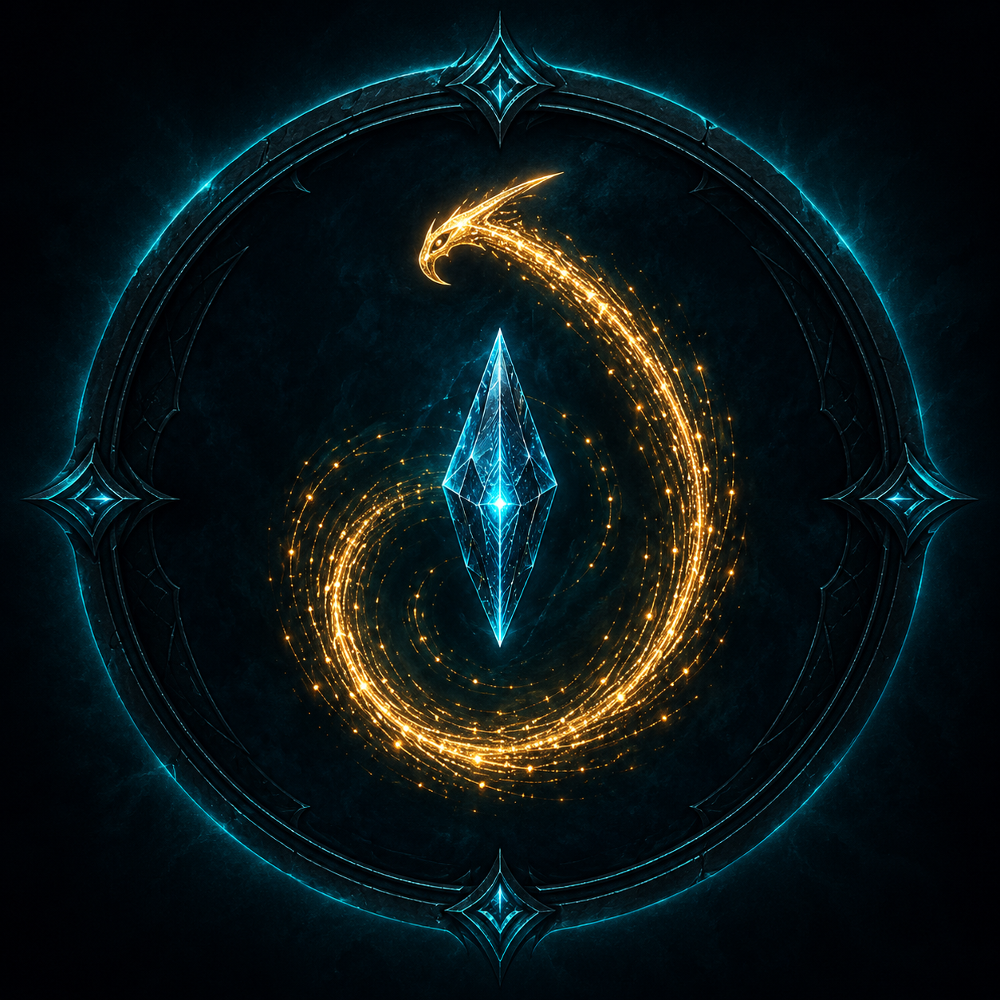

# ffx-mod-hooks

[English](README.md) | **Português (Brasil)**

<div align="center">



**Hooks de runtime para FINAL FANTASY X HD Remaster (Steam, PC)**

[](#status-beta)
[](https://github.com/WanxTitanx/ffx-mod-hooks/releases/tag/v0.6.0-beta.4)
[](LICENSE)
[](#compatibilidade)
[](https://www.paypal.com/cgi-bin/webscr?cmd=_donations&business=wandersonwpires%40hotmail.com&currency_code=USD)

</div>

`ffx-mod-hooks` é a camada pública de comportamento do FFX Mod Studio, desenvolvida pelo
brasileiro **WanxTitanx**. O código-fonte público e as releases ficam em
[ffx-mod-hooks](https://github.com/WanxTitanx/ffx-mod-hooks). Uma única `ffx-hooks.dll` reúne menus nativos, regras opcionais de
combate, sistemas de equipamento, idiomas, diagnóstico e configuração em runtime.
Este inventário descreve a versão consolidada para **FFX**; não implica suporte
equivalente ao FFX-2.

- [Download e instalação](#download-e-instalação)
- [DLL atual](#dll-atual)
- [Menus e controles do F8](#painel-f8)
- [Combate, equipamentos e cartas](#combate-equipamentos-e-cartas)
- [F7 In-Live](#estado-do-f7-in-live)
- [Outros sistemas de runtime](#outros-sistemas-de-runtime)
- [Ativação e prioridades](#ativação-e-prioridades)
- [Compilação](#compilação), [deploy](#deploy) e [validação](#testes-rt2)
- [Roadmap com checks](docs/ROADMAP.md)
- [Dossiê completo de integração com o Editor](docs/ai/EDITOR_INTEGRATION_COMPLETE_HANDOFF_2026_09_28.md)
- [Apoie o projeto](#apoie-o-projeto)

## Novidades da v0.6.0-beta.4

Esta beta restaura o suporte ao executável Steam suportado de outubro de 2026 e amplia a estrutura para pacotes de idioma. Inclui também a opção experimental de inicialização do RNG inspirada no PS2, DESLIGADA por padrão. Leia as [notas completas em inglês e português](docs/release-notes/hooks/v0.6.0-beta.4.md).

A tradução PT-BR do jogo ainda está em testes e **não está incluída**. A interface do Hooks em nove idiomas continua disponível em **F8 > System > Interface language**, separadamente do texto e áudio do jogo.

A validação visual, de gameplay e do ciclo de saves dentro do jogo continua incompleta. Preserve configurações e saves. Não há novo pacote de provider/bridge do Fahrenheit; o complemento antigo da beta.3 não está certificado para o executável atualizado.

## Nuls elementais e integração anterior de 29/09/2026

A integração reúne a branch publicada de recuperação/Seymour/Sphere Grid com os
fixes atuais de elementos, Tarot, recompensas, idiomas e efeitos de armas da main.
O novo controle `F8 > Extras > Additional mods > Elemental Nul spells` começa OFF
e requer reinício. Os seis comandos custam 2 MP, protegem o grupo e entram na
White Magic+ da Yuna depois de aprendidos no Sphere Grid:

| Comando | ID | Animação própria | Elemento |
|---|---:|---:|---|
| NulHoly | 320 | 870 | Holy |
| NulShadow | 321 | 871 | Darkness |
| NulEarth | 370 | 872 | Earth |
| NulWind | 371 | 873 | Wind |
| NulPoison | 372 | 874 | Poison |
| NulGravity | 373 | 875 | Gravity |

Cada aliado recebe uma carga por elemento. Ataques mistos exigem cobertura de
todos os elementos; cobertura parcial não gasta a carga custom. NulPoison bloqueia
o elemento Poison, não o status de veneno. Nenhum desbloqueio é gravado
automaticamente no save. As seis DLLs de animação e suas texturas são clones
independentes, sem substituir efeitos vanilla. Os aliases do F8 não renomeiam os
comandos canônicos nem atributos de itens.

O [registro desta integração](docs/ai/NUL_ELEMENTS_INTEGRATION_2026_09_29.md)
separa build/testes, instalação e o que ainda depende de observação em jogo.
A [receita de assets](tools/nul_elements/README.md) usa os arquivos locais do
usuário; DLLs/texturas proprietárias do jogo não entram no código-fonte público.

## Status beta

As funções são opcionais. Todos os controles booleanos editáveis do catálogo F8
começam **OFF**; o painel em si começa **ON**. Uma opção habilitada pode precisar
de pacote compatível, executável suportado, reinício ou outra condição de
ativação antes de produzir efeito. `LIVE` no F8 descreve como a configuração é
aplicada; não significa que a validação RT2 esteja concluída.

A DLL consolidada tem evidências de compilação Windows, RT0 e RT1 isolado.
Observações anteriores de jogadores continuam vinculadas às DLLs originais.
A aceitação completa de gameplay, visual e ciclo de save desta candidata ainda
está pendente. Instalar a DLL não a promove automaticamente a Production.
Os problemas conhecidos estão em [KNOWN_BUGS](docs/KNOWN_BUGS.md) e no
[roadmap atual](docs/ROADMAP.md).

## Download e instalação

Baixe a [release v0.6.0-beta.4](https://github.com/WanxTitanx/ffx-mod-hooks/releases/tag/v0.6.0-beta.4): DLL, arte original do Arcana já existente, guias EN/PT-BR, exemplos OFF, código-fonte e checksums. Não inclui tradução do jogo, fontes/texturas nativas do jogo ou novo complemento Fahrenheit.

Siga o [guia em português](docs/INSTALACAO_PT-BR.md). Com o jogo fechado, preserve sua DLL e configurações anteriores e copie a DLL e `mods/` do pacote para `modules/`. O jogo e o carregador de módulos não são distribuídos aqui.

## DLL atual

| Identidade | Valor |
|---|---|
| Código de runtime | `df532011907b94c348ecb498714ca268c7217ddc` |
| DLL | Windows x86 / PE32; tamanho/hash exatos nos [insumos da release](docs/releases/v0.6.0-beta.4-inputs.json) |
| Executável suportado | FFX.exe Steam, 10.687.744 bytes; SHA-256 `0537b2a1047f3266e73495cd4e35f63f0777f4231d417699f979954686da686d` |
| Versão interna do PE | `0.2.0.0`; versão do pacote `v0.6.0-beta.4` |
| Validação | [Evidências de build e fonte](docs/releases/v0.6.0-beta.4-validation.json); aceitação em jogo permanece separada |

## O que compõe o projeto

| Componente | Função | Estado |
|---|---|---|
| `ffx-hooks.dll` (FfxHooksDll) | Hooks de engine, UI nativa, consumidores compartilhados de combate/save e sistemas opcionais descritos abaixo | Beta pública; aceitação em jogo pendente |
| Menu F7 In-Live | Difficulty, S.I.N. RAM, Force Last Battle, música, observador de AI e Arena+ CustomMix | Candidata com fonte/RT0/build e RT1 isolado de runtime/política aprovados; RT1 do callback real e RT2 pelo jogador ainda pendentes na matriz de Difficulty |
| Painel F8 | Sete abas, submenus e controles opcionais canônicos | LIVE, RESTART REQUIRED e READ ONLY; são classes de ativação, não provas de gameplay |
| Maechen F9 | UI nativa de perguntas/respostas e cliente de serviço com limites | Há observações anteriores de UI/transporte; aceitação da versão atual e qualidade das respostas do serviço são questões separadas |
| `ffx-probe.dll` (FfxDinput8Probe) | Probe separado de READ / WRITE / CALL na thread principal pelo ponto DINPUT8 | Opcional, OFF por padrão; habilitar uma função de gameplay do Hooks não o habilita |
| `SinScaleInject` + `SinCoreLib` | Ferramentas offline de pesquisa/materialização do S.I.N. | O caminho legado que escreve em disco continua em quarentena; o S.I.N. RAM atual é outro caminho |

## Painel F8

As abas atuais são **System, Boosters, Cheats, Extras, Input, Dev e Reforge**.
Teclado, mouse, roda e controle compartilham a estrutura de menu nativa.
Submenus preservam a seleção do menu anterior; edições pendentes podem ser
confirmadas ou canceladas. Ações em lote respeitam a autoridade de cada controle
e informam indisponibilidade, sobreposição externa ou falha de aplicação.

Os nomes abaixo são mantidos como aparecem na interface do jogo.

| Aba | Opções e submenus incluídos |
|---|---|
| System | Janela sem bordas, restrição/ocultação do cursor, desempenho, câmera livre de batalha e congelamento de cenário; quatro linhas informativas de módulos; Audio languages e Text languages |
| Boosters | Permanent Sensor, Playable Seymour experimental, Speed Hack, aceleração opcional de FMV e Entire Party Earns AP |
| Cheats | Invincible Party/Enemies, Always Overdrive/Critical, Damage 99999 e Always Rare Drop; submenu AP/Gil Multipliers |
| Extras | Additional mods: Elemental Core/Tactics/Gravity/Magic BDL, Spira Reforge, Aeon Ascension, efeitos Holy/Shadow opcionais, Elemental Nul spells e RNG experimental do PS2; Vanguard Combat Engine separado com 31 controles |
| Input | Bloqueio da tecla Windows, correção de input em segundo plano, filtro IME e Dialog Skip; atalhos de teclado/controle e mapeamento de botões |
| Dev | FieldScout (Master/Heavy/Max/Ultra), Fastload Autosave e opção de desenvolvimento para o baralho completo do Arcana; configurações de desenvolvimento do Equipment Workshop |
| Reforge | Arcana, Nova Super Damage, Ronso Mana, Equipment Workshop/detalhes nativos, Scan settings, Grid Teach, Lancet Dual Grant, limite de pilha de itens, Double/Triple Drop e Arena+ |

As contagens incluem controles movidos para submenus. Linhas de navegação,
cores, seletores de idioma, mapeamentos e editores numéricos são configurações
adicionais, não novos flags booleanos. O [inventário anterior de controles](docs/ROADMAP.md#complete-f8-control-inventory)
registra rótulos, chaves, valores padrão e classes de ativação.

### Multiplicadores de AP/Gil

`F8 > Cheats > AP/Gil Multipliers` reúne controles gerais independentes de AP/Gil
(1–100, taxa configurada padrão de 100 quando habilitados) e **Per-monster AP/Gil**.
O hook por monstro começa OFF e exige reinício para sua instalação inicial.

Escolha um monstro pelo nome ou informe seu ID de arquivo (`m000`–`m4095`).
Configure fatores independentes de AP e Gil entre **1 e 1000**, com 1 como valor
neutro. O AP usa o valor normal ou de Overkill escolhido pelo jogo. Todas as
instâncias daquele ID compartilham a configuração. A prévia mostra o valor
original, o resultado individual e o total configurado, indicando ausência de
dados base ou aplicação de um limite.

```text
base reward -> monster multiplier -> general mod multiplier -> vanilla bonuses
```

Ou seja: recompensa base, multiplicador do monstro, multiplicador geral e, depois,
bônus do jogo original. O cálculo usa intermediários amplos após a leitura nativa
de 16 bits. Assim, pode ultrapassar **65.535** sem modificar os WORDs de recompensa
do arquivo de monstro. Antes dos bônus vanilla, os limites seguros são
**382.494.549 AP** e **573.741.824 Gil**; não se trata de recompensa ilimitada.
O runtime usa a visão de recompensa efetiva, incluindo uma visão S.I.N. admitida.
Uma prévia baseada em disco não prevê todos os modificadores de uma batalha.

Os fatores individuais são persistidos atomicamente em `monster-rewards-v1.tsv`,
ao lado do INI ativo. Edições externas exigem reinício. Multiplicação de drops
de itens é outro sistema. Veja o [formato e o consumidor nativo](docs/research/F8_F7_ELEMENTS_MONSTER_REWARDS_2026_09_28.md).

### Dez elementos no F7 e no Scan

As duas interfaces usam as mesmas identidades: **oito bits nativos e dois slots
exclusivos do Hook**. Fire, Ice, Thunder, Water, Holy, Darkness e os dois bits
Custom nativos permanecem distintos. Elementos externos registrados usam chaves
estáveis; não inventam bits na máscara BYTE do jogo. O Core agora inclui
**Poison** e **Gravity** quando nenhum pacote externo está selecionado ou
presente. Habilite Core e reinicie para registrá-los. Um pacote explicitamente
selecionado, ausente ou inválido continua sendo recusado. Pacotes válidos preservam
seus bindings e recebem os slots externos neutros que estiverem faltando.

`F8 > Reforge > Scan settings` reúne stats/MP expandidos, cores dos elementos
nativos extras, cores dos dois externos e visibilidade individual. Os controles
weak/resist/absorb do F7 cobrem os dez slots. Afinidades externas de gameplay só
são publicadas após uma transação Difficulty Apply/Restore bem-sucedida; Save
sozinho não as aplica. Cor e visibilidade no Scan afetam apenas a apresentação.

`F8 > Reforge > Scan settings > Element names` permite renomear **Holy, Darkness,
Earth, Wind, Poison e Gravity**. Digite pelo teclado ou use o seletor
de caracteres com o controle e confirme em Save. Cancelar/perder o foco preserva
o nome anterior; Reset recupera o nome canônico. São aceitos até 32 caracteres
ASCII suportados. Nomes vazios, duplicados ou inseguros são recusados.

Os aliases acompanham o bit nativo ou a chave externa estável e atualizam os
rótulos de elementos no F7, Scan, cores, visibilidade e ordem. **Atributos de itens/
equipamentos, nomes de habilidades/magias/status e dados nativos permanecem
iguais.** Afinidades e cores salvas sobrevivem à renomeação. Core/Tactics junto
com Scan Extra Elements ativa a visão numérica por padrão, sem exigir outra opção
interna; uma preferência explícita `elemental.numeric_scan` continua prevalecendo.

Os novos elementos começam neutros e sem ataques associados. Bindings de comandos,
perfis/equipamentos continuam necessários para um ataque usar um elemento novo;
renomear não converte ataques nativos automaticamente.


## Combate, equipamentos e cartas

### Vanguard Combat Engine — MOD-002

As **31** regras possuem consumidores nativos e ativação independente, organizadas
em Damage, Magic, Status, Formation, Weapons, Armor, Equipment e Mapping:

- Percentuais universais de stats, defesa baseada em HP efetivo, cura que ignora
  Shell, Armor/Mental Break aditivos, consumo de Auto-Crit/MP0 no fim da ação,
  fraqueza ao elemento oposto e escalas configuráveis para golpes únicos/múltiplos.
- Renovação de duração de status, resistência à duração em inimigos, Threaten uma
  vez por instância de ator e política de acerto garantido.
- Quickcast, White Magic em Double/Quickcast e escala de magia pelo MP atual.
- Troca de personagem com custo de turno e reposição automática após Eject/Shatter.
- Treze habilidades equipáveis: Hero's Bravery, Energy Boost, Energy Burst,
  Efficiency, Vampirism, Follow Up, P-Trade, M-Trade, Hero's Caution, MP Regen,
  Elude, Energy Wall e Energy Barrier.
- Comandos ativos vinculados ao equipamento e custos parciais de Overdrive,
  com consumidores nativos de exibição/seleção/débito e mapeamentos configuráveis.

Os IDs padrão das habilidades custom são 135–147, separados dos IDs Spira/Aeon
148–174. O [dossiê do Editor](docs/ai/EDITOR_INTEGRATION_COMPLETE_HANDOFF_2026_09_28.md)
detalha IDs, payloads, donos, codificação de comandos e requisitos de validação.

### Elemental Dominion — MOD-007

Quatro gates independentes controlam Core, Tactics, Gravity e Magic Break Damage
Limit. O pacote admitido `ffx.mod007.elements.v1` fornece definições de elementos,
bindings de comandos, perfis de atores e deltas de equipamento. Os consumidores
nativos abrangem:

- Oito identidades nativas e identidades externas estáveis; afinidades percentuais,
  políticas de combinação de elementos e Scan numérico.
- Interações de Imperil, Ward e Nul, temporizadores de ação e regras de consumo/
  ciclo de vida compostas com os donos já existentes no combate.
- Gravity condicionado ao perfil, incluindo a fração de HP não letal definida
  para chefes.
- Dano mágico de até 999.999 HP por golpe quando o gate e o limite correspondente
  se aplicam.
- Perfis de monstros com fingerprint e deltas de afinidade de equipamento,
  incluindo admissão por dono/tipo/SOS e descarte ao encerrar a identidade.

O registro suporta mais identidades que os dez slots oferecidos pela UI atual
do F7/Scan; são limites diferentes. Uma capacidade declarada não torna disponíveis
todos os consumidores de apresentação planejados. Os detalhes e limites estão
no [contrato completo de integração](docs/ai/EDITOR_INTEGRATION_COMPLETE_HANDOFF_2026_09_28.md).

### Spira Reforge e Aeon Ascension pago

O catálogo compartilhado reserva **27 identidades, IDs 148–174**. Os efeitos
Spira implementados incluem Mana Spring, Break Limits, Devil's Bargain,
Warden's Oath de Auron, Double/Triple Drop, Element Eater, percentuais HP/MP,
percentuais de todos os stats e combinações STR/MAG e DEF/MDEF. Os drops usam
o maior fator do grupo, sem multiplicar fatores de várias cópias equipadas,
e não multiplicam AP/Gil.

**Arcane Focus, Spell Spring, Foolstrike e Fooltouch permanecem inativos,
aguardando definição.** Fourstrike/Fourtouch possuem a base nativa de quatro
elementos definida; efeitos adicionais ainda não especificados não foram
implementados. Estar no catálogo não significa que todo efeito reservado seja
jogável.

Aeon Ascension acrescenta upgrades pagos para equipamentos de Aeons canônicos
adquiridos: armadura com HP até **999.999** e MP até **9.999**, ou arma com dano
até **999.999**. A autorização exige peça/dono corretos e recibo persistido de
compra, não apenas um WORD de habilidade. A compra consome Gil/materiais,
preserva a imunidade e não reabastece o HP/MP atual. A remoção não reembolsa a compra.

### Equipment Workshop — MOD-004/005

O Workshop nativo oferece quinta habilidade lógica, refinamento A/B, bônus
genéricos de refinamento, expansão/fusão, prévias de receitas/economia,
comparação/detalhes nativos, correções de navegação/áudio e upgrades de Aeons.
As opções Dev oferecem substituições explícitas de custo/progressão para
desenvolvimento sem transformar um recibo pago do Ascension em desbloqueio grátis.

O registro nativo de equipamento continua com **22 bytes e quatro WORDs de
habilidade**. Quinto slot, ranks e autorizações pagas ficam em sidecars versionados.
Journals de transação, fingerprints de save, recuperação por checkpoint e projeção
para o save nativo impedem que metadados custom sejam escritos no próximo registro
de equipamento. Veja a [economia do Workshop](docs/WORKSHOP_ECONOMY.md) e o
[contrato Editor/save](docs/ai/EDITOR_INTEGRATION_COMPLETE_HANDOFF_2026_09_28.md).

### Spira: Arcana Fayth — MOD-008

Arcana oferece **78 cartas**, coleção/aquisição, loadouts de sete personagens,
até três slots de cartas, modos Twin/Constellation, consumidores de combate,
integração nativa em **Main Menu > Equip**, apresentação em Status/Auto-Abilities,
artes, áudio de menu e persistência da coleção/loadouts. A projeção de stats
temporários é composta com a camada compartilhada de save. A opção Dev de baralho
completo é independente e começa OFF, assim como o próprio Arcana.

O catálogo é compilado na DLL; o JSON conceitual não é um contrato de pacote
dinâmico de gameplay. Arcana funciona sem Spira Reforge. O [guia de instalação e
aquisição do Arcana](research/mod_008_arcana/README.md) descreve as artes necessárias
e o conteúdo do pacote.

A candidata de fonte de 29 de setembro acrescenta bônus sem retirar os atuais:
The Moon ganha **Shadowstrike/Shadow Ward**; The Empress, **Earthstrike/Earth Ward**;
The Chariot, **Aerostrike/Wind Ward**; Death, **Biostrike/Poison Ward**; The Hanged
Man, **Gravitystrike/Gravity Ward**. The Sun mantém Holystrike/Holy Ward.
Shadow é Darkness, não cegueira; Bio usa o elemento Poison, não o status Poison.
Poison/Gravity exigem **Core ON** no Elemental Dominion e Arcana ativo. Os strikes
mantêm o dano normal da arma: Gravitystrike não vira Demi. As Wards dos extras
reduzem pela metade a exposição positiva e preservam imunidade, absorção e perfis
travados. As partículas Holy/Shadow usam a opção separada Weapon Strike VFX.
O limite passa a dez efeitos por carta, preservando IDs, coleção e nomes salvos.
Veja o [contrato de integração](docs/ai/ARCANA_ELEMENTAL_STRIKES_2026_09_29.md).
Essas adições de fonte são distintas da identidade do deploy anterior acima.

Aliases salvos têm prioridade sobre os quatro novos padrões. Se houver colisão,
o slot padrão mantém seu antigo nome Custom numerado; nenhuma preferência é sobrescrita.

### Idiomas de texto — MOD-006

`F8 > System > Text languages` seleciona o texto nativo ou um pacote PT-BR
compatível e separado, com reinício obrigatório. O runtime suporta os recursos
admitidos de menu/batalha/evento/legendas de cena, métricas/atlas/sombras de fonte,
hashes exatos de origem, validação de capacidade/largura de linha e fallback
nativo. API/schema 2 preservam a compatibilidade documentada com versões anteriores.

A DLL não contém, por si só, uma tradução completa ou uma nova dublagem.
Seletores independentes de voz, efeitos de batalha e áudio de filmes ficam em
**Audio languages**. Veja o [handoff MOD-006 para o Editor](docs/ai/MOD006_EDITOR_HANDOFF.md)
para exportar um pacote utilizável de texto e fonte, além de selecionar um idioma.

## Estado do F7 In-Live

- **Difficulty:** escala em RAM para HP/MP máximo e atual, Overkill, STR/DEF/MAG/
  MDF/AGI/LCK/EVA/ACC, com bases imutáveis, proporções transacionais e restauração
  dos campos pertencentes ao hook. Elementos e status têm evidência dos campos/
  larguras e testes isolados; a aceitação em jogo desta versão ainda está pendente.
  Weak/resist/absorb nativos e duas afinidades externas compartilham o limite Apply.
- **Presets:** Off, Hunter, Sombra de Sin e True Nightmare; Apply Now, Save e Back
  explícitos. A configuração de substituição por área existe, mas seu editor
  nativo ainda está no roadmap. Resistências a status também são editadas por JSON.
- **S.I.N. RAM:** seleção de encontros naturais por seed/visita, scripts de
  maldições admitidos, nomes limitados, escala de stats pelo writer compartilhado
  de Difficulty e visões de recompensa por Threat no piloto revisado de Macalania.
  O materializador legado em disco não é iniciado. A confirmação em gameplay da
  correção de alvos das maldições permanece aberta.
- **Force Last Battle:** novo pedido de encontro na thread principal, com número
  limitado de repetições; a aceitação completa do ciclo de vida e de cenários
  adversariais permanece pendente.
- **Music:** trava de faixa, substituição na entrada da batalha, seleção aleatória
  da playlist e fade. A edição completa de playlist e o mapeamento completo de
  nomes das faixas ainda estão pendentes.
- **Monster AI observer:** OFF por padrão, condicionado ao perfil, com telemetria
  somente leitura de registro, limpeza e dispatch. A mutação genérica de AI swap
  continua bloqueada.
- **Arena+ / CustomMix:** catálogos/browser nativos, bypass de progressão,
  biblioteca de mixes, seleção de atores/cenário e pedidos Ultra limitados à RAM.
  A composição legada baseada em disco permanece separada e em quarentena.

Os [contratos e a evidência do executável do F7](docs/F7_INLIVE.md) distinguem
consumidores, larguras dos campos, ciclos de vida e níveis de evidência.

## Outros sistemas de runtime

| Sistema | Comportamento incluído e limite |
|---|---|
| Speed Hack | Atalho padrão configurável Ctrl+Shift+K: 1x/2x/4x/8x; 2x/4x nativos e 8x no serviço de campo; exibição do estado efetivo/pausado/conflito. F12 continua disponível para screenshots. |
| Aceleração de FMV | Gate separado, OFF por padrão e com reinício; imagem e o canal FMOD pertencente ao filme seguem a velocidade solicitada. O pitch do áudio sobe com a velocidade; aceitação completa de reprodução/legendas/transição segue pendente. |
| Controles nativos/input | Janela/cursor/desempenho/câmera, atalhos de teclado e gamepad, seleção XInput/Steam Input e remapeamento de botões digitais. O compositor do sistema ainda pode interceptar a tecla Windows/Super. |
| Dialog Skip | Consumidor nativo de voz independente, composto com Speed Hack para evitar dois donos do mesmo ponto de hook. |
| Fastload Autosave | Carregamento de autosave na inicialização e integração com o ciclo nativo de load/save; a confirmação anterior do jogador pertence ao artefato anterior, não a toda esta DLL. |
| FieldScout | Diagnóstico e captura Master/Heavy/Max/Ultra; os quatro controles ficam em Dev > FieldScout. |
| Maechen F9 | Modal nativo limitado de perguntas/respostas e transporte para o serviço; implementar o cliente não prova qualidade de resposta nem suporte a contexto local no protocolo v2. |
| Ronso/Nova | Pool Ronso Mana opcional, integração de custos de comandos/save e gate Nova Super Damage. |
| Nul/ensino | Composição Nul compartilhada, controles legados NulWard/ensino, Grid Teach e Lancet Dual Grant. Modos experimentais de escrita conservam gates e conflitos próprios. |
| Inventário/recompensas | Limite configurável de pilha até 255; Double/Triple Drop separado de AP/Gil; autoridade e restauração específicas de cada família. |
| Aurora/diagnóstico de laboratório | Diagnóstico de atores/detalhes OFF por padrão; Aurora usa Ctrl+Alt+F9/F10, não F9/F10 sem modificadores. Experimentos desativados ou aposentados estão no roadmap. |
| Infraestrutura compartilhada | Consumidores compostos de dano/turno/Nul/ação, coordenação dos lotes de hooks, apresentação nativa e múltiplos observadores de save; projeção de checkpoint pago preserva a autoridade Arcana/Ronso. |

## Roadmap

O [roadmap](docs/ROADMAP.md) preserva os checks concluídos e separa o que já foi
entregue em fonte/deploy do que ainda depende de RT2, authoring no Editor e release.
As prioridades são aceitação em jogo da DLL exata, exportadores e validação de
dependências no Editor, definições restantes do Spira e pendências F7/probe.
O [dossiê completo do Editor](docs/ai/EDITOR_INTEGRATION_COMPLETE_HANDOFF_2026_09_28.md)
reúne 40 identidades custom de autoabilities, 31 regras Vanguard, controles F8,
78 cartas Arcana, formatos/dependências e 62 tarefas concretas do Editor.
É um handoff, não uma declaração de que essas tarefas do Editor já foram feitas.

## Arquitetura

```text
FFX.exe (x86)
  dinput8.dll -> FF10 module loader
    modules/ff10-file-loader.dll -> optional external data/packages
    modules/ffx-hooks.dll -> native menus + gated runtime systems
    modules/ffx-probe.dll -> optional, separately armed diagnostics

FFX Mod Studio / Launcher
  authoring + package/install front ends
  versioned manifests, sidecars and contracts (integration status in roadmap)
```

Veja a [arquitetura](docs/ARCHITECTURE.md) e o
[contrato atual do Editor](docs/ai/EDITOR_INTEGRATION_COMPLETE_HANDOFF_2026_09_28.md).

## Organização do repositório

```text
contracts/       Hooks/probe MMF and interoperability contracts
src/runtime/    FfxHooksDll, FfxDinput8Probe, NativeMenuShell, BattlePhotoMode
src/sin/        Offline SinCoreLib / SinScaleInject
docs/           Runtime guides, checked roadmap, evidence, Editor handoffs
research/       Mod catalogs, packaging inputs and research
assets/         Logo and licensed/recorded mod artwork
tools/          Package, runtime-check and export tooling
```

Os diretórios separam contratos, runtime, ferramentas SIN offline, documentação,
pesquisa, artes e ferramentas de empacotamento/validação/exportação.

## Ativação e prioridades

Todo booleano editável do F8 começa OFF; `[dashboard] enabled=1` controla apenas
a disponibilidade do menu. Falha no carregamento da configuração mantém o painel
OFF. A prioridade de compatibilidade é conservadora, da mais forte para a menor:

```text
true disable env > local/global off flags > positive env (true or false) >
authority marker + canonical INI > legacy INI > positive flags in
modules, config, modules\config, then root > unmarked canonical (only without an authority key) > default
```

| Família | Controle principal |
|---|---|
| F7 | `modules\config\f7_inlive.flag` ou `FFXHOOKS_ENABLE_F7=1`; as condições de cada família continuam valendo |
| Observador de AI do F7 | `f7_aiswap.flag` / `FFXHOOKS_ENABLE_F7_AISWAP=1`, somente observação, exige reinício |
| F8 | `[dashboard] enabled`; chaves e defaults individuais no catálogo completo do roadmap |
| Vanguard | Gates `vanguard.*` independentes e mapeamentos `vanguard_ids.*` / `vanguard_commands.*` |
| Elemental | `elemental.core`, `.tactics`, `.gravity`, `.magic_bdl`; pacote `elemental.pack` admitido |
| Spira / Aeon | `spira.enabled`, `aeon_ascension.enabled`; validação de identidade/payload/dono e recibo pago |
| Arcana | `arcana.enabled`; opção de desenvolvimento separada `development.arcana_full_deck` |
| AP/Gil por monstro | `cheats.monster_rewards`, autoridade F8 e `monster-rewards-v1.tsv` |
| Dialog Skip / FMV | `input.dialog_skip` / `boosters.speed_hack_fmv` |
| Famílias de laboratório | Flags/configurações independentes; habilitar o painel não as arma |

O F8 preserva marcadores OFF externos com prioridade. Uma configuração ON salva,
um detour instalado e uma operação efetiva no runtime são estados distintos.

## Compilação

Pré-requisitos: Windows, Visual Studio 2022 com carga de trabalho Desktop C++,
PowerShell, [vcpkg](https://github.com/microsoft/vcpkg) e .NET 8 SDK para o
injetor SIN offline.

```powershell
# One-time: vcpkg static deps (x86)
vcpkg install --triplet x86-windows-static polyhook2 zydis minhook

# Build the hooks DLL (PolyHook build, Release)
.\src\runtime\FfxHooksDll\build_hooks.ps1 -WithPolyHook -Release

# Build the probe
.\src\runtime\FfxDinput8Probe\build.ps1

# Build the SIN injector
dotnet build src\sin\SinScaleInject\SinScaleInject.csproj -c Release
```

- O build de `FfxHooksDll.vcxproj` no Visual Studio é a referência (zero erros);
  o script CLI é o caminho de deploy. Um novo hook deve estar registrado nos dois.
- O artefato de laboratório `ffx-hooks-polyhook-lab.dll` não deve ficar na pasta
  do jogo: ele causa crash no menu. `build_hooks.ps1 -Deploy` recusa deploy de
  laboratório sem `-LabDeploy -GameRoot <cópia descartável>`.

O CI executa um único build nativo quando o código relacionado muda e ignora
documentação comum. A matriz completa de contexto e o pacote grande do Arcana
são manuais. Veja os [controles de execução e custo do CI](.github/CI.md).

## Deploy

```powershell
# Lab deploy (disposable game copy — NEVER the installed game)
.\src\runtime\FfxHooksDll\build_hooks.ps1 -WithPolyHook -Release -Deploy -LabDeploy -GameRoot D:\path\to\game-copy

# Arm a feature (game closed)
New-Item -ItemType File "<game>\modules\config\f7_inlive.flag"
```

Feche o FFX antes de instalar, faça backup identificado da DLL anterior, use um
destino sob seu controle e confira `%TEMP%\ffx-hooks.log` após iniciar o jogo.

## Testes RT2

O comportamento em jogo é validado por protocolo reproduzível: jogo fechado antes
do deploy, save descartável, hashes antes/depois e evidência em log. Consulte
[docs/RT2_PROTOCOL.md](docs/RT2_PROTOCOL.md). O FFX Mod Studio também deve estar
fechado durante a sessão RT2 do hook.

`run_f8_rt2.ps1` é uma checagem manual Preflight/Verify: não inicia nem encerra
o jogo ou o Editor, não copia/instala DLL e não espera um boot. Ele gera um
manifesto com verificação de integridade e valida apenas o caso selecionado na
sessão conduzida por uma pessoa. O script sozinho não promove nenhum caso F8.

## Compatibilidade

- As integrações atuais atendem ao executável FFX exato e suportado. Garantias
  de perfil/assinatura valem para os pontos revisados, não para toda versão futura
  do jogo ou patches de outros mods.
- Outros donos de DINPUT8/GetDeviceState, proxies, Special K ou UnX podem
  disputar os mesmos pontos. Os controles nativos deste projeto não dependem
  de carregar UnX ou Special K junto com Hooks.
- Velocidade de campo, FMV opcional, Dialog Skip e hooks compartilhados de
  combate/save possuem regras próprias de autoridade/admissão. Aceleração do
  áudio de FMV altera o pitch; não é time stretching que preserve o tom.
- Playable Seymour cobre a composição experimental do grupo em batalha, não
  Sphere Grid. AI swap genérico e o writer legado S.I.N. em disco seguem indisponíveis.
- `FreeLibrary`/remoção dinâmica da DLL não são suportados. `DLL_PROCESS_DETACH`
  apenas fecha a admissão com pedidos de parada não bloqueantes; a limpeza
  completa ocorre fora do loader lock.
- Use saves descartáveis em RT2. Siga o protocolo da família, preserve hashes/logs
  e confira a restauração antes de afirmar prontidão Production.

## Versionamento

O projeto usa SemVer independente, iniciado em `0.1.0-beta.1`, e permanece abaixo
de `1.0.0` enquanto beta. A versão segue `MAJOR.MINOR.PATCH` com sufixo de
pré-release; revisões documentais não implicam mudança do código da DLL.
A v0.6.0-beta.2 revisa a documentação da v0.6.0-beta, com o mesmo binário validado.
Veja o [CHANGELOG](CHANGELOG.md).

## Créditos

O projeto utiliza trabalho open source e da comunidade; a lista completa está
em [NOTICE](NOTICE): PolyHook2 (stevemk14ebr), MinHook (TsudaKageyu), Zydis/Zycore
(zyantific), asmjit/asmtk, Xe.BinaryMapper (Xeeynamo) e o conceito de module loader/
proxy DINPUT8 para FFX (ffgriever).

O ponto de execução na thread principal via DINPUT8 (`GetDeviceState`, vtable)
foi descoberto e comprovado internamente; veja os registros do projeto.
Os codecs ATEL/monstros do SinCoreLib vieram do código do FFX Mod Studio Editor,
do próprio projeto.

## Apoie o projeto

🇧🇷 Este projeto é desenvolvido por um brasileiro. Se ele ajuda você, considere
apoiar seu desenvolvimento:

[](https://www.paypal.com/cgi-bin/webscr?cmd=_donations&business=wandersonwpires%40hotmail.com&currency_code=USD)

**Qualquer valor ajuda.** Até US$ 2 contribuem para a manutenção. O FFX Mod Studio
vai além dos hooks: reúne o Editor, o Launcher, o site de downloads e outras
ferramentas. Sua contribuição ajuda a manter esse trabalho. A doação é opcional.

## Licença

GPL-3.0 — veja [LICENSE](LICENSE). Assets do jogo e `FFX.exe` não estão incluídos
e continuam pertencendo à Square Enix. Este projeto é uma camada de ferramentas
criada por fãs.
