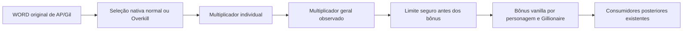

## Adendo vigente: seis Nuls e integração publicada — 2026-09-29

Este adendo é posterior ao checkpoint original abaixo. Implementação e assets
possuem validação offline/isolada; não presumir aceitação visual ou de gameplay.
O [registro de integração](NUL_ELEMENTS_INTEGRATION_2026_09_29.md) identifica o
artefato e os backups, e a [receita reproduzível](../../tools/nul_elements/README.md)
contém os comandos de geração/instalação a partir dos arquivos locais.

### Registros que o Editor precisa preservar e produzir

| Nome canônico | ID decimal / codificado | `Anim1Id` | Identidade protegida |
|---|---|---:|---|
| NulHoly | 320 / `0x3140` | 870 | `0x10` |
| NulShadow | 321 / `0x3141` | 871 | `0x80` |
| NulEarth | 370 / `0x3172` | 872 | `0x20` |
| NulWind | 371 / `0x3173` | 873 | `0x40` |
| NulPoison | 372 / `0x3174` | 874 | `hook.custom03` ou `spira.poison` |
| NulGravity | 373 / `0x3175` | 875 | `hook.custom04` ou `spira.gravity` |

- A base auditada possui 370 registros de 96 bytes. Reutilizar Radiant Ward/Umbral
  Ward em 320/321; não duplicar essas identidades. Anexar 370–373, chegando a 374.
- Preservar 366 (White Magic+), 367–369 (Aero/Aerora/Aeroga) e todos os outros
  registros existentes. O limite exclusivo do menu passa a 374.
- Receita padrão: Yuna (`CharacterUser=1`), categorias 4/4, `TargetFlgs=5`
  (grupo aliado), custo MP 2, uma ocorrência, `Anim2Id=0`, zero dano/poder,
  zero máscara elemental nativa no próprio comando e zero payload de status.
- Campo de texto: offsets WORD relativos ao pool, não ao começo de `command.bin`.
  Preservar os quatro pares de texto/ScriptId do registro, todos os campos não
  alterados e o prefixo completo do pool antigo; acrescentar os novos textos.
- Alterar payload/efeito fora do contrato pode fazer o hook recusar a concessão.
  Não representar Poison/Gravity com bits inventados no BYTE nativo. Os bits
  privados `0x100/0x200` existem apenas na implementação das cargas do hook.
- `NulElementCommands.h` é a tabela autoritativa do runtime. Nomes de apresentação
  em F7/Scan podem mudar; IDs/chaves e nomes canônicos de comandos/itens não são
  renomeados por substituição global.

### Aprendizado e persistência

- Nova opção independente `elemental.nul_spells`, autoridade
  `f8_authority.elemental_nul_spells`, OFF por padrão, reinício obrigatório.
- O controle solicita o produtor de ensino/leitura de saves do GridTeach. Não
  concede as habilidades automaticamente e não cria nós do Sphere Grid sozinho.
- O Editor pode criar/atribuir nós de comando com as identidades codificadas acima
  na malha escolhida pelo usuário. Não alterar uma malha ou save apenas ao abrir
  o projeto, habilitar o painel ou instalar o pacote.
- Usar o estado aprendido do hook, ligado ao save e ao personagem. Ele cobre
  comandos 96–383 em 18 WORDs por personagem; o banco vanilla continua com seu
  tamanho nativo. Nunca ampliar o save vanilla ou escrever o bit 373 fora dele.
- O submenu White Magic+ aparece derivado dos filhos aprendidos; o hook não
  precisa gravar um desbloqueio artificial de 366. A menuização não grava estado.
- A integração publicada usa a mesma infraestrutura de eventos de save para
  Arcana, Ronso, GridTeach e Grid8. Não introduzir um segundo fread/fwrite nem
  publicar identidades a partir de uma leitura incompleta, preview ou hash sem
  proveniência de buffer. Checkpoints pagos continuam selecionados antes de LoadPool.

### Assets e exportação em três raízes

- Clones privados `magic_0870.dll`–`magic_0875.dll`, com oito texturas próprias por
  efeito. Doador compatível: `magic_0146.dll`; três strings UTF-16 de identidade
  são reescritas e a seção `.text` permanece idêntica.
- O `holy_donor_recipe.json` fixa SHA-256, tamanho e layout dos oito DXT5, incluindo
  todos os mipmaps. Não clonar cegamente NulTide/NulShock removendo seus statuses:
  o histórico do Editor registra incompatibilidade nesse caminho.
- Exportar `jppc` e `new_uspc` para Steam e Spira em
  `data/mods/ffx_ps2/ffx/master/<locale>/battle/kernel/command.bin`; Extracted usa
  `ffx_ps2/ffx/master/<locale>/battle/kernel/command.bin`.
- DLLs em `magicFiles/FFX` nas três raízes. Texturas em
  `data/mods/FFX_Data/GameData/PS3Data/magic` na Steam/Spira e
  `ffx_data/gamedata/ps3data/magic` no Extracted. Não escrever em FFX-2 ou outros
  idiomas extraídos por analogia.
- Prévia totaliza 168 arquivos: seis bancos e 162 arquivos de FX. Recusar IDs
  ocupados, symlinks, hashes alterados ou stage incompleto; criar backup antes de
  publicar e verificar cada SHA-256 depois. A reinstalação idêntica é no-op.
- Rollback só restaura/remove arquivos que ainda correspondem ao recibo da
  instalação; preservar alterações posteriores de outra ferramenta/usuário.
- Não distribuir bytes proprietários dos donors no repositório ou release de
  fontes. Distribuir receita, proveniência e hashes; o usuário fornece os assets.

### Critérios de aceitação do Editor

- [x] Parser real do Editor lê 374 registros, os seis nomes/FX/custos e as seis
  raízes das DLLs de animação produzidas nesta rodada.
- [x] Todos os registros e scripts referenciados sobrevivem ao round-trip; o
  writer do Editor zera 149 bytes órfãos dos textos substituídos. Esse buffer
  reescrito não foi usado como arquivo de instalação.
- [x] Receita recusa colisões e drift e conserva os outros 368 registros.
- [ ] Oferecer autoria visual dos nós/IDs e validação do contrato Nul na UI do Editor.
- [ ] Integrar geração/preview dos seis FX e publicação transacional nos destinos
  escolhidos, sem desbloqueios automáticos.
- [ ] Observar aprendizado, save/load, conjuração no grupo, cores, consumo de carga
  e retorno ao estado original em uma sessão RT2 separada.

---

# Dossiê completo de integração Hooks → Editor

**Jarvis-HOOK · 28/09/2026 · entrega após o deploy da rodada F7/F8/elementos/AP/Gil**

Este documento é o contrato de trabalho para completar o suporte do FFX Editor ao
runtime consolidado. Ele reúne os arquivos consumidos, identidades, formatos,
limites, dependências, interfaces necessárias, lacunas encontradas no Editor e
critérios de aceitação. Um nome de arquivo sugerido abaixo é uma proposta de
implementação, não uma alegação de que esse arquivo já existe.

Não execute prompts históricos simplesmente porque são citados aqui. A tarefa do
Editor deve partir do código e dos contratos desta revisão. Este dossiê não altera
o repositório do Editor, não concede autorização para editar saves pessoais e não
transforma validação offline em comprovação de gameplay.

## Atualização de contrato — 2026-09-29: registro interno e nomes

A implementação posterior à identidade de 2026-09-28 acrescenta um registro
interno de dez elementos. Os hashes e resultados históricos deste dossiê continuam
identificando seu checkpoint original; o handoff atual registra a nova DLL.

- Sem `elemental.pack` explícito e sem `elemental-pack.json` no diretório do INI,
  o Core usa o registro interno. `elemental.pack=builtin` o seleciona explicitamente.
  Arquivo externo existente inválido, ou caminho explicitamente selecionado ausente,
  permanece erro. O fallback não mascara um pacote recusado.
- Os oito bits nativos são preservados. As chaves externas internas são
  `hook.custom03` e `hook.custom04`, com nomes padrão Poison/Gravity, afinidade neutra
  e nenhum comando associado automaticamente. Pacotes válidos com menos de dois
  externos recebem descritores neutros sem reindexar os bindings existentes.
- `F8 > Reforge > Scan settings > Element names` fornece editor de nomes com
  teclado/seletor de caracteres. Os seis padrões são Holy, Darkness, Earth, Wind, Poison e Gravity.
  O limite dos aliases é 32 caracteres ASCII suportados: letras, números, espaços,
  hífen, sublinhado, apóstrofo, ponto, parênteses e barra. Há trim nas extremidades,
  recusa de duplicados sem distinguir maiúsculas/minúsculas e cancelamento seguro.
- Aliases são preferências do hook, fora do manifesto e dos assets. As chaves
  nativas são `element_names.native_10`, `element_names.native_80`, `element_names.native_20`,
  `element_names.native_40`.
  As duas internas são `element_names.hook.custom03` e `element_names.hook.custom04`;
  para qualquer externo usa-se `element_names.<chave-estável>`. Valor vazio é Reset
  para o rótulo canônico. Precedência: alias válido > rótulo do registro/pacote.
- Cores externas continuam em `element_scan.hook.<chave>.rgb/.enabled`; portanto
  a cor interna 03 fica em `element_scan.hook.hook.custom03.rgb`. Renomear nunca
  altera essas chaves nem as entradas `diff_elemExtra`/`elemExtra` do F7.
- F7/Scan e seus controles usam os aliases. Nomes canônicos de habilidades, magias,
  status e atributos de itens/equipamentos não passam por substituição textual.
- O Scan numérico agora é solicitado por padrão quando Scan Extra Elements e
  Core/Tactics estão habilitados. Uma configuração explícita `elemental.numeric_scan`
  conserva sua prioridade. O registro e os hooks continuam OFF por padrão.

O Editor deve separar **nome de apresentação** de **identidade/binding** e nunca
regravar `a_ability.bin`, nomes de comandos ou arquivos de monstros ao exportar
esses aliases. Criar/renomear um descritor continua sem atribuí-lo a um ataque.

## Navegação

- [00. Identidade da entrega e limites da evidência](#00-identidade-da-entrega-e-limites-da-evidência)
- [01. Resultado que o Editor precisa entregar](#01-resultado-que-o-editor-precisa-entregar)
- [02. Matriz de responsabilidade](#02-matriz-de-responsabilidade)
- [03. Auditoria do que já existe no Editor](#03-auditoria-do-que-já-existe-no-editor)
- [04. Dependências de compilação, ferramentas e ativos privados](#04-dependências-de-compilação-ferramentas-e-ativos-privados)
- [05. Perfil de projeto Vanilla/OnlyMod](#05-perfil-de-projeto-vanillaonlymod)
- [06. Registro único de IDs de autoabilities](#06-registro-único-de-ids-de-autoabilities)
- [07. `a_ability.bin`, preços e payloads](#07-a_abilitybin-preços-e-payloads)
- [08. Vanguard Combat Engine](#08-vanguard-combat-engine)
- [09. Elemental Dominion: modelo e arquivo](#09-elemental-dominion-modelo-e-arquivo)
- [10. Bancos, comandos e fingerprints Elemental](#10-bancos-comandos-e-fingerprints-elemental)
- [11. Perfis, Tactics, Gravity e equipamentos Elemental](#11-perfis-tactics-gravity-e-equipamentos-elemental)
- [12. F7 e Scan: contrato novo que o Editor deve criar](#12-f7-e-scan-contrato-novo-que-o-editor-deve-criar)
- [13. AP/Gil por monstro: authoring novo obrigatório](#13-apgil-por-monstro-authoring-novo-obrigatório)
- [14. Equipment Workshop e quinto slot](#14-equipment-workshop-e-quinto-slot)
- [15. Aeon Ascension pago](#15-aeon-ascension-pago)
- [16. Spira Reforge: catálogo e consumidores](#16-spira-reforge-catálogo-e-consumidores)
- [17. MOD-006: pacote textual, fonte e fallback](#17-mod-006-pacote-textual-fonte-e-fallback)
- [18. Arcana: integração existente e fronteira do Editor](#18-arcana-integração-existente-e-fronteira-do-editor)
- [19. Save lifecycle, projeções e coexistência](#19-save-lifecycle-projeções-e-coexistência)
- [20. Sistemas relacionados: o que precisa ou não de authoring](#20-sistemas-relacionados-o-que-precisa-ou-não-de-authoring)
- [21. Layout de pacote e instalação](#21-layout-de-pacote-e-instalação)
- [22. Arquitetura de implementação proposta para o Editor](#22-arquitetura-de-implementação-proposta-para-o-editor)
- [23. Ordem de implementação recomendada](#23-ordem-de-implementação-recomendada)
- [24. Matriz mínima de validação](#24-matriz-mínima-de-validação)
- [25. Migração, compatibilidade e rollback](#25-migração-compatibilidade-e-rollback)
- [26. RT2 e publicação](#26-rt2-e-publicação)
- [27. Definição de pronto para a frente Editor](#27-definição-de-pronto-para-a-frente-editor)
- [Apêndice A. As 40 identidades de autoability](#apêndice-a-as-40-identidades-de-autoability)
- [Apêndice B. As 31 regras do Vanguard](#apêndice-b-as-31-regras-do-vanguard)
- [Apêndice C. Inventário das 89 identidades F8](#apêndice-c-inventário-das-89-identidades-f8)
- [Apêndice D. Catálogo Arcana compilado](#apêndice-d-catálogo-arcana-compilado)
- [Apêndice E. Dependências diretas de build do Editor](#apêndice-e-dependências-diretas-de-build-do-editor)
- [Apêndice F. Mapa de artefatos e fontes canônicas](#apêndice-f-mapa-de-artefatos-e-fontes-canônicas)
- [Apêndice G. Telemetria e ferramentas de runtime do Editor](#apêndice-g-telemetria-e-ferramentas-de-runtime-do-editor)
- [Apêndice H. Backlog concreto de implementação do Editor](#apêndice-h-backlog-concreto-de-implementação-do-editor)
- [Apêndice I. Limites de Workshop para validar na UI](#apêndice-i-limites-de-workshop-para-validar-na-ui)
- [Apêndice J. Índice de evidência, hashes e manutenção](#apêndice-j-índice-de-evidência-hashes-e-manutenção)

## 00. Identidade da entrega e limites da evidência

| Item | Identidade conferida |
|---|---|
| Repositório Hooks | `/home/wanderson/Documents/ffx-hooks` |
| Branch de implementação | `main`, sem criar outra branch nesta rodada |
| Commit de código publicado | `dda5cb45305448d761e5412f3b265e58213d8ce2` |
| DLL instalada | `modules/ffx-hooks.dll` da instalação Steam Linux |
| Tamanho da DLL | 3.398.144 bytes |
| SHA-256 da DLL | `734a0bf94b56157648e5391ca06dfb1c60aad2c6bb27748762a67315c98b8ffc` |
| Deploy verificado | 2026-09-28 22:28:57 UTC |
| Entradas nativas da compilação | 472/472 iguais ao pacote que produziu a DLL |
| Todas as entradas de fonte do pacote | 605/605 iguais antes do deploy |
| Arquivos protegidos na instalação | 178/178 sem alteração na troca da DLL |
| Executável suportado | PE32/i386, ImageBase preferido `0x00400000` |
| SHA-256 do executável | `78ce34397da5e6f49b72c2aebadedaf4cd3f6720e1949d46a1b8ed67d3db5ced` |
| Editor inspecionado | `/home/wanderson/Documents/ffx-editor-main` |
| Branch do Editor | `codexclaudiocodeffxeditor` |
| HEAD do Editor na leitura | `399164236638bd34d44c4833b02ea3b15a49d771` |
| Estado local do Editor | 99 entradas dirty existentes; não modificadas por esta tarefa |
| Momento da identificação do Editor | 2026-09-28 22:29:54 UTC |

As observações sobre o Editor incluem o checkout local dirty, não apenas o HEAD.
Mudanças posteriores nessa outra frente precisam ser reconciliadas. A inspeção de
fonte confirma contratos e a presença de implementações; não comprova que toda a
interface do Editor já esteja entregue ou que seus testes tenham sido executados
nesta rodada.

O runtime passou pelos testes Windows apropriados e por 22 casos com os mesmos
binários recuperados no Proton, incluindo carregamento da DLL. Os três workflows
GitHub do commit de código — build, context-tools e text-languages — concluíram
com sucesso. A validação é RT0/RT1. A aceitação em jogo, RT2, permanece separada.

Referências de partida:

- [Rodada atual: implementação, formatos e deploy](../research/F8_F7_ELEMENTS_MONSTER_REWARDS_2026_09_28.md).
- [Contrato consolidado da integração anterior](INTEGRATION_EDITOR_HANDOFF_2026_09_28.md).
- [Contrato do pacote de idiomas](MOD006_EDITOR_HANDOFF.md).
- [Fronteira entre Editor vanilla e OnlyMod](HOOKS_EDITOR_MODE_BOUNDARY_2026_09_27.md).
- [Protocolo e classificação de evidência](../RT2_PROTOCOL.md).

## 01. Resultado que o Editor precisa entregar

O Editor precisa conseguir produzir um conjunto coerente de dados e configurações
que o Hook consiga admitir. Isso inclui a criação das linhas binárias necessárias,
os manifestos que identificam essas linhas, os parâmetros independentes dos mods,
os perfis de monstros/personagens/equipamentos, os recursos de apresentação e uma
pré-validação executável do pacote final.

Uma opção visual chamada “Hook”, “Vanguard” ou “Elemental Dominion” não basta. Cada
opção precisa chegar a um consumidor real, com os mesmos nomes de campos, IDs,
larguras, limites, hashes e condições de ativação usados pela DLL. Se não existir
consumidor, a interface deve tratar a ideia como proposta indisponível.

O produto final deve oferecer pelo menos estas superfícies:

1. Perfil de projeto **Vanilla** ou **OnlyMod**, explícito e persistente.
2. Registro único das identidades de autoabilities e dos remapeamentos.
3. Authoring das 13 habilidades do Vanguard e das 27 identidades Aeon/Spira.
4. Editor/exportador do pacote `ffx.mod007.elements.v1`.
5. Edição de comandos, perfis e equipamentos que referenciem esse registro.
6. Preferências consistentes de F7/Scan para oito elementos nativos e dois extras.
7. Taxas de AP/Gil por monstro com prévia ampla, sem aumentar o WORD nativo.
8. Presets de configuração do Hook com autoridade e necessidade de restart claras.
9. Inspeção compatível com Workshop, quinto slot e recibos pagos, sem fabricar posse.
10. Authoring e validação do pacote textual MOD-006, incluindo fontes.
11. Referência/compatibilidade com Arcana e com os consumidores compartilhados.
12. Empacotamento, inventário, hashes, validação negativa e um relatório exportável.

O Editor não deve instalar hooks dentro do próprio processo para fazer uma prévia.
A DLL do jogo é x86; o Editor não precisa compartilhar sua arquitetura. Use um
validador offline, um processo auxiliar da arquitetura correta ou uma biblioteca
portável com contrato explícito.

## 02. Matriz de responsabilidade

| Superfície | Responsabilidade do Editor | Responsabilidade do Hook/jogo |
|---|---|---|
| Dados vanilla | Ler, preservar, editar apenas os campos autorizados e exportar cópia | Interpretar o formato nativo |
| Autoability OnlyMod | Criar linha, nome/descrição permitidos, preço e identidade correta | Validar linha/owner/equipamento e executar efeito |
| Nono/décimo elemento | Declarar chave, label, cor, bindings e perfis externos | Resolver o elemento sem ampliar o BYTE nativo |
| Imperil/Ward/Nul | Definir ações, alvos declarativos e limites válidos | Contar ações, consumir cargas, restaurar ciclo de vida |
| Gravity | Exportar comando e perfil explícitos | Aplicar divisor, imunidade e limite não letal |
| AP/Gil individual | Exportar taxas e apresentar cálculo/limites | Interceptar o valor já ampliado e manter bônus vanilla posteriores |
| Workshop | Authoring de dados/receitas compatíveis; inspeção e simulação válidas | Admitir save, cobrar, transacionar e manter identidade da peça |
| Quinto slot | Mostrar separadamente; nunca gravar o quinto WORD no save vanilla | Manter a habilidade lógica e seus consumidores |
| Ascension pago | Mostrar receita/estado e inspecionar recibos compatíveis | Emitir recibo após compra real, associá-lo ao save/peça/habilidade |
| Idiomas | Gerar texto/fontes/pacote com preflight completo | Publicar recursos e fonte juntos no processo correto |
| Arcana | Referência e authoring suportado por contrato; não inventar runtime dinâmico | Inventário, equipar, efeitos, aquisição e persistência nativa |
| Perfil de executável | Identificar compatibilidade antes de exportar/instalar | Revalidar PE, assinaturas e posse dos pontos nativos |
| Deploy/RT2 | Fluxo separado, com confirmação e relatório | Sessão de jogo reproduzível e observação real |

## 03. Auditoria do que já existe no Editor

Foram lidos os arquivos reais de `FFXProjectEditor/FfxLib/Mods` e a interface
`Modules/HookModAuthoring`. Também foram pesquisados os nomes de contratos nos
arquivos `.cs`, `.axaml` e `.json` do projeto. Ausência de uma string isolada não
substitui revisão completa de uma implementação com outro nome; as lacunas abaixo
combinam essa busca com as classes efetivamente encontradas.

| Evidência atual | O que já fornece | O que não deve ser presumido |
|---|---|---|
| `FfxLib/Mods/Mod002Manifest.cs` | Manifesto schema 1, chaves/IDs, duplicatas e defaults embarcados | Exportador universal de todos os mods |
| `FfxLib/Mods/Mod002Authoring.cs` | Sessão offline, fontes clonadas, edição de texto/preço, preview, fingerprint e export separado | Criação completa de todos os IDs novos ou compatibilidade automática com a DLL atual |
| `FfxLib/Mods/ModAuthoringFiles.cs` | Utilitários de I/O/hash e proteção de caminhos | Um instalador de runtime ou autorização de deploy |
| `FfxLib/Mods/WorkshopInspector.cs` | Inspeção somente leitura do host experimental v1 | Leitura/escrita completa dos checkpoints binários de produção e recibos Ascension |
| `FfxLib/Mods/Mod006Readiness.cs` | Diagnóstico de caracteres do codec | Exportação de idioma: `CanExportPack` está explicitamente `false` |
| `Modules/HookModAuthoring/HookModAuthoring_DataModel.cs` | Toggles MOD-002/004/005/006, importação, preview/export MOD-002, inspeção Workshop e relatório de codec | UI pronta de MOD-007, taxas por monstro, recibos pagos ou todo o catálogo Spira |
| `FfxLib/Save/FfxSaveEquipment.cs` | Modelo de equipamento nativo que deve permanecer com stride 22 | Um quinto slot físico dentro do mesmo registro |
| `FfxLib/Monster/Monster_Loot.cs` | Gil/AP/APOverkill como `ushort` | Armazenar diretamente recompensas acima de 65535 no monstro |
| `FfxLib/Ability/SpiraReforge*Writer.cs` e ferramentas relacionadas | Trabalho específico de comandos/pacotes Spira já presente | Exportação do manifesto e de todas as capacidades Elemental do Hook |

As buscas pelos literais `ffx.mod007.elements.v1`, `monster-rewards-v1`,
`Elemental Dominion`, `AeonAscension`, `SpiraAbilityCatalog` e `ffx.mod006` não
localizaram esses contratos nos arquivos pesquisados do projeto. Isso é evidência
de lacuna de integração no snapshot, não autorização para apagar trabalho da
outra frente.

### 03.1 Incompatibilidades concretas a corrigir

- `Mod002Authoring` ainda emite a mensagem de que a versão/PE do Hook está pendente
  e o gameplay indisponível. O novo contrato já existe; essa mensagem deve passar
  a depender da compatibilidade efetivamente validada, sem virar um “pronto” fixo.
- A mesma classe permite entrada `a_ability.bin` de até 2.000.000 bytes. O consumidor
  real da DLL usa tamanho WORD e rejeita essa classe de banco acima de 65535 bytes.
  O limite do Editor para exportação compatível precisa refletir o consumidor.
- O authoring permite editar o nome da linha. Vanguard e Spira validam identidade
  pelo nome canônico/placeholder admitido, além do payload. Um rename arbitrário
  pode gerar um arquivo sintaticamente válido cujo efeito será recusado pelo Hook.
- O modo MOD-002 exige payload nativo neutro a partir de `0x10`. Ele não pode ser
  reutilizado indiscriminadamente nas linhas Spira que possuem payload nativo
  específico e validado.
- `WorkshopInspector` declara estado de 16260 bytes, mas lê um envelope JSON do
  host experimental e contém um subconjunto antigo de habilidades suportadas.
  O mesmo tamanho de estado não torna esse envelope um checkpoint de produção.
- A tela de idiomas diagnostica codec, mas o código bloqueia export. A nova
  implementação precisa entregar o pacote, as fontes e a validação; não basta
  trocar a constante para `true`.
- As novas afinidades F7 externas e taxas de recompensa têm formatos próprios.
  Não devem ser encaixadas por conversão silenciosa em campos vanilla existentes.

## 04. Dependências de compilação, ferramentas e ativos privados

O projeto do Editor usa `net8.0` e Avalonia. O inventário de pacotes diretos e
versões extraído do `.csproj` está no apêndice de build. A DLL do jogo usa MSVC x86,
MinHook/PolyHook e dependências estáticas da configuração de build do repositório
Hooks. Isso não significa que o Editor deva carregar a DLL de gameplay por P/Invoke.

Dependências que o implementador precisa localizar e registrar:

| Dependência | Uso | Distribuição/limite |
|---|---|---|
| Fontes originais do jogo | Comparação, codec, layout e fingerprint | Snapshot privado; não incluir no repositório público |
| `FFX.exe` suportado | Identidade e validadores nativos isolados | Fixture privada do executável exato |
| `FFX_Data.vbf`/arquivos extraídos | Fonte dos bancos, monstros e textos | Seleção explícita do usuário; não reempacotar assets originais sem necessidade |
| `a_ability.bin` por locale | Autoabilities, nomes, payloads e IDs | Hash, tamanho e readback de cada saída |
| `arms_rate.bin` por locale | Preço das autoabilities | Cobertura de todos os IDs e preservação das entradas não editadas |
| Bancos de comandos/itens/monmagic | Bindings Elemental e equipamentos ativos | Seções/strides reais, nunca layout deduzido só pelo nome |
| Arquivos de monstros | Perfil completo e recompensa base | Hash do arquivo inteiro; preservar seções não editadas |
| Fontes FTC/Phyre e tabelas de texto | MOD-006 | Fontes e texto devem ser admitidos juntos |
| DLL/CLI de validação offline | Admissão e testes negativos | Arquitetura correta e processo isolado |
| `research/mod_004_refinement/ability_ingredient_candidates.tsv` | Host experimental Workshop e probe MOD-004 | Não omitir de uma distribuição que execute esses consumidores |
| `kaizou.bin` privado | Fonte do gerador de receitas Customize | Gera/confere `customize_recipes.h`; não publicar o binário de entrada |
| Catálogos de ID/efeito | Identidade estável do projeto | Registrar revisão de origem e detectar deriva |
| Artes Arcana selecionadas | Apresentação de cartas | Manifesto, licença/proveniência, nomes e dimensões corretos |

Não trate um arquivo extraído antigo como se fosse a instalação atual. Para cada
entrada, registre caminho lógico, locale, bytes, SHA-256, papel no pacote e origem.
Um hash identifica bytes, não a confiabilidade de quem os distribuiu.

## 05. Perfil de projeto Vanilla/OnlyMod

### 05.1 Modelo de dados necessário

Criar ou completar um perfil de projeto que registre:

- Modo Vanilla ou OnlyMod, com Vanilla como padrão.
- Família/capacidades requeridas do Hook, separadas por recurso.
- Perfil de executável suportado e identificação do contrato de exportação.
- Locale de cada banco, sem assumir que todos os arquivos usam a mesma pasta.
- Fontes e destinos independentes, com rejeição de links/reparse/traversal.
- Manifestos de IDs, bindings e recursos utilizados.
- Lista de alterações declaradas e de bytes/seções preservados.
- Resultado de preview, fingerprint de confirmação e relatório de validação.
- Dependências ainda não resolvidas, com bloqueio de exportação aplicável.

### 05.2 Comportamento de interface

Uma sessão vanilla não deve ganhar opções que escrevem sidecars sem escolha
explícita. Ao ativar OnlyMod, o Editor deve explicar quais arquivos adicionais
serão produzidos e quais recursos dependem da DLL. O preview precisa mostrar o
delta, e uma nova alteração após a confirmação deve invalidar aquele preview.

Use as marcações de origem onde correspondem ao recurso:
`[DERIVADO DE MOD-002]`, `[DERIVADO DE MOD-004]`, `[DERIVADO DE MOD-005]`,
`[DERIVADO DE MOD-006]`, `[DERIVADO DE MOD-007]` e `[SPIRA REFORGE]`.

Não confundir três estados diferentes:

| Estado | Significado |
|---|---|
| Dados editáveis | O Editor conhece e preserva o formato |
| Pacote admitido offline | O consumidor/validador aceitou os bytes e os contratos |
| Gameplay validado | Existe observação RT2 reproduzível da configuração específica |

## 06. Registro único de IDs de autoabilities

O registro precisa ser compartilhado pelas telas de autoabilities, equipamento,
Workshop, Vanguard, Spira e Ascension. Campos mínimos: chave estável, ID numérico,
WORD de equipamento, nome canônico, tipo de peça, owners permitidos, modo de
payload, consumidor requerido, estado da definição e prova do banco.

Regras atuais de `AutoAbilitySlots.h`:

| Faixa | Reserva |
|---|---|
| 135–147 | Defaults do Vanguard |
| 148–174 | Defaults fixos por efeito Aeon/Spira |
| 175–4095 | Espaço numérico admitido para remapeamento explícito |
| 134 | Identidade custom anterior; não reutilizar implicitamente |

O WORD do equipamento é `0x8000 + id`. O ID deve existir no banco carregado.
O teto numérico 4095 não significa que 4096 linhas caibam no banco atual: cabeçalho,
stride 108, comprimentos WORD e pool de textos continuam limitando o arquivo.

Vanguard aceita a própria faixa de defaults ou IDs a partir de 175. Cada efeito
Aeon/Spira aceita o seu default correspondente ou um remapeamento a partir de 175.
Isso impede trocar uma identidade reservada por outra só mudando um número.
Colisões entre os dois conjuntos são verificadas pelo runtime.

Configurações de mapeamento:

```ini
[vanguard_ids]
hero_bravery = 135
energy_boost = 136

[spira_ids]
aeon_break_hp_mp_limit = 148
aeon_break_damage_limit = 149
```

Mudar o INI não cria uma linha, não move seus bytes e não renomeia o banco. O
exportador deve produzir a linha correta, atualizar preços/referências, gerar os
hashes e só então propor o mapeamento.

### 06.1 Identidade textual e locales

Os validadores aceitam nomes latinos canônicos e, nos caminhos previstos, um
placeholder numérico correspondente à identidade default. O placeholder não é
uma tradução livre. Num remapeamento, ele continua identificando o efeito
canônico, não se transforma automaticamente no novo número físico da linha.

Localize a interface do Editor separadamente do nome binário usado como prova.
Descrições podem ter política diferente do nome; não aplique uma edição de texto
em massa a ambos sem consultar o consumidor. A tabela completa de 40 identidades
está no apêndice de autoabilities.

### 06.2 Locales: diretório de authoring e identificador do runtime

O authoring MOD-002 existente aceita dez diretórios:
`new_uspc`, `inpc`, `new_depc`, `new_frpc`, `new_itpc`, `new_sppc`, `jppc`,
`new_jppc`, `new_chpc`, `new_krpc`. A classe só libera edição textual nos seis
primeiros. Nos quatro restantes preserva o texto e permite o caminho de preço
correspondente; não há autorização implícita para converter o codec US para CJK.

O nome da pasta não é necessariamente o token de locale entregue pelo jogo ao
admissor. Os fixtures nativos Elemental utilizam, por exemplo, `us`. O exportador
precisa mapear e provar o token correto para cada banco/runtime, sem copiar
`new_uspc` para um campo que espera outra identidade. A seleção virtual `pt-BR`
do MOD-006 também é um contrato diferente do nome de pasta de um kernel vanilla.

## 07. `a_ability.bin`, preços e payloads

Contrato essencial dos consumidores desta integração:

| Campo/propriedade | Exigência |
|---|---|
| Cabeçalho da classe usada | 20 bytes; identidade/layout validados |
| Stride da linha | 108 bytes |
| Início da tabela | Offset declarado e validado; aqui a classe usa 20 |
| Limite total do banco admitido | Até 65535 bytes no consumidor nativo desta DLL |
| Textos da linha | Referências a pool, com terminação e limites verificados |
| Payload Vanguard | Bytes `0x10..0x6B` neutros |
| Payload Aeon/Spira | Exatamente o payload da identidade em `SpiraAbilityCatalog.h` |
| Preços | `arms_rate.bin` cobrindo todos os IDs utilizados |
| Readback | Reabrir o par exportado e comparar valores, identidades e preservação |

Os quatro campos de texto tratados pelo authoring existente ficam nos offsets
0, 4, 8 e 12 da linha; o nome e a descrição editados pelo MOD-002 atual usam os
campos 0 e 8. Não confundir a estrutura do registro de texto com um ponteiro
absoluto no arquivo.

### 07.1 Payloads Spira que não são neutros

`SpiraAbilityCatalog::PayloadMatches` percorre os bytes a partir de 16 e aceita
somente os valores previstos para cada entrada. Entre os campos utilizados:

| Offset na linha | Uso no catálogo atual |
|---|---|
| `0x11` | Máscara de Strike; Fourstrike/Fourtouch usam `0x0F` |
| `0x12` | Absorção declarada para Element Eater |
| `0x55` | Quantidade percentual para famílias de atributos |
| `0x56..0x57` | Máscara de atributos correspondente |
| `0x64..0x65` | Flags declaradas, como Break Limits e markers de Drop |

Esses bytes não são uma autorização para editar livremente qualquer payload. O
exportador deve comparar toda a linha com a definição permitida. Uma divergência
não deve ser escondida como “versão mais nova compatível”.

### 07.2 Definições ainda abertas

Arcane Focus, Spell Spring, Foolstrike e Fooltouch continuam com definições
pendentes e sem ativação do efeito proposto. Fourstrike/Fourtouch mantêm a base
nativa de quatro elementos; efeitos adicionais não definidos não devem aparecer
como implementados. O Editor pode registrar proposta, mas não inventar a regra,
escrever flags arbitrárias ou anunciar suporte de gameplay.

## 08. Vanguard Combat Engine

O runtime oferece 31 controles independentes, agrupados em dano, magia, status,
formação, armas, armaduras e sistemas de equipamento. O apêndice lista cada chave,
label e comportamento declarado diretamente do catálogo compilado.

O Editor precisa criar uma tela de preset que diferencie:

- Ativação de regra: `vanguard.<feature>` e sua autoridade F8.
- Mapeamento de identidade: `vanguard_ids.<effect>`.
- Parâmetro de balanceamento realmente suportado.
- Binding de comando de equipamento, com tipo/custo e prova da linha.
- Dados binários necessários para a habilidade selecionada.

Não crie novos IDs para regras puramente sistêmicas, como custo de troca de
personagem ou política de cura. As 13 autoabilities têm IDs próprios; opções de
sistema podem depender apenas de configuração e consumidores nativos.

### 08.1 Regras de authoring e preview

Quickcast, inclusão de White Magic e fortalecimento por MP são opções separadas.
Não ligar uma implicitamente ao editar a outra. A troca que custa turno também é
independente. O preview de normalização single/multi-hit deve começar em 100%,
sem transformar números ambíguos de um prompt antigo em balanceamento definitivo.

Os limites de valores configuráveis devem vir do código consumidor. Exemplos
atuais: `vanguard_balance.single_hit_percent` e `multi_hit_percent` aceitam
0–400; `vanguard_balance.mp_zero_mag_cap` é uma escolha 0/1. Não extrapolar isso
para parâmetros que o Hook não lê.

Bindings ativos de equipamento precisam validar o banco/linha carregados, o
owner e a peça equipada. O ID do comando sozinho não autoriza executá-lo. Custos
parciais de Overdrive exigem que o valor exibido corresponda ao débito único.

### 08.2 Tarefas do Editor

1. Atualizar o perfil de compatibilidade do MOD-002 para a DLL atual.
2. Impedir rename binário que destrua a identidade reconhecida.
3. Validar neutralidade dos 13 payloads e o tamanho total nativo do banco.
4. Integrar o remapeamento ao registro global, incluindo colisões com Spira.
5. Exportar os controles independentes e seus parâmetros suportados.
6. Apresentar estados “definido”, “linha validada”, “consumidor disponível” e
   “ativado” separadamente.
7. Adicionar testes de reload, locale, payload alterado, ID ausente, colisão,
   owner incorreto e arquivo modificado após o preview.

### 08.3 Encoding exato dos comandos de equipamento

As associações são lidas de `vanguard_commands.<chave-da-autoability>`. O valor
zero desliga o binding. Para um binding não zero:

- Os 16 bits baixos contêm o comando nativo codificado, de `0x3000` a `0x313F`.
- Os 16 bits altos iguais a zero conservam a taxa nativa de Overdrive.
- Para um override explícito de 0 a255, a parte alta guarda `override + 1`.
- Assim, custo nativo e custo explicitamente zero são estados diferentes.
- O valor total é limitado pelo leitor a `0x100FFFF` e ainda passa pelas
  verificações semânticas da linha de comando.

Não serializar o sentinel de UI 256 como se fosse uma taxa. Ele significa “usar
custo nativo”. Comandos duplicados entre bindings, IDs fora da tabela, categorias
não executáveis e owners incompatíveis são recusados. O runtime vincula a
validação à prova do mapeamento e aos bytes de comandos carregados; um stamp
antigo não autoriza uma associação após a troca do kernel.

O formato permite representar a taxa; executar um custo parcial continua
exigindo a opção independente `vanguard.equipment_partial_overdrive`. A UI do
Editor deve apresentar ambos os requisitos, em vez de ligar essa regra
implicitamente quando o usuário escolhe um comando.

## 09. Elemental Dominion: modelo e arquivo

O manifesto externo é `ffx.mod007.elements.v1`. O Hook respeita
`elemental-pack.json` ao lado do INI ativo e `elemental.pack` pode selecionar outro
caminho relativo seguro. Na ausência de seleção/arquivo padrão, há agora o registro
interno de dez elementos descrito na atualização de contrato acima. Caminho absoluto, `.`/`..`, nome excessivo e arquivo
maior que 1 MiB são recusados pelo leitor atual.

O Editor deve gerar os dados primeiro, calcular os hashes sobre os bytes finais e
só então emitir o manifesto. Reutilizar o hash da entrada depois de alterar uma
linha produz um pacote corretamente recusado.

### 09.1 Envelope obrigatório

| Campo | Contrato |
|---|---|
| `schema` | `ffx.mod007.elements.v1` |
| `package_id` | Chave estável namespaced |
| `version` | Inteiro 1..2147483647 |
| `exe_sha256` | SHA-256 exato do executável suportado |
| `requires` | Capacidades realmente admitidas pelo runtime alvo |
| `fallback` | `native-unmodified` |
| `elements` | Descritores únicos; todos os oito bits nativos precisam de chave |
| `banks` | Até cinco bancos, com seções e fingerprints |
| `commands` | Até 2048 bindings de comandos |
| `profiles` | Até 1024 perfis de ator |
| `equipment` | Até 1024 bindings de autoability |

O parser rejeita campos desconhecidos onde define uma lista fechada, tipos
incorretos, duplicatas, referências não resolvidas e políticas incompatíveis.
Um JSON Schema serve como primeira camada; o leitor/admissor C++ é a autoridade.

### 09.2 Capacidades: vocabulário não é disponibilidade

| Capacidade | Situação na DLL entregue |
|---|---|
| `mod007.registry.v1` | Declarada como disponível |
| `mod007.affinity.v1` | Declarada como disponível |
| `mod007.context.v1` | Declarada como disponível |
| `mod007.spell-cap.v1` | Declarada como disponível |
| `mod007.tactics.v1` | Declarada como disponível |
| `mod007.gravity.v1` | Declarada como disponível |
| `mod007.equipment.v1` | Declarada como disponível |
| `mod007.presentation.v1` | Existe no vocabulário, mas não integra `availableCapabilities` deste runtime |

Portanto, não adicionar `mod007.presentation.v1` a `requires` só porque o Scan
numérico existe. O manifesto seria recusado por capacidade indisponível. Publicar
uma capacidade nova exige revisar o consumidor e o contrato, não editar o nome
em um arquivo de saída.

### 09.3 Oito nativos e dois externos na interface entregue

| Identidade nativa | Bit |
|---|---:|
| Fire | `0x01` |
| Ice | `0x02` |
| Thunder | `0x04` |
| Water | `0x08` |
| Holy | `0x10` |
| Darkness | `0x80` |
| Custom 1 | `0x20` |
| Custom 2 | `0x40` |

Cada elemento externo usa chave própria e `native_bit: 0`. Não usa `0x100` ou
`0x200` em um BYTE. F7 e a configuração do Scan entregues mostram os oito nativos
mais os dois primeiros descritores externos do pacote. O motor possui capacidade
interna de 32 descritores e paginação numérica; isso não equivale a uma UI completa
de authoring F7/Scan para 32 elementos. O perfil de produto desta entrega é 8+2.

Campos de cada descritor: `key`, `label_key`, `label`, `rgb`, `native_bit`.
Chaves são namespaced e case-sensitive; labels têm limite e charset verificados.
O mesmo bit nativo não pode pertencer a duas chaves. Trocar a ordem dos elementos
não deve mudar uma preferência ou afinidade salva por chave.

Declarar um elemento não o adiciona automaticamente a um ataque. Um elemento
externo precisa de bindings de comandos/equipamentos e de perfis/efeitos que o
utilizem. A interface do Editor deve mostrar essas referências e os órfãos.

## 10. Bancos, comandos e fingerprints Elemental

| `kind` | Namespace codificado | Stride |
|---|---:|---:|
| `item` | 2 | 96 |
| `command` | 3 | 96 |
| `monmagic1` | 4 | 92 |
| `monmagic2` | 6 | 92 |
| `autoability` | 8 | 108 |

O identificador codificado do binding é `(kind << 12) | index`. Não intercambiar
índice de linha, WORD de equipamento, raw ID de monstro e namespace de comando.

Cada banco declara `key`, `kind`, `locale`, `bytes`, `sha256` e `sections`.
As seções declaram `first`, `last`, `width`, `offset`. São limitadas a 16 por banco;
os intervalos de linhas e bytes não podem se sobrepor. Os índices vão de 0 a
4095, a largura é exatamente a do tipo e todas as linhas precisam caber no arquivo.

O schema permite bancos de até 8 MiB, total até 32 MiB. O limite nativo mais
restrito de `autoability` — 65535 bytes — continua aplicável na admissão do
runtime. O Editor precisa aplicar a interseção dos limites, não apenas o maior.

Cada comando declara:

- `key`, `bank`, `index`, `row_sha256`.
- `elements`: lista de chaves e pesos inteiros 1–1000, sem repetir o elemento.
- `policy`: `highest_exposure`, `lowest_exposure`, `split_weighted` ou
  `native_exact`, conforme admissibilidade do consumidor.
- `spell`: `none`, `native_magic` ou `fury`; Fury pertence ao banco de comandos.
- `augment` e `gravity`, com semântica explícita.
- `effects`, quando necessário, exigindo capacidade de Tactics.

O exportador deve deixar claro quando está substituindo a lista elemental e
quando está ampliando dados nativos. Uma lista vazia explícita não significa
“adicionar automaticamente o elemento que parece combinar com a animação”.

### 10.1 Mistura, porcentagens e cálculo

O sistema usa basis points: 10000 = 100%, 2500 = 25%. Afinidade base admite
-10000 a 25000, em passos de 2500. Negativo é absorção; zero é nulificação.
Não converter o sinal em um checkbox booleano nem arredondar vários componentes
antes da combinação definida pela política.

`native_exact` preserva a compatibilidade do helper nativo. As políticas novas
usam resolução própria, incluindo limites e aritmética assinada. Uma prévia do
Editor deve reproduzir a política escolhida e mostrar a diferença entre base,
delta de equipamento, estados temporários e valor efetivo.

## 11. Perfis, Tactics, Gravity e equipamentos Elemental

### 11.1 Perfis de ator

Campos: `key`, `kind`, `id`, `affinities`, opções de Imperil e, quando aplicável,
`file_bytes`, `file_sha256` e `gravity`.

- `monster`: identidade WORD nativa exata, arquivo inteiro com tamanho e SHA-256.
  O runtime também verifica alocação/incarnação e views limitadas de cabeçalho/stats.
- `character`: owner canônico 0–7; não leva fingerprint de arquivo de monstro.
- `aeon`: owner canônico 8–17; não usar a aparência/modelo como prova de owner.
- O sentinel 65535 não é um ID de perfil válido.

Cada afinidade tem `key`, `base_bp`, `locked`, `imperil_immune` e resistência de
Imperil opcional. `imperil_resist_bp` é 0–10000; quando omitido no elemento,
herda o perfil. `locked` não é equivalente a resistência à aplicação.

### 11.2 Tactics

Efeitos de comando: `imperil`, `ward`, `nul`, `remove_imperil`, `remove_ward`,
`remove_nul` e `cleanse`. Cada entrada referencia `element`, `stacks`, `turns` e
`chance_bp`. Limites: stacks 1–4, duração 1–255, chance 0–10000; no máximo 16
efeitos por comando. Duplicar o mesmo par tipo/elemento é erro.

O runtime conta ações e identidades reais. O Editor não deve traduzir a duração
para milissegundos nem usar bytes de timer nativos como armazenamento para cargas
externas. Nul exige cobertura integral do ataque e consumo único; não basta
marcar um dos elementos de um ataque misto como coberto.

### 11.3 Gravity

Gravity exige comando e perfil admitidos. O perfil usa
`maximum_hp_divisor: 16`, `nonlethal: true`, `override_native_immunity` e
`elemental_affinity`. Não existe um divisor arbitrário suportado por essa versão.
O campo de imunidade é uma escolha explícita; não inferir “boss” por HP alto.

### 11.4 Deltas de equipamento

Bindings usam `key`, `bank`, `index`, `row_sha256`, `sos`, `deltas`, `kind` e
`owners`. O banco deve ser `autoability`. Tipo pode ser weapon, armor ou either;
owners declarados são únicos, não vazios e pertencem a 0–17.

Cada delta usa chave elemental e `delta_bp`, entre -35000 e 35000 em passos de
2500. A versão atual aceita deltas externos; rejeita delta em bit nativo para não
aplicar duas vezes o que a engine já agregou. O Editor precisa explicar essa
restrição ao usuário, sem converter silenciosamente um delta externo em flag
nativa.

## 12. F7 e Scan: contrato novo que o Editor deve criar

### 12.1 F7

Manter `elemWeak`, `elemResist` e `elemAbsorb` como BYTEs. Adicionar `diff_elemExtra`
no preset global e `elemExtra` no preset de área, com no máximo duas entradas:

```json
{
  "diff_elemExtra": [
    { "key": "mod.aether", "affinity": 1 },
    { "key": "mod.void", "affinity": 3 }
  ]
}
```

O exemplo é um fragmento de configuração; as chaves precisam existir no pacote do
projeto. Valores: 0 = não alterar, 1 = fraco/150%, 2 = resistente/50%,
3 = absorver/-100%. “Não alterar” preserva o perfil vigente; não força 100%.

A UI deve garantir exclusividade de categoria por elemento e respeitar a seleção
por área. O Hook publica o conjunto apenas depois de Apply/restore nativo bem
sucedido, vinculado à geração, endereço e identidade de ator. Save de uma
configuração desejada não deve ser apresentado como comprovação de aplicação
na batalha em curso.

### 12.2 Scan

Preferências nativas existentes:

```ini
[element_scan]
holy_rgb = 16769152
dark_rgb = 10706159
extra_rgb = 6279038
other_rgb = 7321087
extra_bit = 32
holy_enabled = 1
dark_enabled = 1
extra_enabled = 1
other_enabled = 0
```

Os números acima representam a paleta default do consumidor; o Editor deve
reler o código/preset selecionado ao gerar a interface. `extra_bit` controla a
ordem/associação das duas cores Custom existentes, não a criação de um elemento.
Ambos os bits continuam disponíveis independentemente no F7.

Preferências externas são por chave:

```ini
[element_scan]
hook.mod.aether.rgb = 1193046
hook.mod.aether.enabled = 1
hook.mod.void.enabled = 0
```

`rgb` é RGB24 0..16777215; `enabled` é 0/1. Ausência de uma preferência externa
usa a cor do descritor e visibilidade ligada. Sem pacote admitido/configurado,
as linhas 9/10 aparecem como indisponíveis. Configurar cor não ativa o módulo de
gameplay nem concede uma nova afinidade.

O Editor deve usar as mesmas chaves nas telas de elementos, monstros, comandos,
equipamentos, F7 e Scan. Uma reordenação no JSON não pode mover uma escolha do
elemento A para o B. Preferências visuais e efeitos de combate precisam ter testes
separados: ocultar um elemento não pode desativar seu dano.

## 13. AP/Gil por monstro: authoring novo obrigatório

Esta rodada acrescentou a dependência nova mais importante para a tela de loot:
o valor base continua no arquivo do monstro como `ushort`, enquanto o aumento
individual é armazenado fora dele. O Editor precisa mostrar ambos sem confundir
“valor gravável no formato vanilla” com “valor calculado pelo Hook”.

### 13.1 Modelo necessário

Para cada monstro, manter pelo menos:

| Campo | Tipo/semântica |
|---|---|
| ID do arquivo | 0–4095, exibido como `mNNN` |
| Identidade nativa | `0x1000 | id`, quando se tratar do ator de monstro correspondente |
| Nome | Catálogo/arquivo identificado; nunca utilizado como chave de autorização |
| Gil original | WORD unsigned do loot `+0` |
| AP original | WORD unsigned do loot `+2` |
| AP Overkill original | WORD unsigned do loot `+4` |
| Multiplicador AP individual | Inteiro 1–1000; default 1 |
| Multiplicador Gil individual | Inteiro 1–1000; default 1 |
| Geral AP/Gil | Parâmetros existentes 1–100, ativos apenas quando seus gates estão ligados |
| Origem da prévia | Arquivo instalado, ator/recompensa observado ou base indisponível |
| Resultado | Individual, combinado e valor limitado antes dos bônus vanilla |

Exemplo de cálculo, com AP original 65000, individual 2 e geral 3:

```text
Original no arquivo:              65000
Depois do multiplicador próprio: 130000
Depois do multiplicador geral:   390000
Depois disso: bônus vanilla aplicáveis ao personagem
```

Isso não requer escrever 130000 em um WORD. Também não exige dividir o número em
bytes adicionais, alterar o layout do monstro ou reutilizar um campo desconhecido.

### 13.2 Ordem e composição reais



O ponto instalado é RVA `0x399144`, dentro da rotina de recompensas
`0x3990E0`. Nesse ponto os WORDs já foram lidos e os valores nativos gerais estão
em locais de 32 bits. O Hook reconhece o fator geral efetivamente usado e recalcula
`base × individual × geral` em 64 bits, uma única vez. Essa recomputação preserva
a ordem matemática solicitada sem alimentar um valor largo no leitor de WORD.

As rotas de AP normal e Overkill usam o mesmo multiplicador individual AP, mas
bases distintas. Gil tem controle independente. Uma configuração de um monstro
não se aplica a outra identidade. Todos os exemplares da mesma identidade de
arquivo compartilham a taxa; não é uma edição isolada de “slot 0 desta batalha”.

S.I.N. pode fornecer uma view de recompensa anterior a esse ponto; Arcana possui
ajustes posteriores. A prévia do Editor deve identificar a fonte que conhece e
não prometer uma simulação completa de estados transitórios que não recebeu.

### 13.3 Limites e indicação de saturação

| Etapa | Limite/representação |
|---|---|
| Base vanilla | 0–65535, unsigned |
| Taxa individual | 1–1000 |
| Taxa geral | 1–100 quando habilitada; fator neutro 1 quando desligada |
| Intermediários | Inteiros de 64 bits |
| AP antes dos bônus nativos | Até 382494549 |
| Gil antes dos bônus nativos | Até 573741824 |
| Acumulador nativo considerado | Cap 999999999 |
| Pior fator vanilla considerado | AP 3; Gil 2 |

Quando o combinado exceder o limite, mostrar o valor solicitado e o efetivamente
admitido, com indicação de limite. Não usar wraparound, conversão para `short`,
float ou arredondamento implícito. Uma base zero multiplicada continua zero.

### 13.4 Arquivo `monster-rewards-v1.tsv`

O arquivo fica **ao lado do INI ativo do Hook**. Na instalação atual, a localização
normal decorre de `_isolated/ffx-hooks.ini`; não assumir que ele pertence à pasta
de saves. O Editor precisa pedir/identificar esse diretório de configuração ao
exportar um perfil, preferindo uma pasta de saída isolada.

```text
ffx.monster-rewards.v1
1	2	3
342	5	1
4095	1000	1000
```

As separações acima são TABs reais. Regras completas:

1. Primeira linha exatamente `ffx.monster-rewards.v1`.
2. Três colunas por linha: ID, multiplicador AP, multiplicador Gil.
3. Números inteiros decimais, sem sinal, frações ou separador de milhar.
4. IDs 0–4095, sem duplicatas.
5. AP/Gil 1–1000.
6. LF ou CRLF; a última linha precisa terminar com newline.
7. Linhas vazias extras, quarta coluna e conteúdo truncado são erros.
8. Teto 65535 bytes; as 4096 identidades completas cabem nesse limite.
9. ID omitido significa AP=1 e Gil=1.
10. O serializador pode omitir linhas totalmente neutras e ordenar por ID.
11. Uma falha de parsing rejeita a tabela inteira; não aplicar metade das linhas.

O INI geral tem limite de 256 pares. Portanto, não voltar a armazenar duas chaves
por monstro nele. Esse foi um motivo concreto para criar o arquivo dedicado.

### 13.5 Ativação e persistência

O controle fica em `F8 > Cheats > AP/Gil Multipliers`. O master é
`cheats.monster_rewards`; a autoridade é `f8_authority.monster_rewards`.
O modo começa OFF. Ativar pelo F8 e reiniciar instala a infraestrutura validada;
depois disso as taxas salvas individualmente são usadas na próxima recompensa.

Para um perfil escrito pelo Editor, quando houver pedido explícito de ativação:

```ini
[cheats]
monster_rewards = 1

[f8_authority]
monster_rewards = 1
```

Não criar esse par automaticamente ao editar um valor. Separar “exportar taxas”
de “habilitar o consumidor”. O sistema de autoridade existe justamente para
distinguir intenção explícita de valores legados/ambíguos.

O runtime salva por temporário exclusivo, flush, comparação da versão anterior,
troca atômica e readback. O Editor deve usar o mesmo princípio. Uma alteração
externa detectada não deve ser sobrescrita por uma tela com dados antigos. Não
tentar editar o arquivo que o usuário acabou de trocar sem reimportar o perfil.
Alterações externas requerem restart; não existe um contrato de hot reload do TSV.

### 13.6 UI mínima no Editor

- Lista pesquisável por ID e nome, com ordenação estável.
- AP e Gil em controles independentes.
- AP normal e Overkill visíveis simultaneamente.
- Três colunas de resultado: original, individual, após geral.
- Opção de prévia com global ligado/desligado, sem mudar o arquivo fonte.
- Indicador de saturação e explicação de que bônus vanilla vêm depois.
- Indicador de origem/atualidade da recompensa base.
- Reset por campo e por monstro, sem resetar outro monstro.
- Importação/exportação/reload do TSV, com diagnóstico de linha inválida.
- Preview de diff e conflito de arquivo antes de sobrescrever a saída.
- Bloqueio de exportação se o perfil não declarar o consumidor correspondente.

## 14. Equipment Workshop e quinto slot

### 14.1 O registro nativo permanece igual

O inventário possui 200 registros de 22 bytes. A base de equipamento do save
usada pelo contrato é `0x44DC` / 17628. As quatro habilidades são WORDs em
`+14`, `+16`, `+18`, `+20`. O offset `+22` já pertence ao próximo registro.

O quinto slot é lógico, guardado em sidecar. Não escrever um quinto WORD no
payload vanilla, não aumentar o stride e não reinterpretar padding de outro
campo. Um Editor de saves deve manter o authoring vanilla separado de qualquer
visualização desse estado externo.

### 14.2 Estado e ABI

| Estrutura | Tamanho/contrato atual |
|---|---:|
| `workshop::Piece` | 80 bytes |
| `workshop::State` persistido | 16260 bytes, v1 |
| `workshop::Policy` transitória | 40 bytes |
| `workshop::AeonProgress` | 28 bytes |
| `workshop::Catalog` | 112 bytes, 13 entradas |
| `workshop::Economy` | 188 bytes |
| `workshop::Plan` transitório | 16912 bytes |
| ABI transitória corrente | v5 |

O tamanho persistido v1 não mudou quando a ABI de planejamento cresceu. Consultar
`ws_plan_abi()` antes de chamar uma função com estruturas transitórias. Não usar
`Marshal.SizeOf` sobre uma classe C# aproximada como prova de compatibilidade.

Exports relevantes incluem `ws_import`, `ws_validate`, `ws_plan`,
`ws_plan_economy_v3/v4/v5`, `ws_aeon_progress`, `ws_aeon_access`,
`ws_customize_eligibility_v5` e `ws_fifth_cost_v5`. O Editor deve selecionar um
contrato exato ou executar um validador separado; não adivinhar a versão pela
existência de um único símbolo antigo.

### 14.3 Regras de identidade e operação

Cada peça e habilidade lógica possui identidade própria. Slot do inventário,
WORD e nome não substituem `pieceId`/`abilityId`. Uma peça movida mantém sua
identidade; uma peça recriada não deve herdar recibos ou ranks apenas por ocupar
o mesmo índice.

Operações do modelo: Swap, Retire, Create, Reforge, Fuse, Expand, Clear, Evolve,
Mode, Refine, UnlockFifth e SetFifth. Create/Reforge exigem template de equipamento
validado pelo host, não só um número de modelo. Preview e commit precisam levar
revision e identidade esperadas, e recusar uma seleção stale.

O quinto slot exige os gates de obtenção/progresso e os quatro slots nativos
preenchidos para colocação da habilidade. A interface deve distinguir:

1. Capacidade nativa aberta.
2. Quatro habilidades nativas realmente preenchidas.
3. Quinto slot desbloqueado.
4. Habilidade efetivamente colocada no quinto.
5. Consumidor de gameplay que reconhece essa habilidade lógica.

Não mostrar qualquer WORD como funcional no quinto slot só porque ele cabe no
campo de sidecar. Usar o catálogo e o validador atuais de consumidor/Customize.
Duplicatas, conflitos, owner/tipo, peças protegidas e habilidades especiais
continuam sendo verificados.

### 14.4 Economia, refinamento e RNG

O modelo possui políticas A/B, custos, requisitos, ranks, RNG e histórico de
rolagens. Não reimplementar uma fórmula do custo “parecida” no Editor. Chamar ou
portar a regra canônica com vetores de teste e versão fixada.

Em preview B, não revelar vencedor, custo específico do vencedor ou after-image
que permita prever a rolagem. O cabeçalho do modelo diferencia `requirements`
de `costs` por esse motivo. Cancelar/recarregar não deve permitir reroll gratuito.

Presets de desenvolvimento — materiais grátis, Gil grátis e ignorar progressão —
são explícitos e separados. Um pacote público de balanceamento não deve ativá-los
por acidente. A política transitória não deve ser embutida em bytes de estado
persistido v1 que não comportam esses campos.

### 14.5 Arquivos de produção e inspector antigo

O Store de produção utiliza registros binários com hashes e tipos distintos.
Entre as identidades correntes estão:

| Magic | Papel |
|---|---|
| `FFXWKS01` | Registro de estado Workshop |
| `FFXWKTX1` | Intenção de transação Workshop |
| `FFXWKCP1` | Checkpoint Workshop |
| `FFXASCP1` | Registro de recibos Ascension |
| `FFXASTX1` | Intenção de transação Ascension |

O diretório do runtime é derivado da localização do módulo e usa
`config/equipment-workshop-v1`. Os nomes de registros incluem identidades de
caminho/imagem; não escolher o arquivo “mais recente” só por mtime.

`WorkshopInspector` do Editor lê outro contrato: diretório de host experimental
com `native.bin`, envelope JSON e estado v1. Ele rejeita `pending.json`. Deve
continuar identificado como tal até ganhar leitura do Store de produção. Não
apontar esse leitor para qualquer `.bin` instalado e anunciar compatibilidade.

## 15. Aeon Ascension pago

### 15.1 Contrato de produto

São dois efeitos, vinculados a Aeons aliados obtidos e a peças válidas. A faixa de
owners permitida é 8–17; humanos, Seymour owner 7, inimigos e modelos que apenas
parecem Aeons não recebem autorização.

| Efeito | Default | Tipo | Resultado |
|---|---:|---|---|
| Aeon Break HP/MP Limit | 148 / `0x8094` | Armadura | HP até 999999; MP até 9999 |
| Aeon Break Damage Limit | 149 / `0x8095` | Arma | Dano até 999999 por hit |

Receitas finais:

| Efeito | Materiais exatos | Gil final |
|---|---|---:|
| HP/MP | Wings to Discovery 60; Three Stars 60; Underdog's Secret 30; Master Sphere 2 | 10000000 |
| Damage | Dark Matter 99; Winning Formula 30; Gambler's Spirit 20; Master Sphere 3 | 15000000 |

Índices de item usados pelo consumidor: Wings 108, Three Stars 69, Underdog 110,
Master Sphere 80, Dark Matter 53, Winning Formula 111, Gambler 109. Conferir esses
índices no catálogo/base de itens efetivamente usado antes de exibir nomes.

O multiplicador de Gil do Workshop Aeon já está incluído. Não cobrar ×2 de novo
nem acrescentar o surcharge genérico de quinto slot. Não oferecer refinamento
dessas habilidades, receita vanilla alternativa ou concessão por arrastar o WORD.

### 15.2 Recibo e autorização

`Receipt` tem 32 bytes. `Ledger` v1 tem 680 bytes e suporta até 20 recibos.
Campos: identidade da peça, identidade da habilidade, owner, efeito, versão da
receita, WORD e campo reservado. O ledger também se vincula a um `SaveId` de
32 bytes. A validação impede duplicar o mesmo par owner/efeito em duas peças;
o teto de 20 corresponde aos dois efeitos para os dez owners elegíveis. Valores reservados e entradas não usadas têm forma estrita.

Autorização depende simultaneamente de:

- Save correto e ledger válido.
- Peça existente com identidade correspondente.
- Owner e tipo corretos.
- Posição válida e habilidade lógica correspondente.
- WORD admitido no mapeamento atual.
- Rank zero.
- Progresso/aquisição e demais gates da operação.

O Editor não deve fabricar esse recibo para “consertar” uma habilidade que não
funciona. Também não deve copiar o ledger de outro save, trocar `SaveId`, reutilizar
`abilityId` ou mover um recibo para a peça que ficou no mesmo slot.

### 15.3 Operações e limites

A compra pode ocupar posição nativa vazia, substituir um Break correspondente
explicitamente aceito ou usar o quinto lógico já desbloqueado. A habilidade
Aeon Immunity `0x807B` é protegida. Remoção é uma operação confirmada, sem refund e
sem ressuscitar uma habilidade anterior.

Comprar um teto maior não enche HP/MP atuais. Remover o teto apenas limita valores
que excedem o permitido. O Editor deve distinguir máximo e atual na simulação.
`devFreeMaterials` e `devFreeGil` são rejeitados no caminho de compra paga; não
usar políticas de desenvolvimento como prova de pagamento.

## 16. Spira Reforge: catálogo e consumidores

O catálogo tem 27 identidades de 148–174. Algumas têm efeito composto de dados
nativos e Hook; outras permanecem pendentes. O apêndice de IDs registra tipo,
owners e estado de definição, obtidos do catálogo atual.

Comportamentos relevantes do consumidor:

- Mana Spring restaura 5 MP, limitado pelo máximo vigente; não é uma porcentagem
  inventada pelo Editor.
- Devil's Bargain usa aritmética assinada/ampla e aplica as condições de fonte e
  alvo apenas em resultado positivo de HP admitido.
- Warden's Oath é exclusivo de Auron, owner 2; o teto ampliado exige as condições
  do consumidor, não apenas “ID presente”.
- Double/Triple Drop usam o máximo da equipe, 2 ou 3. Não somar nem multiplicar
  vários usuários entre si.
- O aumento de quantidade de item ocorre no ponto nativo admitido, com os limites
  de oito slots e quantidade 99 preservados. Ele não é o multiplicador AP/Gil.
- Famílias HPMP/AIO/STR-MAG/DEF-MDEF possuem payload e percentuais específicos.
- Element Eater e Fourstrike/Fourtouch não podem ser redesenhados mudando bytes
  desconhecidos e preservando o mesmo nome de efeito.

O Editor deve criar um catálogo visual com, no mínimo, três estados:
**definido com consumidor**, **somente base nativa definida**, **definição pendente**.
O estado de definição não substitui a validação do arquivo nem o gate de ativação.

## 17. MOD-006: pacote textual, fonte e fallback

O contrato detalhado existente continua sendo [MOD006_EDITOR_HANDOFF.md](MOD006_EDITOR_HANDOFF.md).
Esta seção reúne o que o Editor precisa efetivamente construir.

### 17.1 Envelope e versões

Capacidade `ffx.text-locale`, Hook API 2. Pares schema/API aceitos: `(1,1)` para
o contrato inicial de menu/batalha e `(2,2)` para incluir eventos/legendas de cena.
Outras combinações não são compatíveis por suposição.

Campos de manifesto: `schema_version`, `capability`, `hook_api`, `locale`,
`display_name`, `pack_version`, `base_locale`, `fallback`, `activation`,
`executable_sha256`, `coverage`, `resources`, `fonts`.

A primeira locale virtual é `pt-BR`; a base nativa é English ID 1. O pacote
não muda o enum nativo de idiomas, o ID de idioma do save nem as escolhas de áudio.
Configuração textual: `language.text_locale=native|pt-BR`. Voice/SFX/video têm
configurações separadas. Alterar o texto requer restart.

### 17.2 Estrutura de saída

```text
_isolated/
  ffx-hooks.ini
  languages/
    pt-BR/
      manifest.json
      text/...
      font/base.ftc
      font/font_0_0.dds.phyre
      font/font_0_1.dds.phyre
      font/shadow_0_0.dds.phyre
      font/shadow_0_1.dds.phyre
```

A referência original de validação fica fora do pacote traduzido. Não instalar
essa referência como se fosse tradução. O exportador deve impedir origem=destino
e não sobrescrever English para simular uma locale adicional.

### 17.3 Recursos e limites

Cada recurso possui ID único, família, request virtual canônico, caminho relativo
seguro, tamanho/hash original e tamanho/hash de saída. Textos também vinculam a
fonte. Limites: manifesto 1 MiB; até 4096 recursos; cada recurso até 64 MiB;
working set combinado de admissão até 256 MiB.

Famílias admitidas incluem menu, battle, event, métricas e atlas. `texture_text`
não é uma capacidade disponível para tradução arbitrária de texturas. Legendas
de cenas usam a rota demonstrada de tabelas de eventos; não prometer tradução de
todo texto embutido em vídeo ou um formato genérico de legenda de filme.

Cobertura é `partial` ou `unavailable` conforme a família. Não marcar uma família
como completa só porque existe um arquivo de amostra.

### 17.4 Texto e fonte precisam ser um único produto

O pacote precisa fornecer as métricas e atlases compatíveis, preservando glifos
originais e incluindo as adições PT-BR verificadas. Um relatório de “caracteres
presentes no dicionário” não comprova desenho, largura, sombra ou publicação do
recurso na engine.

O codec admite os tokens/controladores documentados. Exemplos: `{TIDUS}`,
`{YUNA}`, `{VAR:0}`…`{VAR:9}`, `{WARN}`, `{NORMAL}`, `{CTRL:XX:YY}`.
Não apagar variáveis, escolhas ou bytes de controle para fazer a tradução caber.

Validar duas capacidades independentes: quantidade de bytes codificados e largura
medida de cada linha. Uma palavra visualmente estreita pode continuar grande
demais em bytes. O tradutor deve encurtar/reformular; aumentar buffer ou mudar
layout requer outra capacidade comprovada.

### 17.5 Implementação no Editor

1. Importar a receita e o snapshot original.
2. Exibir linhas com família, request, row/slot e limite original.
3. Mostrar tokens como entidades protegidas e validar sua preservação.
4. Fazer preview de encoding e de largura com a fonte do pacote.
5. Gerar as fontes/atlases/sombras requeridas.
6. Emitir manifesto e inventário de recursos com hashes reais.
7. Executar o validador C++ completo, não apenas JSON Schema.
8. Oferecer export isolado quando todo o conjunto passar.
9. Mostrar cobertura parcial e fallback explícitos.
10. Manter o modo vanilla e as escolhas de áudio independentes.

Ferramentas existentes para reaproveitar: `tools/text_languages/pack.py`,
`reference.py`, `font_pack.py`, `check_received_pack.py`, `run_checks.py`,
`pt-BR.demo.json`, `contracts/text-languages.recipe.schema.json` e
`contracts/text-languages.v2.schema.json`.

`TextLanguageValidate` é construído pelos runners de idioma. O resultado de
admissão esperado é `ADMITTED RT0` com exit 0. O runner Windows pode receber
`-ExecutablePath`, `-PackageDirectory`, `-ReferenceDirectory` e `-BuildDll`;
isso não faz deploy nem inicia o jogo.

## 18. Arcana: integração existente e fronteira do Editor

O catálogo compilado atual tem **78 cartas**, sete atores, máximo de três slots e
modos Twin/Constellation. `ArcanaCatalog.generated.h` e `ArcanaCore` são a
referência do runtime. A existência de `cards.proposed.json` não significa que a
DLL carregue arbitrariamente novas regras de cartas em runtime.

O Editor deve diferenciar:

- Catálogo de referência já compilado.
- Artes/recursos externos selecionados pelo pacote.
- Alteração declarativa suportada por um contrato efetivamente consumido.
- Proposta que exigirá nova geração/compilação do Hook.
- Estado adquirido/equipado de um save, que pertence ao runtime e sua persistência.

O Store atual codifica um registro de 276 bytes, com estado, hashes e recursos
de HP/MP. Sufixos incluem `.arcana.v1`, `.arcana.pending.v1` e
`.arcana.previous.v1`. O tamanho wire vem de Encode/Decode, não do layout em memória
de uma classe C# semelhante.

Não conceder cartas editando flags desconhecidos do save, clonar inventário entre
saves ou transformar o modo de desenvolvimento “full deck” em conteúdo adquirido
legitimamente. Um inspector inicial deve ser somente leitura, com identificação
de save, pack e revisão.

As artes selecionadas vão em `mods/arcana/cards/` e `mods/arcana/shared/` ao lado
da DLL, conforme o empacotador. Conceitos gerados, imagens de revisão e texturas
efetivamente selecionadas são coisas distintas. O manifesto de assets deve
registrar origem, licença, dimensões, hash e papel de cada arquivo.

## 19. Save lifecycle, projeções e coexistência

O Editor precisa respeitar a composição da integração, inclusive quando só lê
arquivos. Os módulos compartilham produtores e seletores; não são vários
modificadores independentes que podem salvar imagens incompatíveis do mesmo save.

| Serviço | Contrato relevante |
|---|---|
| `NativeSaveEvents` | Múltiplos observadores, um seletor de checkpoint |
| Checkpoint pago | Seleção da imagem canônica e prova de posse |
| Projeção temporária | Retirar efeitos transitórios ao serializar e preservar metadados associados |
| Ronso | Posse vinculada aos bytes realmente escritos após projeção |
| `ReadRejected()` | Fecha admissão; não equivale a novo jogo confirmado |
| Reset confirmado | Evento diferente, com limpeza de ciclo de vida própria |

Uma falha de leitura não deve apagar sombras necessárias à restauração nem
permitir reconstruir uma autorização paga a partir de dados incompletos. Um
Editor que encontrar intent/checkpoint pendente deve mostrar o estado e deixar a
recuperação ao host que conhece o protocolo, salvo implementação explicitamente
compatível e validada.

Pontos compartilhados que o authoring não deve tentar duplicar:

| Serviço | Exemplo de fronteira |
|---|---|
| `SharedClampRuntime` | RVA `0x39A0D0`; clamp original executado uma vez |
| `SharedCombatRuntime` | MP `0x38D030`, crítico `0x389750`, HP `0x38E2F0` |
| `SharedElementRuntime` | Resolução de afinidade com ownership central |
| `SharedNulRuntime` | Reserva/cobertura/consumo de cargas |
| `SharedActionRuntime` | Identidade e fechamento de ação |
| `SharedActorRuntime` | Reuso/incarnação de ator |
| `SharedBattleRuntime` | Inicialização e geração de batalha |

Esses são detalhes do consumidor. O Editor exporta dados e dependências; não
gera um segundo patch de instruções para o mesmo efeito.

## 20. Sistemas relacionados: o que precisa ou não de authoring

| Sistema presente na integração | Dependência do Editor |
|---|---|
| F8 System/Input/controle | Pode exportar presets válidos; não requer novo formato de monstro |
| FieldScout | Ferramenta de diagnóstico; logs não são autorização para aplicar alterações |
| Fastload Autosave | Configuração e protocolo próprios; não converter isso em migração de save |
| F7 Music/Force | Presets existentes; não confundir estado desejado com evento executado |
| F7 Monster AI Observer | Observação não equivale a authoring/aplicação de AI swap |
| S.I.N./Threat | Preservar fronteiras de origem, perfis e recompensas; não misturar proposta BOSS/UNI |
| Seymour no combate | Não anunciar suporte de Sphere Grid ou save estrutural sem contrato próprio |
| Autoabilities de item/drop | Usar consumer/catalog correto; não substituir pelo multiplicador de Gil/AP |
| Arte/renderização | Recurso visual não comprova efeito de combate |
| Habilidades de equipamento | Binding de comando e autorização de peça/owner separados |

Planos de recovery, branches antigas, prompts de pesquisa e protótipos não
integrados não ganham autorização de execução por aparecerem nesse inventário.
O escopo do próximo trabalho no Editor deve selecionar as entregas necessárias
do dossiê e preservar as frentes em andamento.

## 21. Layout de pacote e instalação

O exportador deve produzir um diretório novo, contendo um manifesto de entrega
do Editor e os artefatos efetivamente requeridos. Esse manifesto de entrega é
**proposto para o Editor**: não fingir que a DLL já o consome como um formato
universal. Os manifestos específicos continuam sendo a interface de cada módulo.

Exemplo de organização de saída, para apresentação ao usuário:

```text
export-session/
  report.md
  source-inventory.json
  output-inventory.json
  checksums.sha256
  hook-profile.ini
  elemental-pack.json
  monster-rewards-v1.tsv
  languages/pt-BR/...
  data/mods/ffx_ps2/ffx/master/<locale>/...
  optional-assets/mods/arcana/...
  backups-of-authored-inputs/...
```

Esse exemplo não é um comando de instalação. Cada arquivo precisa ser mapeado ao
destino real do consumidor. Em particular, os sidecars de configuração ao lado
do INI, os assets ao lado da DLL e os overlays de dados não têm a mesma raiz.

### 21.1 Inventário obrigatório

Para cada folha, registrar: caminho relativo canônico, tamanho, SHA-256, tipo,
locale, dependência do Hook, origem, ação (criar/substituir/preservar) e eventual
arquivo de rollback. Não incluir credenciais, caches, dumps, saves pessoais ou
fixtures de jogo por uma regra genérica de “copiar tudo”.

### 21.2 Preflight do destinatário

1. Revalidar caminhos antes de canonicalizar e antes de escrever.
2. Recusar traversal, caminhos absolutos não autorizados e reparse redirects.
3. Verificar o perfil do executável e a versão do consumidor.
4. Conferir hashes dos dados originais aplicáveis.
5. Admitir o conjunto completo em staging.
6. Apresentar o diff e as dependências ainda ausentes.
7. Fazer uma troca controlada somente após a autorização de instalação pertinente.
8. Reabrir os arquivos instalados e registrar readback.

O Editor não deve iniciar uma sessão RT2 como efeito colateral de exportar um
pacote. Também não deve carregar uma DLL diferente só porque seu nome de arquivo
é igual ao esperado.

## 22. Arquitetura de implementação proposta para o Editor

Os nomes abaixo são sugestões de novos componentes, a reconciliar com a árvore
local antes de criar arquivos duplicados.

| Componente proposto | Responsabilidade única |
|---|---|
| `HookCompatibilityProfile` | Capacidades, PE/versão, limites e fontes dos contratos |
| `HookArtifactInventory` | Caminhos, bytes, hashes, origem e destino |
| `HookAbilityRegistry` | Chaves/IDs/WORDs/owners/payloads e colisões intermod |
| `ElementalPackDocument` | Modelo tipado do schema MOD-007 |
| `ElementalPackValidator` | Regras de referência, limites, capabilities e política |
| `ElementalPackExporter` | Hashes finais, emissão e chamada do validador real |
| `ElementalPreviewService` | Cálculo base/equipamento/táticas, com distinção de política |
| `F7ElementPresetCodec` | Campos BYTE nativos e duas entradas externas por chave |
| `ScanElementPreferencesCodec` | Paleta/visibilidade sem habilitar gameplay |
| `MonsterRewardProfile` | Taxas por ID e cálculo de preview em 64 bits |
| `MonsterRewardSettingsCodec` | Parsing/serialização estrita do TSV v1 |
| `MonsterRewardSourceResolver` | Base original e sua proveniência, sem inventar valores |
| `WorkshopProductionInspector` | Leitura versionada dos registros/checkpoints reais |
| `AscensionReceiptInspector` | Diagnóstico de recibo, identidade e autorização |
| `TextLanguageRecipeEditor` | Linhas/tokens/capacidade de encoding e layout |
| `TextLanguagePackageExporter` | Recursos, fonte, manifesto e preflight completo |
| `HookExportTransaction` | Preview, staging, conflito, escrita atômica e readback |

Serviços de domínio devem ser testáveis sem Avalonia e sem jogo. A UI não deve
reimplementar regras em handlers de botão. Operações custosas devem trabalhar
sobre snapshots e suportar cancelamento sem deixar uma saída parcialmente válida.

## 23. Ordem de implementação recomendada

| Ordem | Entrega | Critério de saída |
|---:|---|---|
| 1 | Inventário e perfil de compatibilidade | Fontes/destinos identificados, Vanilla/OnlyMod explícitos |
| 2 | Registro único de IDs | Colisões e identidade textual/payload bloqueadas |
| 3 | MOD-002 atualizado + catálogo Aeon/Spira | Export reproduzível e admitido sobre o banco real |
| 4 | TSV AP/Gil por monstro | 4096 IDs, preview e testes negativos completos |
| 5 | Registro Elemental 8+2 e preferências | Mesmas identidades em todas as telas |
| 6 | Bancos/commands/profiles/equipment MOD-007 | Manifesto completo admitido, sem hashes fictícios |
| 7 | F7 externo e preview de Tactics/Gravity | Sem truncar máscaras nem confundir estado salvo/aplicado |
| 8 | Inspector Workshop/Ascension de produção | Estado pendente/estrangeiro reconhecido sem conceder direitos |
| 9 | MOD-006 completo | Fonte+texto+layout e preflight real, cobertura honesta |
| 10 | Empacotador e diagnóstico integrados | Instalação mapeada, rollback e relatório reproduzível |

Essa ordem não autoriza ignorar trabalho atual do Editor. Antes de iniciar cada
item, reconciliar os arquivos dirty e verificar se outra frente já o concluiu.

## 24. Matriz mínima de validação

| Família | Casos positivos obrigatórios | Casos de rejeição/recuperação |
|---|---|---|
| Perfil | Vanilla sem sidecar; OnlyMod explícito | Hook/PE incompatível, capacidade não admitida |
| IDs | Defaults e remap ≥175 com linha real | Colisão intermod, reserva indevida, ID ausente |
| Nome/payload | Canônico e placeholder permitido | Rename arbitrário, bytes extra não permitidos |
| Bancos | Seções e pool dentro do arquivo | Overlap, largura errada, tamanho/hash stale |
| Elementos | Oito bits únicos e duas chaves externas | Bit duplicado, `0x100` em BYTE, chave órfã |
| Comandos | Lista explícita, pesos/política válidos | Namespace errado, linha alterada, referência ausente |
| Tactics | Chance/stacks/duração, ações múltiplas | Consumo duplicado, alvo reutilizado, charge parcial |
| Perfis | Raw ID + arquivo completo correto | Alias de espécie, monstro diferente, fingerprint alterado |
| Gravity | Divisor 16 não letal e imunidade explícita | Divisor arbitrário, concessão por HP alto/modelo |
| Equipamento | Tipo/owner/linha admitidos | Outro owner, outra peça, delta nativo duplicado |
| F7 | Apply coerente e próximo battle generation | Save vazando estado desejado, transação nativa falha |
| Scan | Cor/visibilidade por chave, reload | Reordenação trocando elemento, cor ativando gameplay |
| AP/Gil | >65535, Overkill, geral OFF/ON | Overflow, ID de jogador, taxa inválida, dupla aplicação |
| TSV | 4096 IDs e CRLF/LF | Duplicata, linha truncada, arquivo estrangeiro modificado |
| Workshop | Preview/commit com revision e identidade | Stale, equipada/protegida, duplicata, conflito de Customize |
| Quinto slot | Lógico e nativos preservados | Escrita em +22, sexto slot inventado, consumer ausente |
| Ascension | Compra real e remoção correta | Recibo falsificado, outro save/owner/peça, ausência de pagamento |
| Idiomas | Pacote completo parcial admitido | Fonte ausente, texto maior, locale errado, traversal |
| Save | Projeção e hashes depois da escrita | ReadRejected tratado como reset, checkpoint ignorado |
| Pacote | Fonte imutável e readback igual | Fonte=destino, symlink/junction, arquivo extra privado |

Nenhum teste deve validar só que um botão escreveu a mesma string que o handler
contém. Os testes precisam provar invariantes, compatibilidade, preservação de
dados e comportamento diante de falhas.

## 25. Migração, compatibilidade e rollback

Projetos vanilla existentes permanecem vanilla. Não inferir OnlyMod porque um
arquivo contém um ID alto. O ID pode ser de outro mod ou ter outro payload.

Importação de um projeto antigo deve produzir um relatório com:

- Contratos reconhecidos e versões encontradas.
- Artefatos ausentes e fingerprints que mudaram.
- Nomes/payloads que deixaram de casar com consumidores.
- Formatos experimentais que não equivalem ao Store de produção.
- Campos preservados sem interpretação.
- Conversões possíveis e conversões que exigem decisão do usuário.

Uma conversão deve gerar uma cópia nova. Migração de schema não consiste em
mudar um número de versão mantendo bytes incompatíveis. Não descartar journals,
receipts ou hashes para forçar a abertura de um projeto.

Rollback de pacote e rollback de save são operações diferentes. Repor a DLL não
inverte transações já aceitas num save. Repor um arquivo de monstro não remove uma
receita paga de um ledger. O relatório precisa declarar exatamente o que cada
rollback recupera.

## 26. RT2 e publicação

O conjunto instalado nesta rodada não é uma comprovação automática de todas as
combinações em gameplay. Para promoção de um pacote produzido pelo Editor,
preparar controles OFF/ON, fixture de save descartável, configuração exata, hashes
e roteiro que exercite o recurso anunciado.

Casos especialmente necessários:

- F7 com Custom1/Custom2 e os dois elementos externos, aplicados e restaurados.
- Scan/Sensor mostrando os mesmos nomes e valores efetivos usados no dano.
- AP/Gil individual, Overkill, multiplicador geral e bônus vanilla em sequência.
- Invocar/dispensar/reinvocar Aeon, com compra e remoção dos limites pagos.
- Save/reload após transações, com projeções e recuperação de checkpoint.
- Nul de ataque misto, múltiplos hits, cancelamento e troca de ator.
- Tradução com fonte e controles preservados em menu, batalha e evento real.

Resultados devem registrar `claim → comando/evidência → confiança → conflito →
próximo passo`. Não usar “100%” para significar apenas “o JSON abriu” ou “a DLL
carregou”. Publicação pública deve passar por inventário, proveniência, licenças,
dependências completas e exclusão de fixtures/credenciais/caches.

## 27. Definição de pronto para a frente Editor

O trabalho só está completo quando o usuário puder selecionar um recurso
suportado, gerar um pacote admitido, entender suas dependências e obter o mesmo
resultado ao reabrir o projeto e validar novamente os arquivos.

Critérios finais:

1. Cada controle tem consumidor, arquivo/field e versão identificados.
2. Dados vanilla preservam formatos e continuam independentes do Hook.
3. Nenhuma identidade nova existe só em um catálogo visual.
4. Referências/hashes são calculados sobre a saída final.
5. O pacote passa pelo validador real e pelos testes negativos relevantes.
6. Save, arquivo de monstro e sidecar têm fronteiras de posse claras.
7. Direitos pagos/adquiridos não são fabricados pelo authoring.
8. Previews identificam fonte, limites, estados desconhecidos e bônus posteriores.
9. Configuração desejada, instalação e aplicação observada são estados distintos.
10. Destino, rollback, cobertura e pendências RT2 constam do relatório exportado.

Os apêndices seguintes são inventários concretos para implementar esses critérios;
não substituem os validadores nem devem ser usados como prova de gameplay.


## Apêndice A. As 40 identidades de autoability

Extraído de `research/autoability_expansion/registry.json` e reconciliado com
`VanguardCatalog.h` / `SpiraAbilityCatalog.h`. O número de ID é default, não uma
permissão de aplicar efeito sem validar o banco, o tipo, o owner e o consumidor.
As labels abaixo são as identidades canônicas do contrato; tradução da interface
não autoriza alterar o nome binário arbitrariamente.

| ID | WORD | Chave | Nome canônico | Tipo | Payload declarado | Estado | Owners |
|---|---|---|---|---|---|---|---|
| 135 | 0x8087 | hero_bravery | Hero's Bravery | weapon | hook_only | Vanguard com consumidor | Validar owner canônico no consumidor |
| 136 | 0x8088 | energy_boost | Energy Boost | weapon | hook_only | Vanguard com consumidor | Validar owner canônico no consumidor |
| 137 | 0x8089 | energy_burst | Energy Burst | weapon | hook_only | Vanguard com consumidor | Validar owner canônico no consumidor |
| 138 | 0x808A | efficiency | Efficiency | weapon | hook_only | Vanguard com consumidor | Validar owner canônico no consumidor |
| 139 | 0x808B | vampirism | Vampirism | weapon | hook_only | Vanguard com consumidor | Validar owner canônico no consumidor |
| 140 | 0x808C | follow_up | Follow Up | weapon | hook_only | Vanguard com consumidor | Validar owner canônico no consumidor |
| 141 | 0x808D | p_trade | P-Trade | armor | hook_only | Vanguard com consumidor | Validar owner canônico no consumidor |
| 142 | 0x808E | m_trade | M-Trade | armor | hook_only | Vanguard com consumidor | Validar owner canônico no consumidor |
| 143 | 0x808F | hero_caution | Hero's Caution | armor | hook_only | Vanguard com consumidor | Validar owner canônico no consumidor |
| 144 | 0x8090 | mp_regen | MP Regen | armor | hook_only | Vanguard com consumidor | Validar owner canônico no consumidor |
| 145 | 0x8091 | elude | Elude | armor | hook_only | Vanguard com consumidor | Validar owner canônico no consumidor |
| 146 | 0x8092 | energy_wall | Energy Wall | armor | hook_only | Vanguard com consumidor | Validar owner canônico no consumidor |
| 147 | 0x8093 | energy_barrier | Energy Barrier | armor | hook_only | Vanguard com consumidor | Validar owner canônico no consumidor |
| 148 | 0x8094 | aeon_break_hp_mp_limit | Aeon Break HP/MP Limit | armor | hook_only | Definido | 8, 9, 10, 11, 12, 13, 14, 15, 16, 17 |
| 149 | 0x8095 | aeon_break_damage_limit | Aeon Break Damage Limit | weapon | hook_only | Definido | 8, 9, 10, 11, 12, 13, 14, 15, 16, 17 |
| 150 | 0x8096 | spira_mana_spring | Mana Spring | weapon | hook_only | Definido | Validar owner canônico no consumidor |
| 151 | 0x8097 | spira_break_limits | Break Limits | armor | native | Definido | Validar owner canônico no consumidor |
| 152 | 0x8098 | spira_devils_bargain | Devil's Bargain | armor | hook_only | Definido | Validar owner canônico no consumidor |
| 153 | 0x8099 | spira_wardens_oath | Warden's Oath | armor | hook_only | Definido | 2 |
| 154 | 0x809A | spira_arcane_focus | Arcane Focus | None | hook_only | Pendente / inativo | 5 |
| 155 | 0x809B | spira_double_drop | Double Drop | armor | hook_marker | Definido | Validar owner canônico no consumidor |
| 156 | 0x809C | spira_triple_drop | Triple Drop | armor | hook_marker | Definido | Validar owner canônico no consumidor |
| 157 | 0x809D | spira_element_eater | Element Eater | weapon | native | Definido | Validar owner canônico no consumidor |
| 158 | 0x809E | spira_hpmp_10 | HPMP +10% | armor | native | Definido | Validar owner canônico no consumidor |
| 159 | 0x809F | spira_hpmp_20 | HPMP +20% | armor | native | Definido | Validar owner canônico no consumidor |
| 160 | 0x80A0 | spira_hpmp_40 | HPMP +40% | armor | native | Definido | Validar owner canônico no consumidor |
| 161 | 0x80A1 | spira_hpmp_60 | HPMP +60% | armor | native | Definido | Validar owner canônico no consumidor |
| 162 | 0x80A2 | spira_aio_3 | AIO +3% | armor | native | Definido | Validar owner canônico no consumidor |
| 163 | 0x80A3 | spira_aio_6 | AIO +6% | armor | native | Definido | Validar owner canônico no consumidor |
| 164 | 0x80A4 | spira_aio_9 | AIO +9% | armor | native | Definido | Validar owner canônico no consumidor |
| 165 | 0x80A5 | spira_aio_12 | AIO +12% | armor | native | Definido | Validar owner canônico no consumidor |
| 166 | 0x80A6 | spira_str_mag_10 | STR MAG +10% | weapon | native | Definido | Validar owner canônico no consumidor |
| 167 | 0x80A7 | spira_str_mag_20 | STR MAG +20% | weapon | native | Definido | Validar owner canônico no consumidor |
| 168 | 0x80A8 | spira_def_mdef_10 | DEF MDEF +10% | armor | native | Definido | Validar owner canônico no consumidor |
| 169 | 0x80A9 | spira_def_mdef_20 | DEF MDEF +20% | armor | native | Definido | Validar owner canônico no consumidor |
| 170 | 0x80AA | spira_foolstrike | Foolstrike | weapon | hook_only | Pendente / inativo | Validar owner canônico no consumidor |
| 171 | 0x80AB | spira_fooltouch | Fooltouch | weapon | hook_only | Pendente / inativo | Validar owner canônico no consumidor |
| 172 | 0x80AC | spira_fourstrike | Fourstrike | weapon | native_base_hook_pending | Somente base nativa | Validar owner canônico no consumidor |
| 173 | 0x80AD | spira_fourtouch | Fourtouch | weapon | native_base_hook_pending | Somente base nativa | Validar owner canônico no consumidor |
| 174 | 0x80AE | spira_spell_spring | Spell Spring | None | hook_only | Pendente / inativo | Validar owner canônico no consumidor |

### A.1 Checklist por identidade

Para cada linha da tabela, o Editor deve conseguir localizar: fonte original,
linha final, locale, preço, nome codificado, payload esperado, consumidor,
remapeamento efetivo e resultado do validador. Um relatório de pacote deve
listar individualmente as identidades recusadas, sem transformar o conjunto
inteiro em um checkbox genérico “compatível”.

## Apêndice B. As 31 regras do Vanguard

Os textos de comportamento abaixo foram extraídos do catálogo compilado. São
contratos de configuração/consumidor, não resultados RT2 desta rodada. O prefixo
canônico é `vanguard.`; a autoridade F8 é `f8_authority.vanguard_<chave>`.

| Chave | Grupo | Label no Hook | Comportamento declarado |
|---|---|---|---|
| stat_pct_universal | Damage | Universal stat percentages | Equipment bonuses follow the actual formula's attributes. |
| defense_ehp_scaling | Damage | Effective-HP defense bonuses | Equipment DEF/MDF bonuses divide damage by 1 + bonus. |
| healing_ignore_shell | Damage | Unhindered healing | Protections do not reduce restoration. Zombie still applies. |
| breaks_additive_damage | Damage | Additive Armor/Mental Break | Break adds 25% of the same hit's unmitigated base damage. |
| auto_crit_mp0_turn_end | Status | Consume buffs at action end | All hits benefit before consumed Auto-Crit/MP-0 expire. |
| element_opposite_weakness | Status | Opposite-element weakness | An opposite elemental weakness grants a 1.25x multiplier. |
| status_refresh_duration | Status | Refresh status duration | Successful reapplication refreshes a timed status. |
| enemy_duration_resistance | Status | Enemy duration resistance | Duration resistance is separate from application chance. |
| threaten_single_use | Status | Single-use Threaten | Only one successful Threaten per enemy incarnation. |
| guaranteed_hits_no_miss | Damage | Guaranteed-hit policy | Native guaranteed-hit actions preserve their hit semantics. |
| quickcast_replace_doublecast | Magic | Quickcast | One Black Magic spell, rank 2, double MP cost. |
| dualcast_white_magic | Magic | White Magic in Double/Quickcast | Independent White Magic submenu in the active cast command. |
| magic_mp_scaling | Magic | Current-MP magic power | MAG gains floor(sqrt(MP / 2)); Focus is counted once. |
| party_switch_costs_turn | Formation | Switch costs a turn | A voluntary switch pays the selected CTB action rank. |
| eject_shatter_auto_replace | Formation | Auto-reinforce Eject/Shatter | First native-eligible reserve replaces an ejected ally. |
| single_multi_hit_normalization | Damage | Single/multi-hit scaling | Explicit balance rates; both default to neutral 100%, not an inferred rule. |
| hero_bravery | Weapons | Hero's Bravery | Equipped: +25 points to critical chance dealt and received. |
| energy_boost | Weapons | Energy Boost | Equipped: elemental damage/healing bonus above 50% OD. |
| energy_burst | Weapons | Energy Burst | Equipped: damage/healing bonus above 75% OD. |
| efficiency | Weapons | Efficiency | Equipped: -25% MP/OD costs; Half MP reductions add. |
| vampirism | Weapons | Vampirism | Equipped: recover 2% of actual hostile HP lost per action. |
| follow_up | Weapons | Follow Up | One non-recursive follow-up to an ally's single-target action. |
| p_trade | Armor | P-Trade | Equipped: physical damage x0.8; magical damage x1.2. |
| m_trade | Armor | M-Trade | Equipped: physical damage x1.2; magical damage x0.8. |
| hero_caution | Armor | Hero's Caution | Explicit critical policy; forced critical effects retain priority. |
| mp_regen | Armor | MP Regen | Equipped: restore 2% maximum MP once at a real turn start. |
| elude | Armor | Elude | Equipped: +50 evasion while defending, without BYTE overflow. |
| energy_wall | Armor | Energy Wall | Equipped: damage x0.8 above 50% OD; no healing reduction. |
| energy_barrier | Armor | Energy Barrier | Equipped: damage x0.7 above 75% OD; with Wall, x0.5. |
| equipment_active_commands | Equipment | Equipped active commands | Only verified equipped bindings may add battle commands. |
| equipment_partial_overdrive | Equipment | Partial Overdrive costs | The displayed partial OD fee must equal the one-time debit. |

## Apêndice C. Inventário das 89 identidades F8

A tabela foi extraída da declaração atual, expandindo os catálogos Vanguard e
ModFeatures. Ela descreve a aba de autoridade/catalogação, não obriga o Editor a
copiar a apresentação física. Vários controles agora vivem em submenus, mas seus
nomes canônicos e operações de autoridade continuam iguais.

`Live` significa que existe um caminho de atualização correspondente; não prova
que uma mudança esteja aplicada naquele instante. `RuntimeAcknowledged` exige
readback do produtor. `ConfigPolled` usa o consumidor que acompanha a configuração.
`RestartRequired` não deve ser apresentado como hot install. `ReadOnly` não é um
switch de loader.

| Índice | Aba | Label | Chave canônica | Autoridade | Default | Ativação | Aplicação |
|---|---|---|---|---|---|---|---|
| 0 | System | Borderless window | window.borderless | — | false | Live | RuntimeAcknowledged |
| 1 | System | Keep cursor in game | window.clip_cursor | — | false | Live | RuntimeAcknowledged |
| 2 | System | Hide idle cursor | window.hide_cursor | — | false | Live | RuntimeAcknowledged |
| 3 | System | Performance display | diagnostics.performance | — | false | Live | RuntimeAcknowledged |
| 4 | System | Free battle camera | camera.free_look | — | false | Live | RuntimeAcknowledged |
| 5 | System | Freeze field scene | camera.freeze_scene | — | false | Live | RuntimeAcknowledged |
| 6 | System | Native Hooks | plugins.dinput8 | — | true | ReadOnly | None |
| 7 | System | External render module | plugins.dxgi | — | false | ReadOnly | None |
| 8 | System | External UnX module | plugins.unx | — | false | ReadOnly | None |
| 9 | System | Native diagnostics | plugins.ffx_probe | — | false | ReadOnly | None |
| 10 | Boosters | Permanent Sensor | boosters.permanent_sensor | — | false | Live | RuntimeAcknowledged |
| 11 | Boosters | Playable Seymour | boosters.playable_seymour | — | false | Live | RuntimeAcknowledged |
| 12 | Boosters | Speed Hack | boosters.speed_hack | — | false | Live | ConfigPolled |
| 13 | Boosters | SpeedHack FMV acceleration | boosters.speed_hack_fmv | — | false | RestartRequired | None |
| 14 | Boosters | Entire Party Earns AP | boosters.entire_party_earns_ap | — | false | Live | RuntimeAcknowledged |
| 15 | Cheats | Invincible Party | cheats.invincible_party | — | false | Live | RuntimeAcknowledged |
| 16 | Cheats | Invincible Enemies | cheats.invincible_enemies | — | false | Live | RuntimeAcknowledged |
| 17 | Cheats | Always Overdrive | cheats.always_overdrive | — | false | Live | RuntimeAcknowledged |
| 18 | Cheats | Always Critical | cheats.always_critical | — | false | Live | RuntimeAcknowledged |
| 19 | Cheats | Damage 99999 | cheats.damage_value | — | false | Live | RuntimeAcknowledged |
| 20 | Cheats | Always Rare Drop | cheats.always_rare_drop | — | false | Live | RuntimeAcknowledged |
| 21 | Cheats | AP Multiplier | cheats.ap_100x | — | false | Live | RuntimeAcknowledged |
| 22 | Cheats | Gil Multiplier | cheats.gil_100x | — | false | Live | RuntimeAcknowledged |
| 23 | Dev | FieldScout Master | field_scout.master | f8_authority.field_scout_master | false | RestartRequired | None |
| 24 | Dev | FieldScout Heavy | field_scout.heavy | f8_authority.field_scout_heavy | false | RestartRequired | None |
| 25 | Dev | FieldScout Max | field_scout.max | f8_authority.field_scout_max | false | RestartRequired | None |
| 26 | Dev | FieldScout Ultra | field_scout.ultra | f8_authority.field_scout_ultra | false | RestartRequired | None |
| 27 | Reforge | Arena+ Master | arena_plus.master | f8_authority.arena_plus_master | false | RestartRequired | None |
| 28 | Reforge | Arena+ Compose F7 | arena_plus.compose_f7 | f8_authority.arena_plus_compose_f7 | false | Live | ConfigPolled |
| 29 | Reforge | Bypass Progression | arena_plus.unlock_all | f8_authority.arena_plus_unlock_all | false | Live | ConfigPolled |
| 30 | Reforge | Arena+ Victory Hook | arena_plus.victory_hook | f8_authority.arena_plus_victory_hook | false | RestartRequired | None |
| 31 | Reforge | Arena+ Resolver Log | arena_plus.resolver_log | f8_authority.arena_plus_resolver_log | false | RestartRequired | None |
| 32 | Reforge | Arena+ Music | arena_plus.music | f8_authority.arena_plus_music | false | RestartRequired | None |
| 33 | Input | Block Windows Key | input.block_windows_key | — | false | Live | RuntimeAcknowledged |
| 34 | Input | Fix Background Input | input.fix_background_input | — | false | Live | RuntimeAcknowledged |
| 35 | Input | Filter IME | input.filter_ime | — | false | Live | RuntimeAcknowledged |
| 36 | Input | Dialog Skip | input.dialog_skip | — | false | Live | ConfigPolled |
| 37 | Dev | Fastload Autosave | development.fastload_autosave | f8_authority.fastload_autosave | false | RestartRequired | None |
| 38 | Dev | Arcana: full deck | development.arcana_full_deck | f8_authority.arcana_full_deck | false | Live | ConfigPolled |
| 39 | Reforge | Arcana of the Fayth | arcana.enabled | f8_authority.arcana | false | RestartRequired | None |
| 40 | Reforge | Nova Super Damage | labs.nova_super_damage | f8_authority.lab_nova_super_damage | false | RestartRequired | None |
| 41 | Reforge | Ronso Mana | labs.kimahri_ronso_mana | f8_authority.lab_kimahri_ronso_mana | false | RestartRequired | None |
| 42 | Reforge | Equipment Workshop | labs.equipment_workshop | f8_authority.equipment_workshop | false | RestartRequired | None |
| 43 | Reforge | Native equipment details | labs.equipment_workshop_native_ui | f8_authority.equipment_workshop_native_ui | false | RestartRequired | None |
| 44 | Reforge | Scan Expanded | labs.scan_expanded | f8_authority.scan_expanded | false | RestartRequired | None |
| 45 | Reforge | Scan Extra Elements | labs.element_scan_dark | f8_authority.element_scan_dark | false | RestartRequired | None |
| 46 | Reforge | Grid Teach | labs.grid_teach | f8_authority.lab_grid_teach | false | RestartRequired | None |
| 47 | Reforge | Lancet Dual Grant | labs.kimahri_lancet_dual_grant | f8_authority.lab_kimahri_lancet_dual_grant | false | RestartRequired | None |
| 48 | Reforge | Item Stack Cap | labs.item_stack_cap | f8_authority.lab_item_stack_cap | false | RestartRequired | None |
| 49 | Reforge | Double/Triple Drop | labs.double_triple_drop | f8_authority.lab_double_triple_drop | false | RestartRequired | None |
| 50 | Extras | Universal stat percentages | vanguard.stat_pct_universal | f8_authority.vanguard_stat_pct_universal | false | RestartRequired | None |
| 51 | Extras | Effective-HP defense bonuses | vanguard.defense_ehp_scaling | f8_authority.vanguard_defense_ehp_scaling | false | RestartRequired | None |
| 52 | Extras | Unhindered healing | vanguard.healing_ignore_shell | f8_authority.vanguard_healing_ignore_shell | false | RestartRequired | None |
| 53 | Extras | Additive Armor/Mental Break | vanguard.breaks_additive_damage | f8_authority.vanguard_breaks_additive_damage | false | RestartRequired | None |
| 54 | Extras | Consume buffs at action end | vanguard.auto_crit_mp0_turn_end | f8_authority.vanguard_auto_crit_mp0_turn_end | false | RestartRequired | None |
| 55 | Extras | Opposite-element weakness | vanguard.element_opposite_weakness | f8_authority.vanguard_element_opposite_weakness | false | RestartRequired | None |
| 56 | Extras | Refresh status duration | vanguard.status_refresh_duration | f8_authority.vanguard_status_refresh_duration | false | RestartRequired | None |
| 57 | Extras | Enemy duration resistance | vanguard.enemy_duration_resistance | f8_authority.vanguard_enemy_duration_resistance | false | RestartRequired | None |
| 58 | Extras | Single-use Threaten | vanguard.threaten_single_use | f8_authority.vanguard_threaten_single_use | false | RestartRequired | None |
| 59 | Extras | Guaranteed-hit policy | vanguard.guaranteed_hits_no_miss | f8_authority.vanguard_guaranteed_hits_no_miss | false | RestartRequired | None |
| 60 | Extras | Quickcast | vanguard.quickcast_replace_doublecast | f8_authority.vanguard_quickcast_replace_doublecast | false | RestartRequired | None |
| 61 | Extras | White Magic in Double/Quickcast | vanguard.dualcast_white_magic | f8_authority.vanguard_dualcast_white_magic | false | RestartRequired | None |
| 62 | Extras | Current-MP magic power | vanguard.magic_mp_scaling | f8_authority.vanguard_magic_mp_scaling | false | RestartRequired | None |
| 63 | Extras | Switch costs a turn | vanguard.party_switch_costs_turn | f8_authority.vanguard_party_switch_costs_turn | false | RestartRequired | None |
| 64 | Extras | Auto-reinforce Eject/Shatter | vanguard.eject_shatter_auto_replace | f8_authority.vanguard_eject_shatter_auto_replace | false | RestartRequired | None |
| 65 | Extras | Single/multi-hit scaling | vanguard.single_multi_hit_normalization | f8_authority.vanguard_single_multi_hit_normalization | false | RestartRequired | None |
| 66 | Extras | Hero's Bravery | vanguard.hero_bravery | f8_authority.vanguard_hero_bravery | false | RestartRequired | None |
| 67 | Extras | Energy Boost | vanguard.energy_boost | f8_authority.vanguard_energy_boost | false | RestartRequired | None |
| 68 | Extras | Energy Burst | vanguard.energy_burst | f8_authority.vanguard_energy_burst | false | RestartRequired | None |
| 69 | Extras | Efficiency | vanguard.efficiency | f8_authority.vanguard_efficiency | false | RestartRequired | None |
| 70 | Extras | Vampirism | vanguard.vampirism | f8_authority.vanguard_vampirism | false | RestartRequired | None |
| 71 | Extras | Follow Up | vanguard.follow_up | f8_authority.vanguard_follow_up | false | RestartRequired | None |
| 72 | Extras | P-Trade | vanguard.p_trade | f8_authority.vanguard_p_trade | false | RestartRequired | None |
| 73 | Extras | M-Trade | vanguard.m_trade | f8_authority.vanguard_m_trade | false | RestartRequired | None |
| 74 | Extras | Hero's Caution | vanguard.hero_caution | f8_authority.vanguard_hero_caution | false | RestartRequired | None |
| 75 | Extras | MP Regen | vanguard.mp_regen | f8_authority.vanguard_mp_regen | false | RestartRequired | None |
| 76 | Extras | Elude | vanguard.elude | f8_authority.vanguard_elude | false | RestartRequired | None |
| 77 | Extras | Energy Wall | vanguard.energy_wall | f8_authority.vanguard_energy_wall | false | RestartRequired | None |
| 78 | Extras | Energy Barrier | vanguard.energy_barrier | f8_authority.vanguard_energy_barrier | false | RestartRequired | None |
| 79 | Extras | Equipped active commands | vanguard.equipment_active_commands | f8_authority.vanguard_equipment_active_commands | false | RestartRequired | None |
| 80 | Extras | Partial Overdrive costs | vanguard.equipment_partial_overdrive | f8_authority.vanguard_equipment_partial_overdrive | false | RestartRequired | None |
| 81 | Extras | Elemental Dominion: Core | elemental.core | f8_authority.elemental_core | false | RestartRequired | None |
| 82 | Extras | Elemental Dominion: Tactics | elemental.tactics | f8_authority.elemental_tactics | false | RestartRequired | None |
| 83 | Extras | Elemental Dominion: Gravity | elemental.gravity | f8_authority.elemental_gravity | false | RestartRequired | None |
| 84 | Extras | Magic Break Damage Limit | elemental.magic_bdl | f8_authority.elemental_magic_bdl | false | RestartRequired | None |
| 85 | Extras | Spira Reforge abilities | spira.enabled | f8_authority.spira_enabled | false | RestartRequired | None |
| 86 | Extras | Aeon Ascension upgrades | aeon_ascension.enabled | f8_authority.aeon_ascension_enabled | false | RestartRequired | None |
| 87 | Cheats | Per-monster AP/Gil | cheats.monster_rewards | f8_authority.monster_rewards | false | RestartRequired | None |
| 88 | Extras | Holy / Shadow weapon effects | weapon_strike_vfx.enabled | f8_authority.weapon_strike_vfx | false | RestartRequired | None |

### C.1 Parâmetros que não são novos flags booleanos

| Parâmetro | Default | Intervalo | Observação |
|---|---:|---:|---|
| `cheats.ap_multiplier` | 100 | 1–100 | Depende do gate global AP |
| `cheats.gil_multiplier` | 100 | 1–100 | Depende do gate global Gil |
| `monster-rewards-v1.tsv`: AP | 1 | 1–1000 | Por ID; arquivo próprio |
| `monster-rewards-v1.tsv`: Gil | 1 | 1–1000 | Independente do AP |
| `vanguard_balance.single_hit_percent` | Neutro 100 | 0–400 | Não inferir outro balanceamento |
| `vanguard_balance.multi_hit_percent` | Neutro 100 | 0–400 | Independente do anterior |
| `vanguard_balance.mp_zero_mag_cap` | Consultar perfil | 0/1 | Escolha suportada pelo consumidor |
| `element_scan.*_rgb` | Paleta do consumidor | 0–16777215 | RGB24 |
| `element_scan.*_enabled` | Defaults por coluna | 0/1 | Preferência visual |
| `element_scan.extra_bit` | 32 | 32 ou 64 | Ordem/associação das cores Custom |
| `elemental.scan_page` | 0 | Páginas válidas do snapshot | Não cria descritores |

Para outros parâmetros, portar os limites da função leitora/validadora
correspondente. Não extrapolar um range de outro módulo por semelhança do nome.

## Apêndice D. Catálogo Arcana compilado

Este inventário vem de `ArcanaCatalog.generated.h`, não dos prompts de arte.
Alterar a tabela de design só terá efeito depois da geração/compilação e da
validação do consumidor. As artes são recursos externos separados. Aquisição,
posse e efeitos temporários continuam pertencendo ao runtime.

| ID | Grupo | Chave | Nome compilado | Asset esperado | Efeitos tipados |
|---|---|---|---|---|---|
| 0 | Major | major.the_fool | 0 - The Fool - Tidus | 000-major-the_fool.png | FirstStrike=1; FirstCtbReduction=35; EvasionFlat=20; Sensor=1 |
| 1 | Major | major.the_magician | I - The Magician - Lulu | 001-major-the_magician.png | MagicPercent=30; HalfBlackMp=1; ElementDamageFireIce=10; WardFire=1; WardIce=1 |
| 2 | Major | major.the_high_priestess | II - The High Priestess - Yuna | 002-major-the_high_priestess.png | WhiteHealing=40; HalfWhiteMp=1; ProofSilence=1 |
| 3 | Major | major.the_empress | III - The Empress - Moonflow | 003-major-the_empress.png | HpPercent=40; AutoRegen=1; StrikeEarth=1; WardEarth=1 |
| 4 | Major | major.the_emperor | IV - The Emperor - Bevelle | 004-major-the_emperor.png | AutoProtect=1; AutoShell=1; DefensePercent=20; MagicDefensePercent=20 |
| 5 | Major | major.the_hierophant | V - The Hierophant - Yevon | 005-major-the_hierophant.png | ProofDark=1; ProofSilence=1; ProofSleep=1; ProofPoison=1; ProofConfuse=1; ProofDeath=1; FocusOnStart=5; DefendMp=3 |
| 6 | Major | major.the_lovers | VI - The Lovers - Macalania Spring | 006-major-the_lovers.png | LoversHealing=25; LoversCapHp=10; WhiteMpReduction=25; WhiteHealing=15 |
| 7 | Major | major.the_chariot | VII - The Chariot - Calm Lands | 007-major-the_chariot.png | AutoHaste=1; FirstStrike=1; CtbReduction=10; StrengthPercent=15; StrikeWind=1; WardWind=1 |
| 8 | Major | major.strength | VIII - Strength - Ifrit | 008-major-strength.png | StrengthPercent=30; Piercing=1; CriticalChance=10 |
| 9 | Major | major.the_hermit | IX - The Hermit - Auron | 009-major-the_hermit.png | MpPercent=60; MpPerTurn=1; AutoShell=1 |
| 10 | Major | major.wheel_of_fortune | X - Wheel of Fortune - Al Bhed | 010-major-wheel_of_fortune.png | LuckFlat=20; DropMultiplier=2; ApBonus=25; GilBonus=25 |
| 11 | Major | major.justice | XI - Justice - Bevelle Guardians | 011-major-justice.png | Counter=1; MagicCounter=1; DefensePercent=20; AccuracyFlat=20 |
| 12 | Major | major.the_hanged_man | XII - The Hanged Man - Fayth | 012-major-the_hanged_man.png | IncomingDamage=-20; CtbIncrease=25; DefendMp=3; AutoProtect=1; StrikeGravity=1; WardGravity=1 |
| 13 | Major | major.death | XIII - Death - Farplane | 013-major-death.png | TouchDeath=100; KillHp=20; ProofDeath=1; DeathImmuneDamage=20; KillMp=10; StrikeBio=1; WardBio=1 |
| 14 | Major | major.temperance | XIV - Temperance - Moonflow | 014-major-temperance.png | HalfMp=1; ItemHealing=50; WhiteHealing=15; ProofPoison=1 |
| 15 | Major | major.the_devil | XV - The Devil - Anima | 015-major-the_devil.png | OutgoingDamage=40; IncomingDamage=25; KillHp=10 |
| 16 | Major | major.the_tower | XVI - The Tower - Bevelle Temple | 016-major-the_tower.png | TouchArmorBreak=50; TouchMentalBreak=50; StrengthPercent=15; MagicPercent=15; Piercing=1 |
| 17 | Major | major.the_star | XVII - The Star - Macalania Lake | 017-major-the_star.png | AutoRegen=1; MpPerTurn=1; MagicDefensePercent=20; WhiteHealing=20 |
| 18 | Major | major.the_moon | XVIII - The Moon - Macalania Woods | 018-major-the_moon.png | AutoReflect=1; EvadeCounter=1; EvasionFlat=30; ProofSleep=1; ProofConfuse=1; TouchSleep=100; TouchConfuse=50; IncomingDamage=-10; StrikeShadow=1; WardShadow=1 |
| 19 | Major | major.the_sun | XIX - The Sun - Chocobo | 019-major-the_sun.png | StrikeHoly=1; ElementDamageHoly=25; WardHoly=1; MagicPercent=20; AutoProtect=1 |
| 20 | Major | major.judgement | XX - Judgement - Sending | 020-major-judgement.png | SurviveOnce=1; SurviveHeal=25; OverdriveDamage=30; ProofDeath=1 |
| 21 | Major | major.the_world | XXI - The World - Spira | 021-major-the_world.png | BreakHp=1; BreakDamage=1; HpPercent=50; MpPercent=40; OverdriveDamage=50; CtbReduction=15; IncomingDamage=-10; AutoRegen=1 |
| 22 | Minor | wands.ace | I - Ace of Wands - Kilika | 022-wands-ace.png | StrikeFire=1; WardFire=1; StrengthPercent=10; TouchPoison=25 |
| 23 | Minor | wands.two | II - Two of Wands - Macalania | 023-wands-two.png | StrikeIce=1; WardIce=1; MagicPercent=10; TouchSlow=25 |
| 24 | Minor | wands.three | III - Three of Wands - Djose | 024-wands-three.png | StrikeLightning=1; WardLightning=1; AccuracyFlat=15; FirstCtbReduction=10 |
| 25 | Minor | wands.four | IV - Four of Wands - Besaid | 025-wands-four.png | StrikeWater=1; WardWater=1; HpPercent=15; DefendMp=1 |
| 26 | Minor | wands.five | V - Five of Wands - Kilika Temple | 026-wands-five.png | TouchDark=50; ProofDark=1; MagicPercent=10 |
| 27 | Minor | wands.six | VI - Six of Wands - Pilgrimage | 027-wands-six.png | TouchSilence=50; ProofSilence=1; MagicPercent=10 |
| 28 | Minor | wands.seven | VII - Seven of Wands - Gagazet | 028-wands-seven.png | TouchSleep=50; ProofSleep=1; FirstCtbReduction=10 |
| 29 | Minor | wands.eight | VIII - Eight of Wands - Thunder Plains | 029-wands-eight.png | TouchSlow=50; ProofSlow=1; MpReduction=10 |
| 30 | Minor | wands.nine | IX - Nine of Wands - Zanarkand Ruins | 030-wands-nine.png | TouchPoison=50; ProofPoison=1; MagicPercent=15 |
| 31 | Minor | wands.ten | X - Ten of Wands - Zanarkand | 031-wands-ten.png | StrengthPercent=15; Piercing=1; CriticalChance=5 |
| 32 | Minor | wands.page | Page of Wands - Bikanel | 032-wands-page.png | MagicPercent=15; HalfBlackMp=1 |
| 33 | Minor | wands.knight | Knight of Wands - Chocobo | 033-wands-knight.png | ElementDamageFireIce=10; WardFire=1; WardIce=1; DefensePercent=15 |
| 34 | Minor | wands.queen | Queen of Wands - Besaid Flora | 034-wands-queen.png | MpPercent=25; MagicPercent=10; MpPerTurn=1 |
| 35 | Minor | wands.king | King of Wands - Ifrit | 035-wands-king.png | ElementDamageFireIce=20; WardFire=1; WardIce=1; MagicPercent=15; HalfBlackMp=1 |
| 36 | Minor | cups.ace | I - Ace of Cups - Besaid Spring | 036-cups-ace.png | HpPercent=20 |
| 37 | Minor | cups.two | II - Two of Cups - Moonflow | 037-cups-two.png | MpPercent=20; DefendMp=1 |
| 38 | Minor | cups.three | III - Three of Cups - Luca | 038-cups-three.png | ProofPoison=1; TouchPoison=50; SosRegen=1 |
| 39 | Minor | cups.four | IV - Four of Cups - Kilika Woods | 039-cups-four.png | ProofSilence=1; TouchSilence=50; WhiteMpReduction=10 |
| 40 | Minor | cups.five | V - Five of Cups - Moonflow Crossing | 040-cups-five.png | ProofSleep=1; TouchSleep=50; MpPercent=15 |
| 41 | Minor | cups.six | VI - Six of Cups - Besaid Temple | 041-cups-six.png | ProofDark=1; TouchDark=50; AccuracyFlat=15 |
| 42 | Minor | cups.seven | VII - Seven of Cups - Farplane | 042-cups-seven.png | ProofStone=1; TouchStone=30; DefensePercent=10 |
| 43 | Minor | cups.eight | VIII - Eight of Cups - Gagazet | 043-cups-eight.png | ProofConfuse=1; TouchConfuse=30; MagicDefensePercent=15 |
| 44 | Minor | cups.nine | IX - Nine of Cups - Luca Tavern | 044-cups-nine-v2.png | SosRegen=1; HpPercent=20; DefendMp=3 |
| 45 | Minor | cups.ten | X - Ten of Cups - Besaid Village | 045-cups-ten.png | HpPercent=25; WhiteHealing=15; AutoPhoenix=1 |
| 46 | Minor | cups.page | Page of Cups - Temple Acolyte | 046-cups-page.png | WhiteHealing=15; ProofSilence=1; SosRegen=1 |
| 47 | Minor | cups.knight | Knight of Cups - Shoopuf Crossing | 047-cups-knight.png | MpReduction=25; AutoShell=1; MagicDefensePercent=10 |
| 48 | Minor | cups.queen | Queen of Cups - Besaid Coast | 048-cups-queen.png | AutoRegen=1; WhiteHealing=20; HalfWhiteMp=1 |
| 49 | Minor | cups.king | King of Cups - Spiran Sea | 049-cups-king.png | AutoProtect=1; HpPercent=25; ItemHealing=25 |
| 50 | Minor | swords.ace | I - Ace of Swords - Gagazet | 050-swords-ace.png | StrengthPercent=15; Piercing=1; AccuracyFlat=10 |
| 51 | Minor | swords.two | II - Two of Swords - Besaid Coast | 051-swords-two.png | DefensePercent=15; AutoProtect=1; EvasionFlat=10 |
| 52 | Minor | swords.three | III - Three of Swords - Macalania Crystal | 052-swords-three.png | TouchPoison=100; ProofPoison=1; OutgoingDamage=5 |
| 53 | Minor | swords.four | IV - Four of Swords - Fayth Chamber | 053-swords-four.png | TouchSleep=100; ProofSleep=1; FirstCtbReduction=10 |
| 54 | Minor | swords.five | V - Five of Swords - Al Bhed | 054-swords-five.png | TouchSilence=100; ProofSilence=1; MagicDefensePercent=15 |
| 55 | Minor | swords.six | VI - Six of Swords - Moonflow Ferry | 055-swords-six.png | TouchDark=100; ProofDark=1; EvasionFlat=15 |
| 56 | Minor | swords.seven | VII - Seven of Swords - Rikku | 056-swords-seven.png | MasterThief=1; AccuracyFlat=20; FirstCtbReduction=15 |
| 57 | Minor | swords.eight | VIII - Eight of Swords - Calm Lands | 057-swords-eight.png | TouchSlow=100; ProofSlow=1; FirstCtbReduction=10 |
| 58 | Minor | swords.nine | IX - Nine of Swords - Zanarkand Pilgrim | 058-swords-nine.png | TouchDeath=25; ProofDeath=1; KillMp=10 |
| 59 | Minor | swords.ten | X - Ten of Swords - Fallen Guardians | 059-swords-ten.png | Counter=1; StrengthPercent=15; DefensePercent=15; HpPercent=10 |
| 60 | Minor | swords.page | Page of Swords - Calm Lands | 060-swords-page.png | AccuracyFlat=25; Sensor=1; CriticalChance=5 |
| 61 | Minor | swords.knight | Knight of Swords - Chocobo Knights | 061-swords-knight.png | EvadeCounter=1; EvasionFlat=20; AutoProtect=1 |
| 62 | Minor | swords.queen | Queen of Swords - Spiran Guardians | 062-swords-queen.png | MagicCounter=1; MagicDefensePercent=20; HalfBlackMp=1 |
| 63 | Minor | swords.king | King of Swords - Bevelle | 063-swords-king.png | CriticalChance=15; LuckFlat=15; StrengthPercent=15; OverdriveDamage=10 |
| 64 | Minor | pentacles.ace | I - Ace of Pentacles - Besaid | 064-pentacles-ace.png | GilBonus=50; MasterThief=1 |
| 65 | Minor | pentacles.two | II - Two of Pentacles - Al Bhed | 065-pentacles-two.png | ApBonus=35; GilBonus=25; LuckFlat=10 |
| 66 | Minor | pentacles.three | III - Three of Pentacles - Djose Temple | 066-pentacles-three.png | ItemHealing=50; AutoPotion=1; HpPercent=20 |
| 67 | Minor | pentacles.four | IV - Four of Pentacles - Rin | 067-pentacles-four.png | DefensePercent=25; AutoProtect=1; HpPercent=10 |
| 68 | Minor | pentacles.five | V - Five of Pentacles - Gagazet Pilgrims | 068-pentacles-five.png | MagicDefensePercent=25; AutoShell=1; MpPercent=15 |
| 69 | Minor | pentacles.six | VI - Six of Pentacles - Oaka | 069-pentacles-six.png | KillHp=10; KillMp=10; Piercing=1 |
| 70 | Minor | pentacles.seven | VII - Seven of Pentacles - Besaid Grove | 070-pentacles-seven.png | ElementDamageLightningWater=15; WardLightning=1; WardWater=1; MpPercent=20 |
| 71 | Minor | pentacles.eight | VIII - Eight of Pentacles - Rikku | 071-pentacles-eight.png | ApBonus=75; MpReduction=25; FocusOnStart=1 |
| 72 | Minor | pentacles.nine | IX - Nine of Pentacles - Luca | 072-pentacles-nine.png | OpeningOverdrive=15; OverdriveDamage=10; FirstCtbReduction=10 |
| 73 | Minor | pentacles.ten | X - Ten of Pentacles - Besaid Village | 073-pentacles-ten.png | HpPercent=25; MpPercent=25; AutoRegen=1; IncomingDamage=-5 |
| 74 | Minor | pentacles.page | Page of Pentacles - Al Bhed Scholar | 074-pentacles-page.png | AutoPotion=1; ItemHealing=25; DefensePercent=15 |
| 75 | Minor | pentacles.knight | Knight of Pentacles - Chocobo | 075-pentacles-knight.png | AutoShell=1; MpPercent=20; MagicCounter=1 |
| 76 | Minor | pentacles.queen | Queen of Pentacles - Bikanel | 076-pentacles-queen.png | AutoPhoenix=1; WhiteHealing=20; HpPercent=20 |
| 77 | Minor | pentacles.king | King of Pentacles - Rin Travel Agency | 077-pentacles-king.png | ProofDark=1; ProofSilence=1; ProofSleep=1; ProofPoison=1; TouchDark=30; TouchSilence=30; TouchSleep=30; TouchPoison=30 |

## Apêndice E. Dependências diretas de build do Editor

Snapshot do `FFXProjectEditor.csproj` inspecionado. Target framework: **net8.0**.
Esta lista de PackageReference não substitui o restore/lockfile, dependências
transitivas, ferramentas externas e assets privados da máquina. As condições de
plataforma devem continuar respeitadas.

| Pacote | Versão | Condição/observação |
|---|---|---|
| Avalonia | 11.2.3 | Todas |
| Avalonia.Controls.DataGrid | 11.2.3 | Todas |
| Avalonia.Win32 | 11.2.3 | '$(FFXTargetPlatform)' == 'Windows' |
| Avalonia.X11 | 11.2.3 | '$(FFXTargetPlatform)' == 'Linux' |
| Tmds.DBus.Protocol | 0.21.3 | '$(FFXTargetPlatform)' == 'Linux' |
| Avalonia.Skia | 11.2.3 | Todas |
| Avalonia.Themes.Fluent | 11.2.3 | Todas |
| Avalonia.Fonts.Inter | 11.2.3 | Todas |
| Avalonia.Diagnostics | 11.2.3 | '$(Configuration)' == 'Debug' |
| Avalonia.Xaml.Behaviors | 11.2.0 | Todas |
| CommunityToolkit.Mvvm | 8.4.0 | Todas |
| DialogHost.Avalonia | 0.7.7 | Todas |
| keystoneengine.csharp | 0.9.1.1 | Todas · ExcludeAssets=build |
| Material.Icons.Avalonia | 2.1.10 | Todas |
| Microsoft.Extensions.DependencyInjection | 10.0.10 | Todas |
| Microsoft.Web.WebView2 | 1.0.4129.50 | '$(FFXTargetPlatform)' == 'Windows' · ExcludeAssets=all |
| NAudio | 2.3.0 | Todas |
| Xe.BinaryMapper | 1.5.2 | Todas |

### E.1 Ferramentas auxiliares e arquitetura

- SDK .NET compatível com net8.0 para build/test do Editor.
- Python 3 para as ferramentas de authoring/validação que o Editor decidir orquestrar.
- Pillow para o gerador de fontes do pacote de idioma, quando esse caminho for usado.
- pefile/capstone para probes offline de PE; não são dependências da DLL instalada.
- MSVC x86 e dependências do projeto Hooks para recompilar validadores/DLL Windows.
- Proton/Wine em prefixo privado para replay dos mesmos binários, quando aplicável.
- Ferramenta de extração VBF configurada ou biblioteca comprovada para obter snapshots.
- Bibliotecas de codec/parser já existentes no Editor: reutilizar com testes de byte identity.

Nenhum desses itens deve ser baixado silenciosamente dentro de um pacote de mod.
Registrar versões e tratar a ausência como dependência pendente com diagnóstico.


## Apêndice F. Mapa de artefatos e fontes canônicas

A coluna “saída do Editor” indica o que deve ser criado ou preservado. Uma API
C++ interna não é automaticamente uma interface de instalação ou de edição de
save. Os caminhos de fonte são relativos ao repositório Hooks, salvo indicação
explícita de que pertencem ao Editor.

| Superfície | Saída do Editor | Fonte canônica | Invariante |
|---|---|---|---|
| Perfil OnlyMod | Projeto/preset e inventário próprios | docs/ai/HOOKS_EDITOR_MODE_BOUNDARY_2026_09_27.md | Compatibilidade explícita, sem converter projeto vanilla |
| IDs Vanguard | Manifesto de IDs e linhas correspondentes | research/mod_002_autoabilities/default_ids.json | 13 identidades, neutralidade, nome e colisões |
| IDs Aeon/Spira | Registro, linhas e mapeamento | research/autoability_expansion/registry.json | 40 identidades consolidadas; payload por efeito |
| Payload Aeon/Spira | Bytes autorizados das 27 linhas | research/autoability_expansion/definitions.json | Preservar linhas anteriores e validar os campos permitidos |
| Reserva de slots | Validação de IDs no projeto | src/runtime/FfxHooksDll/hooks/AutoAbilitySlots.h | Defaults reservados e remaps >=175 |
| Capacidades MOD-007 | Manifesto completo | src/runtime/FfxHooksDll/hooks/ElementPackCore.h | Campos fechados, limits, referência e política |
| Admissão MOD-007 | Relatório real de admissão | src/runtime/FfxHooksDll/hooks/ElementPackAdmission.h | Banco/locale/hash e prova de linha |
| Perfil de monstro | ID raw, arquivo e hash | src/runtime/FfxHooksDll/hooks/ElementMonsterProof.h | Arquivo completo + view/incarnação |
| Afinidade | Prévia numérica de policy | src/runtime/FfxHooksDll/hooks/ElementAffinity.h | Sinal, precisão, ordem, rounding e clamp |
| Registro da UI | Os mesmos 8+2 descritores | src/runtime/FfxHooksDll/hooks/ElementMenuCatalog.h | Distinguir nativeBit e chave externa |
| Config F7 | JSON com elemExtra | src/runtime/FfxHooksDll/hooks/F7DifficultyCore.cpp | Preservar BYTEs; duas chaves externas; áreas |
| Publicação aplicada F7 | Estado de diagnóstico, não arquivo de ator | src/runtime/FfxHooksDll/hooks/F7ElementAffinities.h | Geração, identidade e fronteira Apply |
| Cores/visibilidade | Preferências no INI | src/runtime/FfxHooksDll/hooks/ElementScanSettings.h | Configurar aparência não ativa gameplay |
| Cálculo AP/Gil | Prévia ampla em 64 bits | src/runtime/FfxHooksDll/hooks/MonsterRewardsCore.h | Individual, geral, Overkill e limites pré-vanilla |
| Taxas AP/Gil | monster-rewards-v1.tsv | src/runtime/FfxHooksDll/hooks/MonsterRewardSettings.h | 4096 IDs, duas taxas, formato estrito |
| Persistência AP/Gil | Exportação atômica e conflitável | src/runtime/FfxHooksDll/hooks/MonsterRewardStore.inl | Snapshot, temporário exclusivo, flush e readback |
| Preview AP/Gil | Base identificada e estado | src/runtime/FfxHooksDll/hooks/MonsterRewardsRuntime.h | Ausência de base não é zero inventado |
| Workshop core | Simulação/interop compatíveis | research/equipment_workshop/include/workshop.h | State v1 e ABI transitória v5 separados |
| Receitas Customize | Tabela derivada do kaizou real | research/equipment_workshop/tools/generate_customize_recipes.py | 125 receitas nativas e seis entradas explicitamente mod-only |
| Inspector experimental | Leitura do host v1 | research/equipment_workshop/host/store.py | Não confundir envelope JSON com Store de produção |
| Store Workshop | Inspector de records/checkpoints | src/runtime/FfxHooksDll/hooks/EquipmentWorkshopStore.cpp | Hashes de caminho/imagem/estado e journals |
| Ascension | Receita/inspeção de ledger | src/runtime/FfxHooksDll/hooks/AeonAscensionCore.h | Recibo não pode ser produzido por arrastar um WORD |
| Save compartilhado | Relatório de projeção/recuperação | src/runtime/FfxHooksDll/hooks/NativeSaveEvents.h | Um seletor, vários observadores, ReadRejected separado |
| Ronso | Preservação do estado associado ao save | src/runtime/FfxHooksDll/hooks/RonsoPoolStore.h | Não copiar posse/hashes de outro arquivo |
| Idioma: estrutura | Recipe/manifesto | contracts/text-languages.v2.schema.json | JSON Schema é camada inicial |
| Idioma: codec | Preview de bytes e tokens | src/runtime/FfxHooksDll/hooks/TextLanguageCore.h | UTF-8, glyphs e limites |
| Idioma: payload | Recursos traduzidos preservados | src/runtime/FfxHooksDll/hooks/TextLanguagePayload.cpp | Header/tabelas/pool e largura/capacidade |
| Idioma: arquivos | Pacote seguro | src/runtime/FfxHooksDll/hooks/TextLanguageFiles.cpp | Sem traversal/reparse; arquivos fixados na admissão |
| Idioma: admissão | ADMITTED RT0 | src/runtime/FfxHooksDll/hooks/TextLanguagePack.cpp | Fontes e recursos validados em conjunto |
| Arcana: definição | Referência e propostas versionadas | src/runtime/FfxHooksDll/hooks/ArcanaCatalog.generated.h | Catálogo compilado, não JSON dinâmico genérico |
| Arcana: estado | Inspector compatível | src/runtime/FfxHooksDll/hooks/ArcanaStore.h | Wire 276, hash nativo e hash do pack |
| Arcana: distribuição | Assets selecionados e manifesto | research/mod_008_arcana/package_runtime.py | Não instalar conceitos/artes de pesquisa em bloco |
| F8: autoridade | Preset fiel ao catálogo | src/runtime/FfxHooksDll/hooks/F8FlagCatalog.cpp | Canonical, authority, ativação e apply mode |
| F8: submenus | UI de referência | src/runtime/FfxHooksDll/hooks/NativeSettingsUi.inl | Cursor/Back/Cancel e independência de controles |
| AP/Gil: UI | Prévia por monstro e global | src/runtime/FfxHooksDll/hooks/NativeRewardSettings.inl | Totais configurados, fonte e limite explícitos |
| Runtime telemetry | Leitor/cliente versionado | contracts/ffx_hooks_block.h | MMF v1 de 256 bytes; não é registro de 10 elementos |
| Probe de laboratório | Cliente explícito e separado | contracts/ffx_probe_block.h | 580 bytes, seq/ack, operações de risco não implícitas |

## Apêndice G. Telemetria e ferramentas de runtime do Editor

Existe integração antiga além dos novos pacotes. Ela precisa continuar separada
do authoring offline e não deve ser usada como atalho para instalar efeitos.

| Contrato | Identidade | Tamanho | Papel |
|---|---|---:|---|
| Hooks MMF | `Local\FFXHooksBlock_v1`, magic `0x48584646`, versão 1 | 256 bytes | Bloco compartilhado do Hook |
| Probe MMF | `Local\FFXProbeBlock_v1`, magic `0x46585042`, versão 1 | 580 bytes | Comandos/resultados do probe em processo |

No bloco Hooks, os campos históricos incluem override de música, sequência e um
BYTE `elementFlagsExt`. Comentários antigos chamam bits 20/40 de Earth/Wind. Esses
nomes históricos não definem a semântica atual dos dois Custom nem criam nono e
décimo elementos. O registro novo é o manifesto, não esse BYTE de telemetria.

No probe, verificar magic, version, heartbeat, seq/ackSeq, status e limites do
buffer de 512 bytes. `moduleBase + RVA` é diferente de endereço absoluto hardcoded.
READ, WRITE, CALL, FORCEBATTLE e input persistente são operações distintas; a
presença de um cliente não autoriza executar as que alteram o jogo.

O contrato marca os opcodes PPPDRAW 14–16 como retirados após falha conhecida.
Não reativá-los a partir de prompts históricos. Um fluxo de exportação do Editor
não deve armar o probe, forjar input ou iniciar uma batalha como efeito colateral.

Leitores existentes a reconciliar: `Modules/RuntimeDllManager/` e
`Services/FfxProbe_Service.cs` no Editor. Comparar layouts e versões diretamente
com os headers atuais antes de reutilizar qualquer struct de interop.

## Apêndice H. Backlog concreto de implementação do Editor

Cada item abaixo é uma entrega verificável. Os nomes de componentes propostos
no capítulo 22 são sugestões; reaproveitar código existente quando seu contrato
for realmente equivalente. “Concluído” requer a evidência da última coluna.

| ID de trabalho | Família | Entrega | Evidência de conclusão |
|---|---|---|---|
| EDR-001 | Base | Persistir modo Vanilla/OnlyMod por projeto | Reabrir projeto mantém o modo; abrir vanilla não cria sidecars |
| EDR-002 | Base | Adicionar perfil de consumidor com PE/capabilities | Perfil incompatível bloqueia o recurso afetado e explica a causa |
| EDR-003 | Base | Inventariar origens/destinos e hashes | Preview identifica cada arquivo e rejeita origem dentro do destino ou vice-versa |
| EDR-004 | Base | Versionar fingerprint do preview confirmado | Qualquer edição posterior invalida a confirmação anterior |
| EDR-005 | IDs | Consolidar 40 identidades em registro único | Todas as telas resolvem a mesma chave para o mesmo ID/WORD |
| EDR-006 | IDs | Bloquear colisões Vanguard/Aeon/Spira | Remap conflitante falha antes de gerar arquivos |
| EDR-007 | IDs | Aplicar limites reais do banco de autoability | Arquivo >65535 bytes ou linha fora do banco é recusado |
| EDR-008 | IDs | Separar nome UI localizado e identidade binária | Traduzir a UI não gera IdentityMismatch no Hook |
| EDR-009 | IDs | Validar placeholder numérico por identidade default | Remap físico não troca o significado do placeholder |
| EDR-010 | IDs | Conferir preços para todas as linhas | Readback identifica cobertura ausente e preserva preços não editados |
| EDR-011 | Vanguard | Atualizar relatório de compatibilidade atualmente pendente | Relatório cita contrato/PE atual e resultado concreto do validador |
| EDR-012 | Vanguard | Preservar payload neutro das 13 linhas | Mutação de um byte de gameplay rejeita a exportação |
| EDR-013 | Vanguard | Editar 31 regras independentemente | Um toggle não habilita magia/formação/armas de outro grupo |
| EDR-014 | Vanguard | Expor somente balance knobs consumidos | Valores fora do range e chaves não lidas não viram controles funcionais |
| EDR-015 | Vanguard | Authoring de comando equipado e custo OD | Binding inválido não é exportado; taxa exibida coincide com a consumida |
| EDR-016 | Spira | Gerar as 27 linhas com payload por definição | Validador reconhece todas as linhas definidas e marca pendentes |
| EDR-017 | Spira | Aplicar owner/tipo do catálogo | Warden em outro owner e habilidade de arma em armadura são rejeitados |
| EDR-018 | Spira | Mostrar pendências sem inventar efeitos | Arcane Focus/Spell Spring/Fool não aparecem como gameplay pronto |
| EDR-019 | Elementos | Editor de registro 8+2 por chave | Todos os bits nativos únicos e os externos sem bit nativo |
| EDR-020 | Elementos | Compartilhar registro entre telas | Reordenar JSON não remapeia silenciosamente preferências/perfis |
| EDR-021 | Elementos | Modelar bancos/seções/strides | Overlap e row fora da seção são diagnosticados com caminho de campo |
| EDR-022 | Elementos | Calcular SHA de banco e linha após editar | Uma saída alterada invalida os hashes antigos |
| EDR-023 | Elementos | Editor de command parts/policies | Pesos, políticas e namespaces são validados pelo consumidor real |
| EDR-024 | Elementos | Editor de perfis de monstros | ID raw e arquivo completo correspondem à identidade escolhida |
| EDR-025 | Elementos | Editor de perfis de personagem/Aeon | Faixas 0–7 e 8–17 são respeitadas; sem fingerprint de monstro indevido |
| EDR-026 | Elementos | Preview assinado de afinidades | Absorção, zero, mistura e arredondamento têm vetores de referência |
| EDR-027 | Elementos | Editor de Tactics | Stacks/duração/chance e pares duplicados têm validação estrita |
| EDR-028 | Elementos | Editor de Gravity | Só divisor 16 não letal e overrides explicitamente admitidos |
| EDR-029 | Elementos | Bindings de equipamento externo | Delta nativo duplicado, owner errado e tipo inválido são recusados |
| EDR-030 | Elementos | Relatório de capacidades | Presentation-capability não é anunciada sem estar no runtime alvo |
| EDR-031 | F7/Scan | Codec F7 elemExtra | Round-trip preserva BYTEs e chaves; máximo 2 e duplicatas validados |
| EDR-032 | F7/Scan | Distinguir desejado/aplicado | Save de arquivo não é rotulado como Apply observado em batalha |
| EDR-033 | F7/Scan | Preferências externas por chave | Cor/visibilidade sobrevivem à reordenação e não ativam gameplay |
| EDR-034 | F7/Scan | Mostrar estado indisponível de pacote | Ausência da definição não recebe nome/efeito inventado |
| EDR-035 | Recompensas | Modelo de taxas por ID | AP/Gil e outros monstros permanecem independentes |
| EDR-036 | Recompensas | Resolver a origem da base | Arquivo/observação/missing são diferenciados; missing não é zero fabricado |
| EDR-037 | Recompensas | Calcular três etapas em64 bits | 65000×2×3 aparece como 65000→130000→390000 |
| EDR-038 | Recompensas | Expor Overkill e bônus posteriores | Overkill usa base própria e não duplica o multiplicador AP |
| EDR-039 | Recompensas | Implementar TSV v1 | 4096 IDs round-trip; CRLF/LF aceitos; duplicatas/truncamento recusados |
| EDR-040 | Recompensas | Persistir com proteção de conflito | Arquivo de outro writer permanece idêntico após save stale |
| EDR-041 | Recompensas | Mostrar caps pré-vanilla | Excesso não vira número negativo nem é escrito no WORD |
| EDR-042 | Workshop | Identificar host experimental versus produção | Cada formato abre somente no leitor correspondente |
| EDR-043 | Workshop | Portar inspector de registros/checkpoints | Hashes e intents pendentes são diagnosticados sem recuperação cega |
| EDR-044 | Workshop | Preservar stride 22 e offsets 14/16/18/20 | Canários do próximo registro continuam idênticos |
| EDR-045 | Workshop | Separar quinto lógico de capacidade nativa | Nenhum escritor tenta gravar em+22 como quinto slot |
| EDR-046 | Workshop | Consultar ABI antes de planejar | ABI incompatível falha antes de marshal/call |
| EDR-047 | Workshop | Validar Customize e economia canônicas | Duplicata/conflito/custo/rank/progressão têm round-trip |
| EDR-048 | Workshop | Preservar justiça do modoB | Preview/cancel/reload não expõem o próximo vencedor |
| EDR-049 | Ascension | Mostrar receitas finais e owners | Não duplicar custo Aeon ×2 nem cobrar fifth surcharge |
| EDR-050 | Ascension | Inspector de ledger 680 | Outro save/peça/abilityId é identificado como incompatível |
| EDR-051 | Ascension | Bloquear fabricação de recibo | Importar WORD não se transforma em compra autorizada |
| EDR-052 | Idiomas | Substituir o bloqueio por implementação real | CanExport depende do resultado completo, não de uma constante liberada |
| EDR-053 | Idiomas | Editor de recipe e tokens | Controle/variável/choice não é perdido em tradução |
| EDR-054 | Idiomas | Medir encoding e largura | Ambos os limites originais são exigidos |
| EDR-055 | Idiomas | Produzir fonte/atlas/sombra | Texto nunca é exportado como pronto sem os glifos correspondentes |
| EDR-056 | Idiomas | Gerar schema/API corretos | Par inválido e cobertura completa fictícia são rejeitados |
| EDR-057 | Idiomas | Executar preflight do destinatário | ADMITTED RT0 real e casos negativos registrados |
| EDR-058 | Arcana | Separar catálogo compilado e assets | Editar JSON de proposta não é anunciado como hot runtime |
| EDR-059 | Arcana | Inspecionar estado com hash/revisão | Nenhuma transferência de posse entre saves é inventada |
| EDR-060 | Pacote | Emitir inventário completo | Dependências pequenas comoTSV/manifesto não desaparecem do pacote |
| EDR-061 | Pacote | Gerar relatório e rollback por tipo | DLL, dados, configuração e save não são tratados como uma operação única |
| EDR-062 | Pacote | Preparar roteiro RT2 sem executá-lo automaticamente | Roteiro tem hashes, controlesOFF/ON e save descartável |

## Apêndice I. Limites de Workshop para validar na UI

Estes valores vêm da política atual do core; não são uma sugestão de novo balanceamento.

| Campo/regra | Limite/valor |
|---|---|
| Modo | 1 ou2; default 2 |
| Item base de política | 70–73 |
| Quantidade base | 1–99 |
| Divisor de refinamento | 1–100 |
| Divisor de fusão | 1–100 |
| Gil por habilidade na fusão | 1–100000000 |
| Quantidade de receita mod | 1–255 |
| Flags de desenvolvimento | 0/1 |
| Próximo rank de refinamento | 1–10 |
| Total usado por RefinementGil | 1–50 |
| Custo genérico no quinto | `(3 × original + 1) / 2`, com divisão inteira |
| Peças | 200 |
| Tipos | Arma 0/armadura 1 no registro nativo; conferir representação no catálogo transitório |
| Items do modelo | 112 |

`RefinementGil` soma, para n de 1 ao total pedido, `1000 + 500 × ((n-1)/10)`
com divisão inteira. O Editor deve testar a função inteira e suas faixas, não
mostrar apenas “+500 por nível”. As receitas pagas Ascension têm caminho próprio
com preços finais explícitos.

A elegibilidade de Customize é direcional: regras de grupo/nível e variantes
precisam ser comparadas no sentido correto. Não substituir o validador por uma
simples blacklist simétrica de pares.

## Apêndice J. Índice de evidência, hashes e manutenção

Os hashes a seguir identificam as fontes usadas para este handoff. Não são hashes
de assets que o Editor ainda irá exportar e não devem ser copiados para os
manifestos de pacotes do usuário. Recalcular cada fingerprint sobre seus próprios
bytes finais.

| Repo | Fonte | Bytes | SHA-256 |
|---|---|---|---|
| Hooks | contracts/README.md | 927 | a14413f8f6d5e628d76e9341a0da527b4a590dabb6a956291e0d6ba2eeff3f45 |
| Hooks | contracts/ffx_hooks_block.h | 1570 | 4eddbdbb0585c0fcee79a23dc0a6246a22a527aa10721b2049070364efd7317b |
| Hooks | contracts/ffx_probe_block.h | 6341 | 561d3e9750fdb336e991114571f38d3a917d93db149b0992bff5ae48f83f4dbc |
| Hooks | contracts/text-languages.v2.schema.json | 3930 | 1070de5fc1eddfad58bf3fc30d7f652edcf901a576eedda10dab0de3403ae309 |
| Hooks | docs/ai/HOOKS_EDITOR_MODE_BOUNDARY_2026_09_27.md | 21292 | 226fecd724348680f163aa4e3d19074a53d4b0bc0fc80fa4787c43fdb584e168 |
| Hooks | research/autoability_expansion/definitions.json | 11302 | 1b807dffec27c3af1ca858d14e91b97fe15e6aa7f3b57aa99747df1b3b0cdc08 |
| Hooks | research/autoability_expansion/registry.json | 11836 | 90833b91abc304be787b87186e0ce0dc82c3d573ca9e99420708bf20059bad17 |
| Hooks | research/equipment_workshop/host/store.py | 10770 | 5d23d24367ef0b9d4ddb3fbd6c6cb399ad558ba654b0bc7e7222d4c63352c200 |
| Hooks | research/equipment_workshop/include/workshop.h | 6885 | ecd29807ba0992ac0c0166c2f86b45f51632a44583c9171e0ee61d9131faab7c |
| Hooks | research/equipment_workshop/tools/generate_customize_recipes.py | 3064 | a8662b9f09af212d98c2d322ac8c2efff1a09db3e5c0cb09c68822516c2aaff8 |
| Hooks | research/mod_002_autoabilities/default_ids.json | 1403 | 2915e89cd23d8273c900a7b1624560c2dcd52d4ae29350321988d57f83f6672b |
| Hooks | research/mod_008_arcana/package_runtime.py | 4460 | 9fd9f46956746da09d36dbeaa2059de1d0d46661b560693a83e0e583e304bd5d |
| Hooks | src/runtime/FfxHooksDll/hooks/AeonAscensionCore.h | 12885 | 3837fbe052a51dd4792f08d62fcb316748cf1016a86f98ab071ef841dd73d70a |
| Hooks | src/runtime/FfxHooksDll/hooks/ArcanaCatalog.generated.h | 20791 | 27655f432cf36ee68f87e6ea859e6f4cb37bb0a5a3210b36af7fc5c3717e7feb |
| Hooks | src/runtime/FfxHooksDll/hooks/ArcanaStore.h | 1335 | 5b212ce0d80377c02ba53714eeec00dcc06903f3f19dbd9b4ba7e56247afcb3a |
| Hooks | src/runtime/FfxHooksDll/hooks/AutoAbilitySlots.h | 767 | e689c0e2fd19271af3236a5b2cc224e89371e4ed4a6103b2189dd0f0c89d4601 |
| Hooks | src/runtime/FfxHooksDll/hooks/ElementAffinity.h | 5364 | 5329ee59560ed87ad879e9f772a8999df1ce03d6f754494b7b3f2714b6aae046 |
| Hooks | src/runtime/FfxHooksDll/hooks/ElementMenuCatalog.h | 2364 | b5c1f5913fa25e6703440fce979552079f39d8b39940a62dbd23e7ddb1323168 |
| Hooks | src/runtime/FfxHooksDll/hooks/ElementMonsterProof.h | 3851 | a2195600d296198262d3e6340ab3fc4a4cc1716de54fb12c9d05f7cbb65c6412 |
| Hooks | src/runtime/FfxHooksDll/hooks/ElementPackAdmission.h | 9232 | 08aadf8d1369f38a9a840fb1eb9287014896c96f46c7742ae12ff837e25b7208 |
| Hooks | src/runtime/FfxHooksDll/hooks/ElementPackCore.h | 25236 | 666ef3f1ced40e34cd0065c21f1eaf7b9d4689d248ee466796b60d2a0259b972 |
| Hooks | src/runtime/FfxHooksDll/hooks/ElementRegistry.h | 2800 | cdbcc702315144bf1569fa29950a943687e03065540d3d9003361c9043d5bb58 |
| Hooks | src/runtime/FfxHooksDll/hooks/ElementScanSettings.h | 4480 | 0c57894e0b54f6b577c4dc988a2969d1a6bd3e41585b7481bb9e4514b3f0627d |
| Hooks | src/runtime/FfxHooksDll/hooks/EquipmentWorkshopStore.cpp | 30074 | 706ad7e1665d91a5b1adcb18b213d96cbeefb05ff8e1fb4c82c31432205fe023 |
| Hooks | src/runtime/FfxHooksDll/hooks/F7DifficultyCore.cpp | 95672 | 74b75d287fd8753f08ac07d3fafc454e4457edb1ef55e81777e537c8ab6b8b69 |
| Hooks | src/runtime/FfxHooksDll/hooks/F7ElementAffinities.h | 3646 | 73eb292e5a5367162b60cc1bb6efe7085e6a67b1e7f292b6a5fe51a9cf5e07ba |
| Hooks | src/runtime/FfxHooksDll/hooks/F7InLive.cpp | 104423 | c87c9008b0fa233af76eea2ca1e9554cdadf89fcedd7ac34e4356db767d09331 |
| Hooks | src/runtime/FfxHooksDll/hooks/F8FlagCatalog.cpp | 37714 | ca46d5a796d5c849374b445058b30b7c30c1580f2c26da5f69ca1cd20c663830 |
| Hooks | src/runtime/FfxHooksDll/hooks/MonsterRewardNames.inc | 7744 | d8199ee1e5eab7a3ea08834552d653f68ce056e6831ae89d26eabbc30e6cbfa7 |
| Hooks | src/runtime/FfxHooksDll/hooks/MonsterRewardSettings.h | 2529 | 726b460d97cff7151ec06cf39c373f78086dfeafaae7684707788ac45b0bb85a |
| Hooks | src/runtime/FfxHooksDll/hooks/MonsterRewardStore.inl | 3130 | 39cc3b7d09c6de7e99856b50a1708d50fae3c2bd2b2b775c2c2649e348a4d3c3 |
| Hooks | src/runtime/FfxHooksDll/hooks/MonsterRewardsCore.h | 2818 | 22956fabf80856d21260673a2963d8ff1656d6c4c6aa66c520a0b62145119f65 |
| Hooks | src/runtime/FfxHooksDll/hooks/MonsterRewardsRuntime.h | 896 | aee8f5fa5ff9e564cf337431647494fbae09a7e56061f8b0a50def921feb101e |
| Hooks | src/runtime/FfxHooksDll/hooks/NativeRewardSettings.inl | 8930 | 335bc83971859299aff7a876f54eaa6f7c7b55c4a4dee9820ebb7ec77e3af951 |
| Hooks | src/runtime/FfxHooksDll/hooks/NativeSaveEvents.h | 9767 | 99cab7683ee422faaa74a2656bd84676b532043ff656490b029162f7ee317ebf |
| Hooks | src/runtime/FfxHooksDll/hooks/NativeSettingsUi.inl | 50486 | f92fc43cf8e361a6d513e8bfca968bac8226df782e3ee24edfcf232089fd01d5 |
| Hooks | src/runtime/FfxHooksDll/hooks/RonsoPoolStore.h | 615 | 1a24de9a030a7cc03fd14767d649bd1a48d68f74d4d1bfb9af5731165761c944 |
| Hooks | src/runtime/FfxHooksDll/hooks/SpiraAbilityCatalog.h | 7951 | 6baee1f31b7d8a04916870cacef327cb3fd2a48d43205845a48a53d69bc89a8b |
| Hooks | src/runtime/FfxHooksDll/hooks/SpiraRuntime.cpp | 19625 | 915e332bdb07ecf2ed6247107c3764b2469d635ef218948f71cc293d5348956b |
| Hooks | src/runtime/FfxHooksDll/hooks/TextLanguageCore.h | 1841 | fbd04f08c63b69006402b3840154ba8f99c9f35f9c4e656442fa0c3843d86102 |
| Hooks | src/runtime/FfxHooksDll/hooks/TextLanguageFiles.cpp | 7608 | a32924f51137f34bfb5b2ca89bbd4b38f6fe63b74ba962bad0d4707271833d4c |
| Hooks | src/runtime/FfxHooksDll/hooks/TextLanguagePack.cpp | 4843 | 04466208095dae93cea123e729dc7052fd8b3b9c94a745df6aeca33613ec08b0 |
| Hooks | src/runtime/FfxHooksDll/hooks/TextLanguagePayload.cpp | 8186 | ded09956c18f7538ba0eebf2f9140aa97d95d5d04b4d4b8e0998e3e6767eec70 |
| Hooks | src/runtime/FfxHooksDll/hooks/VanguardCatalog.h | 6461 | 282dd8c7a47338140de17123abacc23c543ce6ebe80283926d71131bdf8c3b20 |
| Hooks | src/runtime/FfxHooksDll/shared/Config.cpp | 35963 | b1c419ba434d7e2cbe6b01e835f0283dc7c474557222f450e316c77e56dabf26 |
| Editor | FFXProjectEditor/FFXProjectEditor.csproj | 26127 | 8a3069bf6f1ff087d60fdbdf269b7ab15ca92b0f4a4a43db61cd7f57d1793c1c |
| Editor | FFXProjectEditor/FfxLib/Mods/Mod002Authoring.cs | 11432 | 75a311347180b4da59a647c30a5d4fb020cb3157dcc6f0a676cd8502a5c85bd8 |
| Editor | FFXProjectEditor/FfxLib/Mods/Mod002Manifest.cs | 3183 | ad9cbcd43b84ba512a502fff9022ba24c1e8b771e5f5fc420e03b55e7c6a0f3c |
| Editor | FFXProjectEditor/FfxLib/Mods/Mod006Readiness.cs | 474 | cb6e6722d55e8487ab1a2385e9fd13d4a5d3ff51ba4d85c2315901de1761bdd3 |
| Editor | FFXProjectEditor/FfxLib/Mods/ModAuthoringFiles.cs | 1533 | ddc0035513aa71cf3d475d4bf550428fc590803faf4fbfd732461d040c225a5d |
| Editor | FFXProjectEditor/FfxLib/Mods/WorkshopInspector.cs | 10200 | a0078680fbc7868dcaa2ad9c47cb06fa74f6c1cabed937982f69410309b270db |
| Editor | FFXProjectEditor/FfxLib/Mods/mod002-default-ids.json | 1403 | 2915e89cd23d8273c900a7b1624560c2dcd52d4ae29350321988d57f83f6672b |
| Editor | FFXProjectEditor/Modules/HookModAuthoring/HookModAuthoring_DataModel.cs | 8393 | 710fcfd66cb1f99c31d1434a88aeba8fc68c1b6cc9932fd9c49fda24de49e1ce |
| Editor | FFXProjectEditor/FfxLib/Save/FfxSaveEquipment.cs | 6445 | 2c5df89bcd396596fb2f3aaca0f69427c9a3097ea4764922477a61807c0f3ac9 |
| Editor | FFXProjectEditor/FfxLib/Monster/Monster_Loot.cs | 6496 | 28d5c5c65b5f39c6f6e4ddd3377b5004c3ed442982fd243de5fbef58cb80a60b |
| Editor | FFXProjectEditor/FfxLib/Monster/Monster_File.cs | 8830 | bb64872b54a7b32e5c55d8fb713580d83763442462ce0b8a018438a12ce4258b |
| Editor | FFXProjectEditor/FfxLib/Monster/Monster_Structs.cs | 3024 | cee648e893e397ef8385ab634f005fc4bdcf22aa8cb320647c343bf24308fac5 |
| Editor | FFXProjectEditor/FfxLib/Dictionaries/Monster_Dictionary.cs | 13327 | e7b3c26422d0bbf11da45be5a54c7460c5c231ca2c2edcc000bdad0c9e28deed |
| Hooks | src/runtime/FfxHooksDll/hooks/VanguardEquipmentCommands.inl | 5654 | d1f3fcaaabf41d2ee01c5c521100817205b85635d324e388f0c2f0f2da5138aa |

### J.1 Como atualizar este documento sem quebrar os contratos

1. Identificar o novo commit/artefato antes de alterar afirmações de suporte.
2. Comparar headers, enums, schemas, defaults e limites da nova revisão.
3. Marcar explicitamente migração ou incompatibilidade de dados/ABI.
4. Atualizar tabelas geradas a partir do catálogo, preservando chaves estáveis.
5. Executar os validadores e testes afetados, incluindo rejeições relevantes.
6. Rever os gaps do Editor no checkout atual, sem apagar alterações de outra frente.
7. Atualizar hashes/relatório e manter o histórico da revisão anterior identificável.
8. Não transformar uma capacidade conhecida, um conceito de arte ou um teste de
   carregamento em alegação de consumer/gameplay validado.

### J.2 Entrega esperada da próxima implementação no Editor

A resposta final da frente Editor deve apontar os commits e arquivos produzidos,
listar os contratos realmente suportados, mostrar os comandos/resultados de
validação e declarar as pendências concretas. Deve entregar os pacotes em uma
pasta nova, com inventário e hashes; preservar fontes/saves; e indicar exatamente
quais etapas de instalação/RT2 ainda dependem de autorização ou observação.

Este dossiê encerra o levantamento desta revisão. Ele não altera o estado de
conclusão de outra tarefa que esteja modificando o Editor simultaneamente.


## Adendo — strikes elementais do Arcana (2026-09-29)

O Editor deve preservar os IDs/keys/artefatos das 78 cartas e a identidade de save.
A capacidade de cada carta passa a **10 efeitos**, definida em
`ArcanaCore.h::kMaximumCardEffects`. `compile_catalog.py` e `check_balance.py`
consomem esse limite; não escrever uma tabela nativa de autoabilities ou uma
quinta WORD de equipamento para representar esses bônus.

| Papel | Identidade existente | Efeito tipado | Defesa tipada |
| --- | --- | --- | --- |
| Holy | bit 0x10 / native.holy | StrikeHoly | WardHoly |
| Shadow / Darkness | bit 0x80 / native.darkness | StrikeShadow | WardShadow |
| Earth | bit 0x20 / native.custom01 | StrikeEarth | WardEarth |
| Wind / Aero | bit 0x40 / native.custom02 | StrikeWind | WardWind |
| Poison / Bio | hook.custom03; pack semântico spira.poison | StrikeBio | WardBio |
| Gravity | hook.custom04; pack semântico spira.gravity | StrikeGravity | WardGravity |

`StrikeShadow` não é `TouchDark`/blindness; `StrikeBio` não é `TouchPoison`.
Gravitystrike preserva a fórmula e o cap da arma e não ativa a política de Demi.
Os novos nomes padrão são Earth, Wind, Poison e Gravity; aliases gravados pelo
usuário têm precedência e nunca reescrevem identidade, item, ability ou status.
Poison/Gravity exigem `arcana.enabled=1` e `elemental.core=1`, com os reinícios
exigidos pelos respectivos módulos. O toggle de VFX Holy/Shadow é independente.

O catálogo canônico é `effects.v1.json`; `cards.proposed.json` fornece a identidade
visual e a descrição. A DLL consome `ArcanaCatalog.generated.h`, não JSON arbitrário.
Os bônus adicionais estão em Empress (3), Chariot (7), Hanged Man (12), Death (13)
e Moon (18); Sun (19) mantém o par Holy existente. Não substituir efeitos antigos.
As Wards externas reduzem pela metade a exposição positiva após afinidades,
preservando imunidade, absorção e perfis travados. Elas não criam stacks temporários.

A ponte `ArcanaElemental.h` publica snapshots limitados ao ator/epoch/revisão;
`ElementalArcana.inl` valida o endereço/shape da linha nativa e revalida a linha
original antes do consumo. Bindings de pack sem `augment` ou `native_exact`
continuam autoritativos; índices externos arbitrários nunca são tomados por Poison
ou Gravity. Não habilitar packs inválidos, gravar em bytes de comando ou inventar
bits 0x100/0x200 na máscara BYTE do jogo. Consumir as afinidades/nomes pelos
contratos F7/Scan existentes. Fonte e testes isolados não substituem aceitação RT2.


O fingerprint do catálogo tipado muda porque os efeitos mudam. A DLL admite
explicitamente o catálogo v4 `c6fe69e9f96cf776a943ebeba725ed65dc1872cc6e8e0e1539963c164df2453e`
para migração ao novo `9ffaa68fd969de9598684e813e570afd5c8ef30e702522f477d4e4cf78ec6ca7`,
além das revisões antigas já admitidas. IDs/keys, hash do save nativo, CRC,
propriedade única e limites de recursos continuam obrigatórios. A leitura da
migração não reescreve o sidecar; isso aguarda o próximo save nativo concluído.
Não remover a lista compilada de compatibilidade nem aceitar qualquer hash externo.


Na promoção dos quatro nomes padrão, aliases válidos já salvos têm precedência.
Se um alias de outro elemento já ocupa `Earth`, `Wind`, `Poison` ou `Gravity`,
apenas o slot sem alias usa seu antigo `Custom 01`–`Custom 04` na apresentação.
O descritor canônico e a configuração não são reescritos; Restore default segue
essa mesma regra. Colisões entre dois aliases manuais inválidos continuam sendo
recusadas. O Editor deve distinguir nome canônico, alias salvo e nome de exibição.
