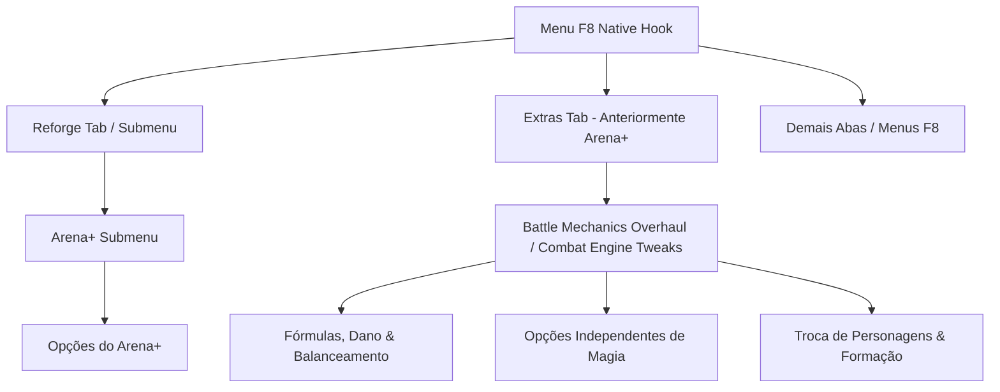

# Registro de Prompt — Reorganização F8 e MOD-002 (Combat & Mechanics)

**Data de Registro:** 27/09/2026
**Status:** Armazenado para planejamento e implementação futura (nenhuma ação de código imediata).

---

## 1. Prompt Original do Usuário (Transcrição Integral)

> *"Modificações nos hooks:*
> *Colocar o Arena+ dentro do Reforge (F8 -> Reforge -> Arena+ -> Opções)*
> *O atual arena+ ser renomeado para "Extras"*
>
> *Dentro de extras ( F8 -> Extras -> Nova Opção ), ter uma nova opção envolvendo o mod abaixo ( crie um nome maneiro em inglês).*
> *Ao abrir essa opção, você poderá escolher o que ativar individualmente do MOD-002 que irei lhe passar.*
>
> *# MOD-002 — Mudanças de combate e mecânicas*
>
> *Seleção das ideias de Kari AP e demais participantes, registradas entre 14/01/2025 e 04/11/2025. Cada caixa acompanha uma proposta; não indica implementação. As propostas de auto-habilidades de equipamento estão em [PARTE 2 MOD 002.md](<../mod-ideas/PARTE 2 MOD 002.md>), e a discussão sobre patches reutilizáveis está em [PARTE 3 MOD 002.md](<../mod-ideas/PARTE 3 MOD 002.md>).*
>
> *## Fórmulas, dano e balanceamento*
>
> *- [ ] Aplicar bônus percentuais de STR, MAG, DEF e MDF vindos de equipamentos quando o atributo correspondente for usado, sem vinculá-los apenas a ataques físicos ou mágicos.*
> *- [ ] Calcular bônus percentuais de DEF/MDF por pontos de vida efetivos; o exemplo da lista diz que DEF +20% reduziria o dano em cerca de 16,6%, não 20%.*
> *- [ ] Fazer Shell e outros efeitos protetivos ou auto-habilidades deixarem de reduzir cura recebida.*
> *- [ ] Alterar Armor Break e Mental Break: em vez de zerar defesa, acrescentariam 25% do dano-base sem mitigação por defesa. Exemplos da lista: 60 DEF, 25% para 50% do dano; 20 DEF, 50% para 75%; 0 DEF, 100% para 125%.*
> *- O texto copiado contém números de ajuste para golpes múltiplos e golpes únicos (`100%`, `110%`, `+5%`), mas a relação entre eles ficou ambígua; confirmar no post original antes de transformar em requisito.*
> *- [ ] Consumir Auto-Crit e MP-0 ao usar, removendo o efeito ao fim do turno para que todos os acertos de um mesmo ataque ainda recebam o benefício.*
> *- [ ] Ao atingir uma fraqueza elemental, aplicar também x1,25 de dano do elemento oposto; exemplo: fraqueza a Ice aumenta dano de Fire.*
> *- [ ] Permitir que reaplicar um status já ativo renove sua duração.*
> *- [ ] Adicionar resistência à duração de status nos inimigos, além da resistência à chance de aplicação, para diferenciar habilidades de Attack Buster por quantidade de turnos em vez de apenas sucesso/falha.*
> *- [ ] Fazer Threaten funcionar apenas uma vez por inimigo.*
> *- [ ] Rever efeitos de ataques que deveriam sempre acertar, mas aparentemente podem errar.*
>
> *## Opções independentes de magia*
>
> *- [ ] **Quickcast:** opção própria para substituir Doublecast. Em vez de lançar duas vezes, lança uma magia como ação de rank 2 pelo dobro do custo de MP. Com esta opção desligada, Doublecast mantém seu comportamento. A abrangência inicial proposta é Black Magic.*
> *- [ ] **White Magic em Doublecast/Quickcast:** opção própria e independente de Quickcast. Quando ligada, permite White Magic no comando que estiver ativo — Doublecast ou Quickcast — em um submenu próprio. Pode ser ligada sem transformar Doublecast em Quickcast.*
> *- [ ] **Fortalecimento de magia pelo MP atual:** opção própria, que pode ser ligada ou desligada independentemente de Quickcast e White Magic. Fórmula sugerida: `Base MAG = MAG + sqrt(MP / 2) + Focus stacks`, com bônus de MAG por faixas de MP: 0–1: +0; 2–7: +1; 8–17: +2; 18–31: +3; 32–49: +4; 50–71: +5; 72–97: +6; 98–127: +7; 128–161: +8; 162–199: +9; 200–241: +10. A anotação sobre efeitos MP-0 limitarem o bônus a +3 precisa ser esclarecida.*
>
> *## Troca de personagens e formação*
>
> *- [ ] **Troca consumir um turno:** opção própria, independente das opções de magia. Kari considera a troca livre parte central do combate de FFX, mas aceitou esta alternativa para modders experimentarem; nenhum padrão foi decidido.*
> *- [ ] Quando um personagem for ejetado ou estilhaçado, colocar o primeiro personagem disponível da retaguarda em seu lugar, em vez de deixar a posição vazia. Verificar restrições de troca nas áreas de natação."*

---

## 2. Estrutura Proposta para a Arquitetura do Menu F8

### Propostas de Nome em Inglês para a Nova Opção
1. **`Battle Mechanics Overhaul`** (Direto, profissional e claro)
2. **`Combat Engine Tweaks`** (Focado em ajustes finos do motor de combate)
3. **`Dynamic Battle Overhaul`** (Sonoridade moderna e impactante)
4. **`Kari's Combat Enhancements`** (Homenagem direta à autora da lista original)

---

## 3. Matriz Modular de Opções Individuais (MOD-002)

Cada item abaixo será um switch toggle individual ativável/desativável dentro do menu:

### Bloco A: Fórmulas, Dano e Balanceamento
| Opção | Identificador Interno Sugerido | Descrição / Efeito |
|---|---|---|
| **Universal Stat Multipliers** | `stat_pct_universal` | Aplica bônus percentuais de STR/MAG/DEF/MDF de equipamentos a qualquer ação que use o atributo (não só físico/mágico padrão). |
| **Effective HP Defense Scaling** | `defense_ehp_scaling` | DEF/MDF calculados por Effective HP (ex: DEF +20% reduz ~16.6% do dano sofrido). |
| **Unhindered Healing** | `healing_ignore_shell` | Shell, proteções e auto-habilidades deixam de mitigar magias de cura recebidas. |
| **Additive Break Debuffs** | `breaks_additive_damage` | Armor/Mental Break somam +25% do dano base puro ao invés de anular a defesa. |
| **Turn-End Buff Consumption** | `auto_crit_mp0_turn_end` | Auto-Crit e MP-0 consomem-se e limpam-se apenas no fim do turno (todos os acertos aproveitam). |
| **Opposite Element Affinity** | `element_opposite_weakness` | Atingir fraqueza elemental aplica também x1.25 do elemento oposto (ex: fraqueza a Ice amplifica dano Fire). |
| **Status Reapplication Refresh** | `status_refresh_duration` | Reaplicar um status já ativo no alvo renova a duração em vez de falhar. |
| **Enemy Status Duration Resistance** | `enemy_duration_resistance` | Adiciona resistência de duração em turnos para diferenciar Attack Busters por tempo. |
| **Single-Use Threaten** | `threaten_single_use` | A habilidade Threaten funciona apenas 1 vez por inimigo por combate. |
| **Guaranteed Hit Fix** | `guaranteed_hits_no_miss` | Garante que ataques programados como infalíveis nunca sofram miss. |

### Bloco B: Opções Independentes de Magia
| Opção | Identificador Interno Sugerido | Descrição / Efeito |
|---|---|---|
| **Quickcast** | `quickcast_replace_doublecast` | Substitui Doublecast por Quickcast (1 magia com custo de Rank 2 por dobro de MP). |
| **White Magic in Double/Quickcast** | `dualcast_white_magic` | Submenu próprio de White Magic dentro de Doublecast/Quickcast (independente). |
| **MP-Scaled Magic Power** | `magic_mp_scaling` | Base MAG escala com MP atual: $\text{Base MAG} = \text{MAG} + \sqrt{\text{MP} / 2} + \text{Focus stacks}$. |

### Bloco C: Troca de Personagens e Formação
| Opção | Identificador Interno Sugerido | Descrição / Efeito |
|---|---|---|
| **Turn-Consuming Character Switch** | `party_switch_costs_turn` | Trocar de personagem na linha de frente consome o turno da unidade (não gratuito). |
| **Frontline Auto-Reinforce on Eject** | `eject_shatter_auto_replace` | Quando um aliado for ejetado ou estilhaçado, o primeiro membro da retaguarda entra no lugar. |
